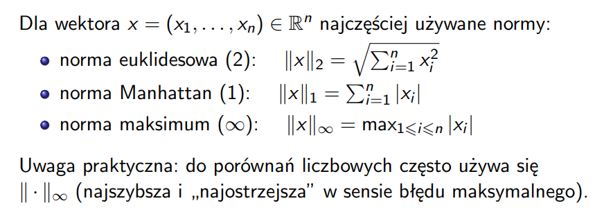
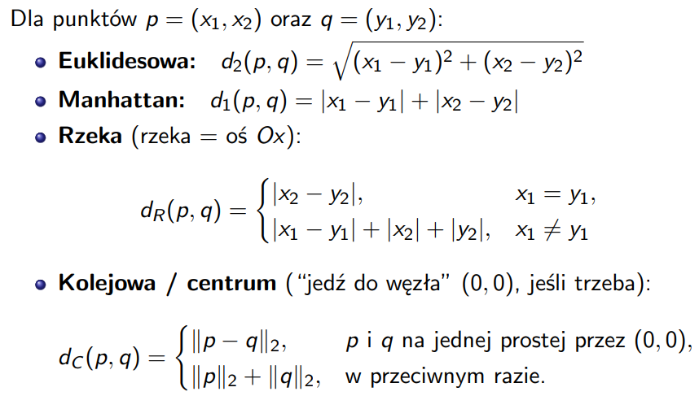
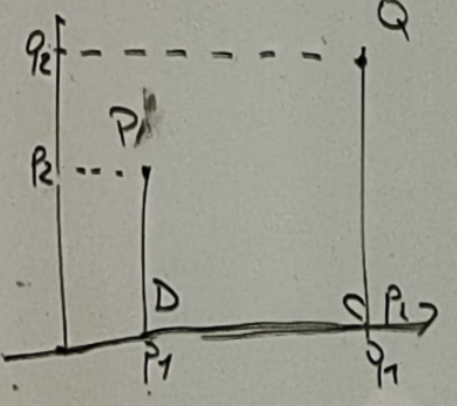
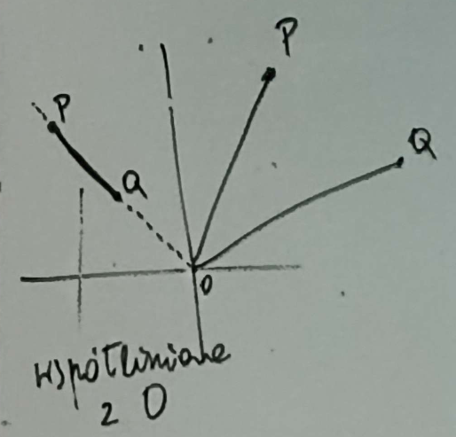
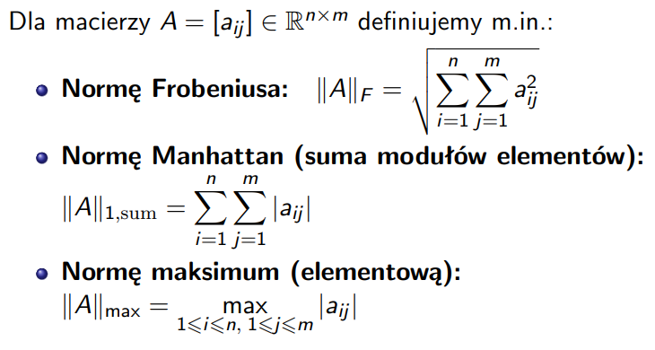

**Zadanie 1.** Napisz program, który obliczy normę: euklidesową, Manhattan, maximum dla $n$-wymiarowego wektora.

```python
import math

def normy_wektora(wektor):

    # norma euklidesowa
    suma_kwadratow = 0
    for x in wektor:
        suma_kwadratow += x**2
    norma_euklidesowa = math.sqrt(suma_kwadratow)

    # norma Manhattan
    norma_manhattan = 0
    for x in wektor:
        norma_manhattan += abs(x)

    # norma maximum
    # norma_max = max(abs(x) for x in wektor)
    norma_max = 0

    for x in wektor:
        wartosc_bezwzgledna = abs(x)

        if wartosc_bezwzgledna > norma_max:
            norma_max = wartosc_bezwzgledna

    return norma_euklidesowa, norma_manhattan, norma_max

wektor = [3, 4, 5]

euklidesowa, manhattan, maksimum = normy_wektora(wektor)

print("Norma euklidesowa:", euklidesowa)
print("Norma Manhattan:", manhattan)
print("Norma maximum:", maksimum)
```

## 1. Norma euklidesowa
### Wzór

$$
\|x\|_2 = \sqrt{\sum_{i=1}^{n} x_i^2}
$$

### Jak to czytać po ludzku?

- bierzesz wszystkie liczby z wektora,
- każdą podnosisz do kwadratu,
- wszystko dodajesz,
- z wyniku wyciągasz pierwiastek.

### Przykład

Dla:

$$
x = (2, -1, 4)
$$

liczymy:

$$
\|x\|_2 = \sqrt{2^2 + (-1)^2 + 4^2}
$$

czyli:

$$
\sqrt{4 + 1 + 16} = \sqrt{21}
$$

To jest zwykła „szkolna długość” wektora.

---

## 2. Norma Manhattan
### Wzór

$$
\|x\|_1 = \sum_{i=1}^{n} |x_i|
$$

### Jak to czytać po ludzku?

- bierzesz wszystkie liczby z wektora,
- zamieniasz je na dodatnie (wartość bezwzględna),
- dodajesz je wszystkie.

### Przykład

Dla:

$$
x = (2, -1, 4)
$$

liczymy:

$$
\|x\|_1 = |2| + |-1| + |4|
$$

czyli:

$$
2 + 1 + 4 = 7
$$

To się nazywa Manhattan, bo przypomina chodzenie po ulicach miasta: tylko poziomo i pionowo, bez skrótów na ukos.

---

## 3. Norma maksimum
### Wzór

$$
\|x\|_{\infty} = \max_{1 \le i \le n} |x_i|
$$

### Jak to czytać po ludzku?

- bierzesz wszystkie liczby z wektora,
- robisz z nich wartości dodatnie,
- wybierasz największą.

### Przykład

Dla:

$$
x = (2, -1, 4)
$$

liczymy:

$$
|2| = 2,\quad |-1| = 1,\quad |4| = 4
$$

największa z nich to:

$$
4
$$

więc:

$$
\|x\|_{\infty} = 4
$$

---

**Zadanie 2.** Napisz program, który będzie wyliczał odległość pomiędzy dwoma punktami przestrzeni dwuwymiarowej w metrykach: euklidesowej, Manhattan, rzece i kolejowej.


```python
import math

def odleglosci(P, Q):
    p1, p2 = P
    q1, q2 = Q

    # metryka euklidesowa
    euklidesowa = math.sqrt(math.pow((q1 - p1), 2) + math.pow((q2 - p2), 2))

    #matryka Manhattan
    manhattan = abs(p1 - q1) + abs(p2 - q2)

    #metryka rzeka
    if p1 == q1:
        rzeka = abs(p2 - q2)
    else:
        rzeka = abs(p1 - q1) + abs(p2) + abs(q2)

    # metryka kolejowa
    det = p1 * q2 - p2 * q1
    if det == 0:
        kolejowa = math.sqrt(math.pow((q1 - p1), 2) + math.pow((q2 - p2), 2))
    else:
        kolejowa = math.sqrt(math.pow((0 - p1), 2) + math.pow((0 - p2), 2)) + math.sqrt(math.pow((0 - q1), 2) + math.pow((0 - q2), 2))

    return euklidesowa, manhattan, rzeka, kolejowa

punktP = (2, 3)
punktQ = (5, 7)

euklidesowa, manhattan, rzeka, kolejowa = odleglosci(punktP, punktQ)

print("Norma euklidesowa:", euklidesowa)
print("Norma Manhattan:", manhattan)
print("Norma rzeka:", rzeka)
print("Norma kolejowa/centrum:", kolejowa)
```



Dla punktów:

$$
p = (x_1, x_2)
$$

oraz

$$
q = (y_1, y_2)
$$

chcemy policzyć odległość między nimi na kilka różnych sposobów.

## 1. Metryka euklidesowa
### Wzór

$$
d_2(p, q) = \sqrt{(x_1 - y_1)^2 + (x_2 - y_2)^2}
$$

### Jak to czytać po ludzku?

- bierzesz różnicę pierwszych współrzędnych,
- bierzesz różnicę drugich współrzędnych,
- obie różnice podnosisz do kwadratu,
- dodajesz je,
- z wyniku wyciągasz pierwiastek.

To jest zwykła „szkolna” odległość między dwoma punktami.

### Przykład

Dla:

$$
p = (2, 3), \quad q = (5, 7)
$$

liczymy:

$$
d_2(p, q) = \sqrt{(2 - 5)^2 + (3 - 7)^2}
$$

czyli:

$$
\sqrt{(-3)^2 + (-4)^2} = \sqrt{9 + 16} = \sqrt{25} = 5
$$

---
## 2. Metryka Manhattan
### Wzór

$$
d_1(p, q) = |x_1 - y_1| + |x_2 - y_2|
$$

### Jak to czytać po ludzku?

- bierzesz różnicę pierwszych współrzędnych,
- bierzesz różnicę drugich współrzędnych,
- zamieniasz je na wartości dodatnie,
- dodajesz je.

Ta metryka przypomina poruszanie się po ulicach miasta: tylko poziomo i pionowo, bez skrótów na ukos.

### Przykład

Dla:

$$
p = (2, 3), \quad q = (5, 7)
$$

liczymy:

$$
d_1(p, q) = |2 - 5| + |3 - 7|
$$

czyli:

$$
3 + 4 = 7
$$

---

## 3. Metryka rzeki

Na slajdzie jest napisane, że rzeka to oś $Ox$.

To znaczy, że można poruszać się wzdłuż osi poziomej, a żeby przejść między punktami o różnych pierwszych współrzędnych, trzeba „zejść do rzeki”, przejść nią i potem „wejść” do drugiego punktu.

### Wzór

$$
d_R(p, q) =
\begin{cases}
|x_2 - y_2|, & x_1 = y_1 \\
|x_1 - y_1| + |x_2| + |y_2|, & x_1 \ne y_1
\end{cases}
$$

### Jak to czytać po ludzku?

#### Przypadek 1: gdy $x_1 = y_1$

Jeśli punkty mają tę samą pierwszą współrzędną, to leżą „nad tym samym miejscem” na osi poziomej.

Wtedy wystarczy policzyć tylko różnicę drugich współrzędnych:

$$
|x_2 - y_2|
$$

#### Przypadek 2: gdy $x_1 \ne y_1$

Wtedy:
- schodzisz z punktu $p$ do osi $Ox$,
- idziesz w poziomie do miejsca pod punktem $q$,
- wchodzisz do punktu $q$.

Dlatego liczymy:

$$
|x_1 - y_1| + |x_2| + |y_2|
$$

### Przykład

Dla:

$$
p = (2, 3), \quad q = (5, 7)
$$

mamy:

$$
x_1 \ne y_1
$$

więc używamy drugiego wzoru:

$$
d_R(p, q) = |2 - 5| + |3| + |7|
$$

czyli:

$$
3 + 3 + 7 = 13
$$

## Notatka z talicy

$$
\operatorname{euclid}(P,D)+\operatorname{euclid}(D,C)+\operatorname{euclid}(C,D)
$$



---

## 4. Metryka kolejowa / centrum

Tutaj idea jest taka, że jeśli trzeba, jedziemy przez punkt centralny:

$$
(0, 0)
$$

### Wzór

$$
d_C(p, q) =
\begin{cases}
\|p - q\|_2, & p \text{ i } q \text{ leżą na jednej prostej przechodzącej przez } (0,0) \\
\|p\|_2 + \|q\|_2, & \text{w przeciwnym razie}
\end{cases}
$$

### Jak to czytać po ludzku?

#### Przypadek 1: punkty leżą na jednej prostej przechodzącej przez $(0,0)$

Wtedy można przejechać bezpośrednio między nimi.

Liczymy zwykłą odległość euklidesową:

$$
\|p - q\|_2
$$

czyli po prostu:

$$
\sqrt{(x_1 - y_1)^2 + (x_2 - y_2)^2}
$$

#### Przypadek 2: punkty nie leżą na jednej takiej prostej

Wtedy:
- jedziesz z punktu $p$ do centrum $(0,0)$,
- potem z centrum do punktu $q$.

Czyli liczysz:

$$
\|p\|_2 + \|q\|_2
$$

To znaczy:
- długość odcinka od $(0,0)$ do $p$,
- plus długość odcinka od $(0,0)$ do $q$.

### Przykład

Dla:

$$
p = (2, 3), \quad q = (5, 7)
$$

sprawdzamy, czy punkty leżą na jednej prostej przechodzącej przez $(0,0)$.

Jeśli nie, to liczymy:

$$
d_C(p, q) = \|p\|_2 + \|q\|_2
$$

czyli:

$$
\sqrt{2^2 + 3^2} + \sqrt{5^2 + 7^2}
$$

czyli:

$$
\sqrt{13} + \sqrt{74}
$$

w przybliżeniu:

$$
3.6055 + 8.6023 = 12.2078
$$

## Notatka z tablicy

$$
\operatorname{euclid}(P,Q) = \sqrt{(q_1 - p_1)^2 + (q_2 - p_2)^2}
$$

Dla punktów:

$$
P = (p_1, p_2)
$$

$$
Q = (q_1, q_2)
$$

punkty $P$, $Q$, $O$ są współliniowe wtedy i tylko wtedy, gdy:

$$
\det
\begin{bmatrix}
p_1 & p_2 \\
q_1 & q_2
\end{bmatrix}
= p_1 q_2 - p_2 q_1 = 0
$$

Jeśli:

$$
\det = 0
$$

to:

$$
\operatorname{odległość}_{kolejowa}(P,Q) = \operatorname{euclid}(P,Q)
$$

w przeciwnym razie:

$$
\operatorname{odległość}_{kolejowa}(P,Q) = \operatorname{euclid}(P,O) + \operatorname{euclid}(Q,O)
$$



---

**Zadanie 3.** Napisz program, który obliczy normę: Frobeniusa, Manhattan, maximum dla $n \times m$-wymiarowej macierzy.

```python
import math

def normy_macierzy(macierz):
    wiersze = len(macierz)
    kolumny = len(macierz[0])

    # norma Frobeniusa
    suma_kwadratow = 0
    for i in range(wiersze):
        for j in range(kolumny):
            suma_kwadratow += math.pow(macierz[i][j], 2)
    Frobeniusa = math.sqrt(suma_kwadratow)

    # norma Manhattan
    suma_modulow = 0
    for i in range(wiersze):
        for j in range(kolumny):
            suma_modulow += abs(macierz[i][j])
    Manhattan = suma_modulow

    # norma maksimum
    maksimum = 0
    for i in range(wiersze):
        for j in range(kolumny):
            if abs(macierz[i][j]) > maksimum:
                maksimum = abs(macierz[i][j])

    return Frobeniusa, Manhattan, maksimum

macierz = [
    [1, -2, 3],
    [4, 5, -6]
]

Frobeniusa, Manhattan, maksimum = normy_macierzy(macierz)

print("Norma Frobeniusa:", Frobeniusa)
print("Norma Manhattan:", Manhattan)
print("Norma maksimum:", maksimum)
```



Dla macierzy:

$$
A = [a_{ij}] \in \mathbb{R}^{n \times m}
$$

czyli macierzy o `n` wierszach i `m` kolumnach, można zdefiniować kilka norm.

---

## 1. Norma Frobeniusa
### Wzór

$$
\|A\|_F = \sqrt{\sum_{i=1}^{n}\sum_{j=1}^{m} a_{ij}^2}
$$

### Jak to czytać po ludzku?

- bierzesz wszystkie elementy macierzy,
- każdy podnosisz do kwadratu,
- dodajesz wszystkie te kwadraty,
- z otrzymanej sumy wyciągasz pierwiastek.

To jest odpowiednik normy euklidesowej dla macierzy.

### Przykład

Dla macierzy:

$$
A =
\begin{bmatrix}
1 & -2 & 3 \\
4 & 5 & -6
\end{bmatrix}
$$

liczymy:

$$
\|A\|_F = \sqrt{1^2 + (-2)^2 + 3^2 + 4^2 + 5^2 + (-6)^2}
$$

czyli:

$$
\sqrt{1 + 4 + 9 + 16 + 25 + 36} = \sqrt{91}
$$

---

## 2. Norma Manhattan
### Wzór

$$
\|A\|_{1,\text{sum}} = \sum_{i=1}^{n}\sum_{j=1}^{m} |a_{ij}|
$$

### Jak to czytać po ludzku?

- bierzesz wszystkie elementy macierzy,
- zamieniasz je na wartości dodatnie (wartości bezwzględne),
- dodajesz wszystkie te wartości.

To jest po prostu suma modułów wszystkich elementów macierzy.

### Przykład

Dla macierzy:

$$
A =
\begin{bmatrix}
1 & -2 & 3 \\
4 & 5 & -6
\end{bmatrix}
$$

liczymy:

$$
\|A\|_{1,\text{sum}} = |1| + |-2| + |3| + |4| + |5| + |-6|
$$

czyli:

$$
1 + 2 + 3 + 4 + 5 + 6 = 21
$$

---

## 3. Norma maksimum
### Wzór

$$
\|A\|_{\max} = \max_{1 \le i \le n,\; 1 \le j \le m} |a_{ij}|
$$

### Jak to czytać po ludzku?

- bierzesz wszystkie elementy macierzy,
- zamieniasz je na wartości dodatnie,
- wybierasz największą z nich.

To jest największy moduł spośród wszystkich elementów macierzy.

### Przykład

Dla macierzy:

$$
A =
\begin{bmatrix}
1 & -2 & 3 \\
4 & 5 & -6
\end{bmatrix}
$$

liczymy moduły elementów:

$$
|1| = 1,\quad |-2| = 2,\quad |3| = 3,\quad |4| = 4,\quad |5| = 5,\quad |-6| = 6
$$

największa z tych wartości to:

$$
6
$$

więc:

$$
\|A\|_{\max} = 6
$$

---

# Co oznaczają symbole?

## \(a_{ij}\)

To element macierzy znajdujący się:
- w `i`-tym wierszu,
- w `j`-tej kolumnie.

Na przykład w macierzy

$$
\begin{bmatrix}
1 & -2 & 3 \\
4 & 5 & -6
\end{bmatrix}
$$

- \(a_{11} = 1\)
- \(a_{12} = -2\)
- \(a_{23} = -6\)

---

## \(\sum \sum\)

Podwójna suma znaczy:
- przejdź po wszystkich wierszach,
- w każdym wierszu przejdź po wszystkich kolumnach,
- dodaj wszystkie elementy.

---

**Zadanie 4.** Napisz program, który wykona mnożenie dwóch macierzy. Kiedy działanie takie nie może zostać przeprowadzone? Sprawdź czy mnożenie macierzy jest przemienne lub łączne?

```python
def mnozenie_macierzy(macierz1, macierz2):
    ilosc_wierszy_macierz1 = len(macierz1)
    ilosc_wierszy_macierz2 = len(macierz2)
    ilosc_kolumn_macierz1 = len(macierz1[0])
    ilosc_kolumn_macierz2 = len(macierz2[0])

    if ilosc_kolumn_macierz1 != ilosc_wierszy_macierz2:
        raise ValueError("Nie da się pomnożyć tych macierzy")
    
    wynik = []
    for i in range(ilosc_wierszy_macierz1):
        wiersz = []
        for j in range(ilosc_kolumn_macierz2):
            suma = 0
            for k in range(ilosc_kolumn_macierz1):
                suma += macierz1[i][k] * macierz2[k][j]
            wiersz.append(suma)
        wynik.append(wiersz)

    return wynik

macierz1 = [
    [1, 2],
    [3, 4]
]

macierz2 = [
    [5, 6],
    [7, 8]
]

wynik = mnozenie_macierzy(macierz1, macierz2)

print("Wynik mnożenia:")
for wiersz in wynik:
    print(wiersz)
```

# Mnożenie macierzy – notatka

## 1. Kiedy można mnożyć macierze?

Jeśli:

$$
A \in \mathbb{R}^{m_1 \times n_1}
\quad \text{oraz} \quad
B \in \mathbb{R}^{m_2 \times n_2}
$$

to iloczyn:

$$
AB
$$

istnieje **wtedy i tylko wtedy**, gdy:

$$
n_1 = m_2
$$

Czyli:

- liczba **kolumn** pierwszej macierzy
- musi być równa liczbie **wierszy** drugiej macierzy.

## 2. Jaki rozmiar ma wynik?

Jeśli mnożenie jest możliwe, to:

$$
AB \in \mathbb{R}^{m_1 \times n_2}
$$

czyli wynik ma:

- tyle wierszy, ile ma macierz **A**
- tyle kolumn, ile ma macierz **B**

## 3. Jak wygląda wzór na mnożenie macierzy?

Niech:

$$
A =
\begin{bmatrix}
a_{1,1} & a_{1,2} & \cdots & a_{1,n} \\
a_{2,1} & a_{2,2} & \cdots & a_{2,n} \\
\vdots & \vdots & \ddots & \vdots \\
a_{m,1} & a_{m,2} & \cdots & a_{m,n}
\end{bmatrix}
$$

oraz

$$
B =
\begin{bmatrix}
b_{1,1} & b_{1,2} & \cdots & b_{1,k} \\
b_{2,1} & b_{2,2} & \cdots & b_{2,k} \\
\vdots & \vdots & \ddots & \vdots \\
b_{n,1} & b_{n,2} & \cdots & b_{n,k}
\end{bmatrix}
$$

Wtedy:

$$
C = AB
$$

jest macierzą postaci:

$$
C =
\begin{bmatrix}
c_{1,1} & c_{1,2} & \cdots & c_{1,k} \\
c_{2,1} & c_{2,2} & \cdots & c_{2,k} \\
\vdots & \vdots & \ddots & \vdots \\
c_{m,1} & c_{m,2} & \cdots & c_{m,k}
\end{bmatrix}
$$

a każdy element macierzy wynikowej liczymy ze wzoru:

$$
c_{i,j} = \sum_{l=1}^{n} a_{i,l} b_{l,j}
$$

dla:

$$
i = 1,2,\dots,m
\quad \text{oraz} \quad
j = 1,2,\dots,k
$$

## 4. Jak to czytać po ludzku?

Żeby policzyć element:

$$
c_{i,j}
$$

trzeba:

- wziąć **i-ty wiersz** z macierzy **A**
- i **j-tą kolumnę** z macierzy **B**
- pomnożyć odpowiadające sobie elementy
- dodać wszystkie wyniki

## 5. Przykład obliczania jednego elementu

Jeśli:

$$
A =
\begin{bmatrix}
1 & 2 \\
3 & 4
\end{bmatrix}
\quad \text{oraz} \quad
B =
\begin{bmatrix}
5 & 6 \\
7 & 8
\end{bmatrix}
$$

to element:

$$
c_{1,1}
$$

liczymy tak:

- pierwszy wiersz z \(A\): \((1,2)\)
- pierwsza kolumna z \(B\): \((5,7)\)

więc:

$$
c_{1,1} = 1 \cdot 5 + 2 \cdot 7 = 5 + 14 = 19
$$

element:

$$
c_{1,2}
$$

- pierwszy wiersz z \(A\): \((1,2)\)
- druga kolumna z \(B\): \((6,8)\)

więc:

$$
c_{1,2} = 1 \cdot 6 + 2 \cdot 8 = 6 + 16 = 22
$$

element:

$$
c_{2,1}
$$

- drugi wiersz z \(A\): \((3,4)\)
- pierwsza kolumna z \(B\): \((5,7)\)

więc:

$$
c_{2,1} = 3 \cdot 5 + 4 \cdot 7 = 15 + 28 = 43
$$

element:

$$
c_{2,2}
$$

- drugi wiersz z \(A\): \((3,4)\)
- druga kolumna z \(B\): \((6,8)\)

więc:

$$
c_{2,2} = 3 \cdot 6 + 4 \cdot 8 = 18 + 32 = 50
$$

Czyli:

$$
AB =
\begin{bmatrix}
19 & 22 \\
43 & 50
\end{bmatrix}
$$

## 6. Własności mnożenia macierzy

### Mnożenie macierzy nie jest przemienne

W ogólności:

$$
AB \ne BA
$$

To znaczy, że zmiana kolejności macierzy zwykle daje inny wynik.

### Mnożenie macierzy jest łączne

$$
(AB)C = A(BC)
$$

o ile wymiary macierzy pozwalają wykonać oba mnożenia.

### Mnożenie macierzy jest rozłączne względem dodawania

$$
A(B + C) = AB + AC
$$

oraz

$$
(A + B)C = AC + BC
$$

### Macierz jednostkowa jest elementem neutralnym

Jeśli \(I\) to macierz jednostkowa, to:

$$
AI = A
\quad \text{oraz} \quad
IA = A
$$

## 7. Przykład pokazujący, że \(AB \ne BA\)

Weźmy:

$$
A =
\begin{bmatrix}
1 & 2 \\
0 & 1
\end{bmatrix}
\quad , \quad
B =
\begin{bmatrix}
1 & 0 \\
3 & 1
\end{bmatrix}
$$

Wtedy:

$$
AB =
\begin{bmatrix}
7 & 2 \\
3 & 1
\end{bmatrix}
$$

oraz:

$$
BA =
\begin{bmatrix}
1 & 2 \\
3 & 7
\end{bmatrix}
$$

Zatem:

$$
AB \ne BA
$$

## 8. Łączność mnożenia

Dla macierzy o pasujących wymiarach zawsze zachodzi:

$$
(AB)C = A(BC)
$$

czyli wynik nie zależy od tego, które mnożenie wykonamy najpierw.

## 9. Koszt obliczeń

Jeśli:

$$
A \in \mathbb{R}^{m_1 \times n_1}
\quad \text{oraz} \quad
B \in \mathbb{R}^{n_1 \times n_2}
$$

to koszt obliczenia iloczynu \(AB\) wynosi:

$$
\Theta(m_1 \cdot n_1 \cdot n_2)
$$

czyli liczba działań rośnie w przybliżeniu jak:

- liczba wierszy pierwszej macierzy
- razy liczba wspólnego wymiaru
- razy liczba kolumn drugiej macierzy

## 10. Najkrócej

### Kiedy można mnożyć?
Gdy liczba kolumn pierwszej macierzy jest równa liczbie wierszy drugiej.

### Jaki rozmiar ma wynik?
Tyle wierszy co pierwsza macierz i tyle kolumn co druga.

### Jak liczymy element wyniku?
Wiersz z pierwszej macierzy razy kolumna z drugiej.

### Czy mnożenie jest przemienne?
Nie.

### Czy mnożenie jest łączne?
Tak.

---

**Zadanie 5*.** Zaprojektuj i utwórz klasę dla macierzy umożliwiającą tworzenie, wypisywanie i wykonywanie działań: mnożenie przez stałą, dodawanie, mnożenie.

```python

```