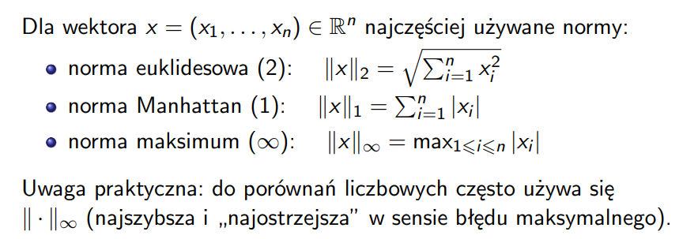
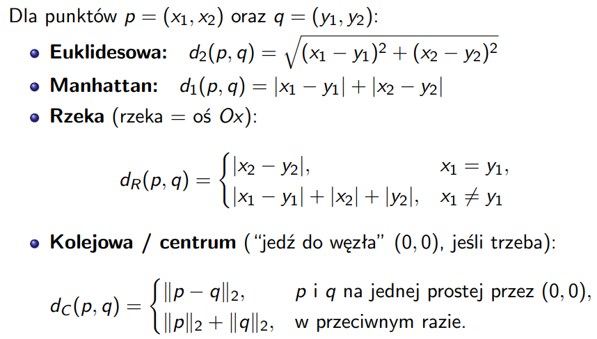
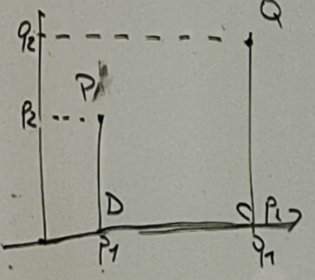
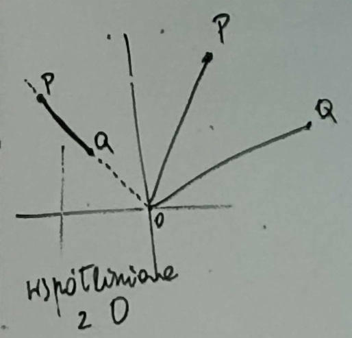
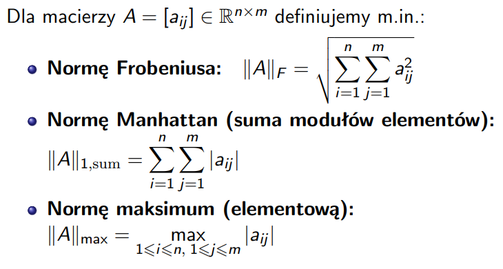

**Zadanie 1.** Napisz program, który obliczy normę: euklidesową, Manhattan, maximum dla $n$-wymiarowego wektora.

```python
import math  # importujemy moduł math, ponieważ używamy funkcji math.sqrt()

def normy_wektora(wektor):  # funkcja liczy trzy normy wektora: euklidesową, Manhattan i maksimum

    # norma euklidesowa  # norma euklidesowa to pierwiastek z sumy kwadratów elementów wektora
    suma_kwadratow = 0  # tworzymy zmienną, w której będziemy przechowywać sumę kwadratów
    for x in wektor:  # przechodzimy po każdym elemencie wektora
        suma_kwadratow += x**2  # dodajemy kwadrat aktualnego elementu do sumy
    norma_euklidesowa = math.sqrt(suma_kwadratow)  # obliczamy pierwiastek z sumy kwadratów

    # norma Manhattan  # norma Manhattan to suma wartości bezwzględnych elementów wektora
    norma_manhattan = 0  # tworzymy zmienną, w której będziemy przechowywać sumę wartości bezwzględnych
    for x in wektor:  # przechodzimy po każdym elemencie wektora
        norma_manhattan += abs(x)  # dodajemy wartość bezwzględną aktualnego elementu

    # norma maximum  # norma maksimum to największa wartość bezwzględna elementu wektora
    # norma_max = max(abs(x) for x in wektor)  # krótsza wersja z użyciem funkcji max(), ale tutaj jej nie używamy
    norma_max = 0  # tworzymy zmienną przechowującą największą znalezioną wartość bezwzględną

    for x in wektor:  # przechodzimy po każdym elemencie wektora
        wartosc_bezwzgledna = abs(x)  # liczymy wartość bezwzględną aktualnego elementu

        if wartosc_bezwzgledna > norma_max:  # sprawdzamy, czy aktualna wartość bezwzględna jest większa od dotychczasowego maksimum
            norma_max = wartosc_bezwzgledna  # jeśli tak, aktualizujemy maksimum

    return norma_euklidesowa, norma_manhattan, norma_max  # zwracamy trzy obliczone normy

wektor = [3, 4, 5]  # tworzymy przykładowy wektor

euklidesowa, manhattan, maksimum = normy_wektora(wektor)  # wywołujemy funkcję i zapisujemy trzy wyniki do osobnych zmiennych

print("Norma euklidesowa:", euklidesowa)  # wypisujemy normę euklidesową
print("Norma Manhattan:", manhattan)  # wypisujemy normę Manhattan
print("Norma maximum:", maksimum)  # wypisujemy normę maksimum
```

## 1. Norma euklidesowa
### Wzór

$$
\|x\|_2 = \sqrt{\sum_{i=1}^{n} x_i^2}
$$

### Jak to czytać po ludzku?

- bierzesz wszystkie liczby z wektora,
- każdą podnosisz do kwadratu,
- wszystko dodajesz,
- z wyniku wyciągasz pierwiastek.

### Przykład

Dla:

$$
x = (2, -1, 4)
$$

liczymy:

$$
\|x\|_2 = \sqrt{2^2 + (-1)^2 + 4^2}
$$

czyli:

$$
\sqrt{4 + 1 + 16} = \sqrt{21}
$$

To jest zwykła „szkolna długość” wektora.

---

## 2. Norma Manhattan
### Wzór

$$
\|x\|_1 = \sum_{i=1}^{n} |x_i|
$$

### Jak to czytać po ludzku?

- bierzesz wszystkie liczby z wektora,
- zamieniasz je na dodatnie (wartość bezwzględna),
- dodajesz je wszystkie.

### Przykład

Dla:

$$
x = (2, -1, 4)
$$

liczymy:

$$
\|x\|_1 = |2| + |-1| + |4|
$$

czyli:

$$
2 + 1 + 4 = 7
$$

To się nazywa Manhattan, bo przypomina chodzenie po ulicach miasta: tylko poziomo i pionowo, bez skrótów na ukos.

---

## 3. Norma maksimum
### Wzór

$$
\|x\|_{\infty} = \max_{1 \le i \le n} |x_i|
$$

### Jak to czytać po ludzku?

- bierzesz wszystkie liczby z wektora,
- robisz z nich wartości dodatnie,
- wybierasz największą.

### Przykład

Dla:

$$
x = (2, -1, 4)
$$

liczymy:

$$
|2| = 2,\quad |-1| = 1,\quad |4| = 4
$$

największa z nich to:

$$
4
$$

więc:

$$
\|x\|_{\infty} = 4
$$

---

**Zadanie 2.** Napisz program, który będzie wyliczał odległość pomiędzy dwoma punktami przestrzeni dwuwymiarowej w metrykach: euklidesowej, Manhattan, rzece i kolejowej.


```python
import math  # importujemy moduł math, ponieważ używamy pierwiastka math.sqrt() i potęgowania math.pow()

def odleglosci(P, Q):  # funkcja liczy różne odległości między punktami P i Q
    p1, p2 = P  # rozpakowujemy współrzędne punktu P, czyli P = (p1, p2)
    q1, q2 = Q  # rozpakowujemy współrzędne punktu Q, czyli Q = (q1, q2)

    # metryka euklidesowa  # zwykła odległość między punktami w linii prostej
    euklidesowa = math.sqrt(math.pow((q1 - p1), 2) + math.pow((q2 - p2), 2))  # liczymy pierwiastek z sumy kwadratów różnic współrzędnych

    #matryka Manhattan  # odległość liczona jak poruszanie się po kratce, czyli poziomo i pionowo
    manhattan = abs(p1 - q1) + abs(p2 - q2)  # dodajemy wartości bezwzględne różnic współrzędnych

    #metryka rzeka  # odległość w metryce rzeka
    if p1 == q1:  # sprawdzamy, czy punkty leżą na tej samej pionowej prostej
        rzeka = abs(p2 - q2)  # jeśli tak, odległość to tylko różnica drugich współrzędnych
    else:  # jeśli punkty nie leżą na tej samej pionowej prostej
        rzeka = abs(p1 - q1) + abs(p2) + abs(q2)  # liczymy drogę przez rzekę, czyli dojście do osi, przejście wzdłuż osi i odejście od osi

    # metryka kolejowa  # odległość w metryce kolejowej, gdzie centrum jest punktem (0, 0)
    det = p1 * q2 - p2 * q1  # liczymy wyznacznik, który sprawdza, czy punkty i początek układu są współliniowe
    if det == 0:  # jeśli wyznacznik jest równy 0, punkty leżą na jednej prostej przechodzącej przez początek układu
        kolejowa = math.sqrt(math.pow((q1 - p1), 2) + math.pow((q2 - p2), 2))  # wtedy odległość kolejowa jest taka sama jak euklidesowa między P i Q
    else:  # jeśli punkty nie leżą na jednej prostej z początkiem układu
        kolejowa = math.sqrt(math.pow((0 - p1), 2) + math.pow((0 - p2), 2)) + math.sqrt(math.pow((0 - q1), 2) + math.pow((0 - q2), 2))  # liczymy drogę z P do centrum i z centrum do Q

    return euklidesowa, manhattan, rzeka, kolejowa  # zwracamy wszystkie obliczone odległości

punktP = (2, 3)  # tworzymy punkt P o współrzędnych (2, 3)
punktQ = (5, 7)  # tworzymy punkt Q o współrzędnych (5, 7)

euklidesowa, manhattan, rzeka, kolejowa = odleglosci(punktP, punktQ)  # wywołujemy funkcję i zapisujemy wyniki do osobnych zmiennych

print("Norma euklidesowa:", euklidesowa)  # wypisujemy odległość euklidesową
print("Norma Manhattan:", manhattan)  # wypisujemy odległość Manhattan
print("Norma rzeka:", rzeka)  # wypisujemy odległość w metryce rzeka
print("Norma kolejowa/centrum:", kolejowa)  # wypisujemy odległość w metryce kolejowej
```



Dla punktów:

$$
p = (x_1, x_2)
$$

oraz

$$
q = (y_1, y_2)
$$

chcemy policzyć odległość między nimi na kilka różnych sposobów.

## 1. Metryka euklidesowa
### Wzór

$$
d_2(p, q) = \sqrt{(x_1 - y_1)^2 + (x_2 - y_2)^2}
$$

### Jak to czytać po ludzku?

- bierzesz różnicę pierwszych współrzędnych,
- bierzesz różnicę drugich współrzędnych,
- obie różnice podnosisz do kwadratu,
- dodajesz je,
- z wyniku wyciągasz pierwiastek.

To jest zwykła „szkolna” odległość między dwoma punktami.

### Przykład

Dla:

$$
p = (2, 3), \quad q = (5, 7)
$$

liczymy:

$$
d_2(p, q) = \sqrt{(2 - 5)^2 + (3 - 7)^2}
$$

czyli:

$$
\sqrt{(-3)^2 + (-4)^2} = \sqrt{9 + 16} = \sqrt{25} = 5
$$

---
## 2. Metryka Manhattan
### Wzór

$$
d_1(p, q) = |x_1 - y_1| + |x_2 - y_2|
$$

### Jak to czytać po ludzku?

- bierzesz różnicę pierwszych współrzędnych,
- bierzesz różnicę drugich współrzędnych,
- zamieniasz je na wartości dodatnie,
- dodajesz je.

Ta metryka przypomina poruszanie się po ulicach miasta: tylko poziomo i pionowo, bez skrótów na ukos.

### Przykład

Dla:

$$
p = (2, 3), \quad q = (5, 7)
$$

liczymy:

$$
d_1(p, q) = |2 - 5| + |3 - 7|
$$

czyli:

$$
3 + 4 = 7
$$

---

## 3. Metryka rzeki

Na slajdzie jest napisane, że rzeka to oś $Ox$.

To znaczy, że można poruszać się wzdłuż osi poziomej, a żeby przejść między punktami o różnych pierwszych współrzędnych, trzeba „zejść do rzeki”, przejść nią i potem „wejść” do drugiego punktu.

### Wzór

$$
d_R(p, q) =
\begin{cases}
|x_2 - y_2|, & x_1 = y_1 \\
|x_1 - y_1| + |x_2| + |y_2|, & x_1 \ne y_1
\end{cases}
$$

### Jak to czytać po ludzku?

#### Przypadek 1: gdy $x_1 = y_1$

Jeśli punkty mają tę samą pierwszą współrzędną, to leżą „nad tym samym miejscem” na osi poziomej.

Wtedy wystarczy policzyć tylko różnicę drugich współrzędnych:

$$
|x_2 - y_2|
$$

#### Przypadek 2: gdy $x_1 \ne y_1$

Wtedy:
- schodzisz z punktu $p$ do osi $Ox$,
- idziesz w poziomie do miejsca pod punktem $q$,
- wchodzisz do punktu $q$.

Dlatego liczymy:

$$
|x_1 - y_1| + |x_2| + |y_2|
$$

### Przykład

Dla:

$$
p = (2, 3), \quad q = (5, 7)
$$

mamy:

$$
x_1 \ne y_1
$$

więc używamy drugiego wzoru:

$$
d_R(p, q) = |2 - 5| + |3| + |7|
$$

czyli:

$$
3 + 3 + 7 = 13
$$

## Notatka z talicy

$$
\operatorname{euclid}(P,D)+\operatorname{euclid}(D,C)+\operatorname{euclid}(C,D)
$$



---

## 4. Metryka kolejowa / centrum

Tutaj idea jest taka, że jeśli trzeba, jedziemy przez punkt centralny:

$$
(0, 0)
$$

### Wzór

$$
d_C(p, q) =
\begin{cases}
\|p - q\|_2, & p \text{ i } q \text{ leżą na jednej prostej przechodzącej przez } (0,0) \\
\|p\|_2 + \|q\|_2, & \text{w przeciwnym razie}
\end{cases}
$$

### Jak to czytać po ludzku?

#### Przypadek 1: punkty leżą na jednej prostej przechodzącej przez $(0,0)$

Wtedy można przejechać bezpośrednio między nimi.

Liczymy zwykłą odległość euklidesową:

$$
\|p - q\|_2
$$

czyli po prostu:

$$
\sqrt{(x_1 - y_1)^2 + (x_2 - y_2)^2}
$$

#### Przypadek 2: punkty nie leżą na jednej takiej prostej

Wtedy:
- jedziesz z punktu $p$ do centrum $(0,0)$,
- potem z centrum do punktu $q$.

Czyli liczysz:

$$
\|p\|_2 + \|q\|_2
$$

To znaczy:
- długość odcinka od $(0,0)$ do $p$,
- plus długość odcinka od $(0,0)$ do $q$.

### Przykład

Dla:

$$
p = (2, 3), \quad q = (5, 7)
$$

sprawdzamy, czy punkty leżą na jednej prostej przechodzącej przez $(0,0)$.

Jeśli nie, to liczymy:

$$
d_C(p, q) = \|p\|_2 + \|q\|_2
$$

czyli:

$$
\sqrt{2^2 + 3^2} + \sqrt{5^2 + 7^2}
$$

czyli:

$$
\sqrt{13} + \sqrt{74}
$$

w przybliżeniu:

$$
3.6055 + 8.6023 = 12.2078
$$

## Notatka z tablicy

$$
\operatorname{euclid}(P,Q) = \sqrt{(q_1 - p_1)^2 + (q_2 - p_2)^2}
$$

Dla punktów:

$$
P = (p_1, p_2)
$$

$$
Q = (q_1, q_2)
$$

punkty $P$, $Q$, $O$ są współliniowe wtedy i tylko wtedy, gdy:

$$
\det
\begin{bmatrix}
p_1 & p_2 \\
q_1 & q_2
\end{bmatrix}
= p_1 q_2 - p_2 q_1 = 0
$$

Jeśli:

$$
\det = 0
$$

to:

$$
\operatorname{odległość}_{kolejowa}(P,Q) = \operatorname{euclid}(P,Q)
$$

w przeciwnym razie:

$$
\operatorname{odległość}_{kolejowa}(P,Q) = \operatorname{euclid}(P,O) + \operatorname{euclid}(Q,O)
$$



---

**Zadanie 3.** Napisz program, który obliczy normę: Frobeniusa, Manhattan, maximum dla $n \times m$-wymiarowej macierzy.

```python
import math  # importujemy moduł math, ponieważ używamy math.pow() i math.sqrt()

def normy_macierzy(macierz):  # funkcja liczy trzy normy macierzy: Frobeniusa, Manhattan i maksimum
    wiersze = len(macierz)  # zapisujemy liczbę wierszy macierzy
    kolumny = len(macierz[0])  # zapisujemy liczbę kolumn macierzy, czyli długość pierwszego wiersza

    # norma Frobeniusa  # pierwiastek z sumy kwadratów wszystkich elementów macierzy
    suma_kwadratow = 0  # tworzymy zmienną, w której będziemy przechowywać sumę kwadratów elementów
    for i in range(wiersze):  # przechodzimy po indeksach wierszy
        for j in range(kolumny):  # przechodzimy po indeksach kolumn
            suma_kwadratow += math.pow(macierz[i][j], 2)  # dodajemy kwadrat aktualnego elementu macierzy
    Frobeniusa = math.sqrt(suma_kwadratow)  # obliczamy pierwiastek z sumy kwadratów

    # norma Manhattan  # suma wartości bezwzględnych wszystkich elementów macierzy
    suma_modulow = 0  # tworzymy zmienną, w której będziemy przechowywać sumę modułów
    for i in range(wiersze):  # przechodzimy po indeksach wierszy
        for j in range(kolumny):  # przechodzimy po indeksach kolumn
            suma_modulow += abs(macierz[i][j])  # dodajemy wartość bezwzględną aktualnego elementu
    Manhattan = suma_modulow  # zapisujemy sumę modułów jako normę Manhattan

    # norma maksimum  # największa wartość bezwzględna spośród elementów macierzy
    maksimum = 0  # tworzymy zmienną przechowującą największą znalezioną wartość bezwzględną
    for i in range(wiersze):  # przechodzimy po indeksach wierszy
        for j in range(kolumny):  # przechodzimy po indeksach kolumn
            if abs(macierz[i][j]) > maksimum:  # sprawdzamy, czy aktualny moduł elementu jest większy niż dotychczasowe maksimum
                maksimum = abs(macierz[i][j])  # jeśli tak, aktualizujemy maksimum

    return Frobeniusa, Manhattan, maksimum  # zwracamy trzy obliczone normy

macierz = [  # tworzymy przykładową macierz
    [1, -2, 3],  # pierwszy wiersz macierzy
    [4, 5, -6]  # drugi wiersz macierzy
]  # koniec definicji macierzy

Frobeniusa, Manhattan, maksimum = normy_macierzy(macierz)  # wywołujemy funkcję i zapisujemy wyniki do osobnych zmiennych

print("Norma Frobeniusa:", Frobeniusa)  # wypisujemy normę Frobeniusa
print("Norma Manhattan:", Manhattan)  # wypisujemy normę Manhattan
print("Norma maksimum:", maksimum)  # wypisujemy normę maksimum
```



Dla macierzy:

$$
A = [a_{ij}] \in \mathbb{R}^{n \times m}
$$

czyli macierzy o `n` wierszach i `m` kolumnach, można zdefiniować kilka norm.

---

## 1. Norma Frobeniusa
### Wzór

$$
\|A\|_F = \sqrt{\sum_{i=1}^{n}\sum_{j=1}^{m} a_{ij}^2}
$$

### Jak to czytać po ludzku?

- bierzesz wszystkie elementy macierzy,
- każdy podnosisz do kwadratu,
- dodajesz wszystkie te kwadraty,
- z otrzymanej sumy wyciągasz pierwiastek.

To jest odpowiednik normy euklidesowej dla macierzy.

### Przykład

Dla macierzy:

$$
A =
\begin{bmatrix}
1 & -2 & 3 \\
4 & 5 & -6
\end{bmatrix}
$$

liczymy:

$$
\|A\|_F = \sqrt{1^2 + (-2)^2 + 3^2 + 4^2 + 5^2 + (-6)^2}
$$

czyli:

$$
\sqrt{1 + 4 + 9 + 16 + 25 + 36} = \sqrt{91}
$$

---

## 2. Norma Manhattan
### Wzór

$$
\|A\|_{1,\text{sum}} = \sum_{i=1}^{n}\sum_{j=1}^{m} |a_{ij}|
$$

### Jak to czytać po ludzku?

- bierzesz wszystkie elementy macierzy,
- zamieniasz je na wartości dodatnie (wartości bezwzględne),
- dodajesz wszystkie te wartości.

To jest po prostu suma modułów wszystkich elementów macierzy.

### Przykład

Dla macierzy:

$$
A =
\begin{bmatrix}
1 & -2 & 3 \\
4 & 5 & -6
\end{bmatrix}
$$

liczymy:

$$
\|A\|_{1,\text{sum}} = |1| + |-2| + |3| + |4| + |5| + |-6|
$$

czyli:

$$
1 + 2 + 3 + 4 + 5 + 6 = 21
$$

---

## 3. Norma maksimum
### Wzór

$$
\|A\|_{\max} = \max_{1 \le i \le n,\; 1 \le j \le m} |a_{ij}|
$$

### Jak to czytać po ludzku?

- bierzesz wszystkie elementy macierzy,
- zamieniasz je na wartości dodatnie,
- wybierasz największą z nich.

To jest największy moduł spośród wszystkich elementów macierzy.

### Przykład

Dla macierzy:

$$
A =
\begin{bmatrix}
1 & -2 & 3 \\
4 & 5 & -6
\end{bmatrix}
$$

liczymy moduły elementów:

$$
|1| = 1,\quad |-2| = 2,\quad |3| = 3,\quad |4| = 4,\quad |5| = 5,\quad |-6| = 6
$$

największa z tych wartości to:

$$
6
$$

więc:

$$
\|A\|_{\max} = 6
$$

---

# Co oznaczają symbole?

## \(a_{ij}\)

To element macierzy znajdujący się:
- w `i`-tym wierszu,
- w `j`-tej kolumnie.

Na przykład w macierzy

$$
\begin{bmatrix}
1 & -2 & 3 \\
4 & 5 & -6
\end{bmatrix}
$$

- \(a_{11} = 1\)
- \(a_{12} = -2\)
- \(a_{23} = -6\)

---

## \(\sum \sum\)

Podwójna suma znaczy:
- przejdź po wszystkich wierszach,
- w każdym wierszu przejdź po wszystkich kolumnach,
- dodaj wszystkie elementy.

---

**Zadanie 4.** Napisz program, który wykona mnożenie dwóch macierzy. Kiedy działanie takie nie może zostać przeprowadzone? Sprawdź czy mnożenie macierzy jest przemienne lub łączne?

```python
def mnozenie_macierzy(macierz1, macierz2):  # funkcja mnoży dwie macierze
    ilosc_wierszy_macierz1 = len(macierz1)  # zapisujemy liczbę wierszy pierwszej macierzy
    ilosc_wierszy_macierz2 = len(macierz2)  # zapisujemy liczbę wierszy drugiej macierzy
    ilosc_kolumn_macierz1 = len(macierz1[0])  # zapisujemy liczbę kolumn pierwszej macierzy
    ilosc_kolumn_macierz2 = len(macierz2[0])  # zapisujemy liczbę kolumn drugiej macierzy

    if ilosc_kolumn_macierz1 != ilosc_wierszy_macierz2:  # sprawdzamy, czy liczba kolumn pierwszej macierzy jest równa liczbie wierszy drugiej macierzy
        raise ValueError("Nie da się pomnożyć tych macierzy")  # jeśli warunek nie jest spełniony, zgłaszamy błąd
    
    wynik = []  # tworzymy pustą listę na macierz wynikową
    for i in range(ilosc_wierszy_macierz1):  # przechodzimy po wierszach pierwszej macierzy
        wiersz = []  # tworzymy pusty wiersz wyniku
        for j in range(ilosc_kolumn_macierz2):  # przechodzimy po kolumnach drugiej macierzy
            suma = 0  # zerujemy sumę dla jednego elementu macierzy wynikowej
            for k in range(ilosc_kolumn_macierz1):  # przechodzimy po elementach wiersza pierwszej macierzy i kolumny drugiej macierzy
                suma += macierz1[i][k] * macierz2[k][j]  # mnożymy odpowiednie elementy i dodajemy je do sumy
            wiersz.append(suma)  # dodajemy obliczony element do aktualnego wiersza
        wynik.append(wiersz)  # dodajemy gotowy wiersz do macierzy wynikowej

    return wynik  # zwracamy macierz wynikową

macierz1 = [  # tworzymy pierwszą macierz
    [1, 2],  # pierwszy wiersz pierwszej macierzy
    [3, 4]  # drugi wiersz pierwszej macierzy
]  # koniec pierwszej macierzy

macierz2 = [  # tworzymy drugą macierz
    [5, 6],  # pierwszy wiersz drugiej macierzy
    [7, 8]  # drugi wiersz drugiej macierzy
]  # koniec drugiej macierzy

wynik = mnozenie_macierzy(macierz1, macierz2)  # wywołujemy funkcję mnożenia i zapisujemy wynik

print("Wynik mnożenia:")  # wypisujemy tekst informacyjny
for wiersz in wynik:  # przechodzimy po kolejnych wierszach wyniku
    print(wiersz)  # wypisujemy aktualny wiersz
```

# Mnożenie macierzy – notatka

## 1. Kiedy można mnożyć macierze?

Jeśli:

$$
A \in \mathbb{R}^{m_1 \times n_1}
\quad \text{oraz} \quad
B \in \mathbb{R}^{m_2 \times n_2}
$$

to iloczyn:

$$
AB
$$

istnieje **wtedy i tylko wtedy**, gdy:

$$
n_1 = m_2
$$

Czyli:

- liczba **kolumn** pierwszej macierzy
- musi być równa liczbie **wierszy** drugiej macierzy.

## 2. Jaki rozmiar ma wynik?

Jeśli mnożenie jest możliwe, to:

$$
AB \in \mathbb{R}^{m_1 \times n_2}
$$

czyli wynik ma:

- tyle wierszy, ile ma macierz **A**
- tyle kolumn, ile ma macierz **B**

## 3. Jak wygląda wzór na mnożenie macierzy?

Niech:

$$
A =
\begin{bmatrix}
a_{1,1} & a_{1,2} & \cdots & a_{1,n} \\
a_{2,1} & a_{2,2} & \cdots & a_{2,n} \\
\vdots & \vdots & \ddots & \vdots \\
a_{m,1} & a_{m,2} & \cdots & a_{m,n}
\end{bmatrix}
$$

oraz

$$
B =
\begin{bmatrix}
b_{1,1} & b_{1,2} & \cdots & b_{1,k} \\
b_{2,1} & b_{2,2} & \cdots & b_{2,k} \\
\vdots & \vdots & \ddots & \vdots \\
b_{n,1} & b_{n,2} & \cdots & b_{n,k}
\end{bmatrix}
$$

Wtedy:

$$
C = AB
$$

jest macierzą postaci:

$$
C =
\begin{bmatrix}
c_{1,1} & c_{1,2} & \cdots & c_{1,k} \\
c_{2,1} & c_{2,2} & \cdots & c_{2,k} \\
\vdots & \vdots & \ddots & \vdots \\
c_{m,1} & c_{m,2} & \cdots & c_{m,k}
\end{bmatrix}
$$

a każdy element macierzy wynikowej liczymy ze wzoru:

$$
c_{i,j} = \sum_{l=1}^{n} a_{i,l} b_{l,j}
$$

dla:

$$
i = 1,2,\dots,m
\quad \text{oraz} \quad
j = 1,2,\dots,k
$$

## 4. Jak to czytać po ludzku?

Żeby policzyć element:

$$
c_{i,j}
$$

trzeba:

- wziąć **i-ty wiersz** z macierzy **A**
- i **j-tą kolumnę** z macierzy **B**
- pomnożyć odpowiadające sobie elementy
- dodać wszystkie wyniki

## 5. Przykład obliczania jednego elementu

Jeśli:

$$
A =
\begin{bmatrix}
1 & 2 \\
3 & 4
\end{bmatrix}
\quad \text{oraz} \quad
B =
\begin{bmatrix}
5 & 6 \\
7 & 8
\end{bmatrix}
$$

to element:

$$
c_{1,1}
$$

liczymy tak:

- pierwszy wiersz z \(A\): \((1,2)\)
- pierwsza kolumna z \(B\): \((5,7)\)

więc:

$$
c_{1,1} = 1 \cdot 5 + 2 \cdot 7 = 5 + 14 = 19
$$

element:

$$
c_{1,2}
$$

- pierwszy wiersz z \(A\): \((1,2)\)
- druga kolumna z \(B\): \((6,8)\)

więc:

$$
c_{1,2} = 1 \cdot 6 + 2 \cdot 8 = 6 + 16 = 22
$$

element:

$$
c_{2,1}
$$

- drugi wiersz z \(A\): \((3,4)\)
- pierwsza kolumna z \(B\): \((5,7)\)

więc:

$$
c_{2,1} = 3 \cdot 5 + 4 \cdot 7 = 15 + 28 = 43
$$

element:

$$
c_{2,2}
$$

- drugi wiersz z \(A\): \((3,4)\)
- druga kolumna z \(B\): \((6,8)\)

więc:

$$
c_{2,2} = 3 \cdot 6 + 4 \cdot 8 = 18 + 32 = 50
$$

Czyli:

$$
AB =
\begin{bmatrix}
19 & 22 \\
43 & 50
\end{bmatrix}
$$

## 6. Własności mnożenia macierzy

### Mnożenie macierzy nie jest przemienne

W ogólności:

$$
AB \ne BA
$$

To znaczy, że zmiana kolejności macierzy zwykle daje inny wynik.

### Mnożenie macierzy jest łączne

$$
(AB)C = A(BC)
$$

o ile wymiary macierzy pozwalają wykonać oba mnożenia.

### Mnożenie macierzy jest rozłączne względem dodawania

$$
A(B + C) = AB + AC
$$

oraz

$$
(A + B)C = AC + BC
$$

### Macierz jednostkowa jest elementem neutralnym

Jeśli \(I\) to macierz jednostkowa, to:

$$
AI = A
\quad \text{oraz} \quad
IA = A
$$

## 7. Przykład pokazujący, że \(AB \ne BA\)

Weźmy:

$$
A =
\begin{bmatrix}
1 & 2 \\
0 & 1
\end{bmatrix}
\quad , \quad
B =
\begin{bmatrix}
1 & 0 \\
3 & 1
\end{bmatrix}
$$

Wtedy:

$$
AB =
\begin{bmatrix}
7 & 2 \\
3 & 1
\end{bmatrix}
$$

oraz:

$$
BA =
\begin{bmatrix}
1 & 2 \\
3 & 7
\end{bmatrix}
$$

Zatem:

$$
AB \ne BA
$$

## 8. Łączność mnożenia

Dla macierzy o pasujących wymiarach zawsze zachodzi:

$$
(AB)C = A(BC)
$$

czyli wynik nie zależy od tego, które mnożenie wykonamy najpierw.

## 9. Koszt obliczeń

Jeśli:

$$
A \in \mathbb{R}^{m_1 \times n_1}
\quad \text{oraz} \quad
B \in \mathbb{R}^{n_1 \times n_2}
$$

to koszt obliczenia iloczynu \(AB\) wynosi:

$$
\Theta(m_1 \cdot n_1 \cdot n_2)
$$

czyli liczba działań rośnie w przybliżeniu jak:

- liczba wierszy pierwszej macierzy
- razy liczba wspólnego wymiaru
- razy liczba kolumn drugiej macierzy

## 10. Najkrócej

### Kiedy można mnożyć?
Gdy liczba kolumn pierwszej macierzy jest równa liczbie wierszy drugiej.

### Jaki rozmiar ma wynik?
Tyle wierszy co pierwsza macierz i tyle kolumn co druga.

### Jak liczymy element wyniku?
Wiersz z pierwszej macierzy razy kolumna z drugiej.

### Czy mnożenie jest przemienne?
Nie.

### Czy mnożenie jest łączne?
Tak.

---

**Zadanie 5*.** Zaprojektuj i utwórz klasę dla macierzy umożliwiającą tworzenie, wypisywanie i wykonywanie działań: mnożenie przez stałą, dodawanie, mnożenie.

```python
# definicja klasy Macierz
class Macierz:
    # funkcja uruchamiana przy tworzeniu nowego obiektu klasy
    def __init__(self, dane):
        # zapisanie danych macierzy wewnątrz obiektu
        self.dane = dane

    # funkcja do wypisywania macierzy
    def wypisz(self):
        # przejście po wszystkich wierszach macierzy
        for wiersz in self.dane:
            # wypisanie jednego wiersza
            print(wiersz)

    # funkcja mnożąca macierz przez liczbę
    def mnozenie_przez_stala(self, stala):
        # pusta lista na wynik
        wynik = []

        # przejście po wszystkich wierszach macierzy
        for wiersz in self.dane:
            # nowy wiersz wynikowy
            nowy_wiersz = []

            # przejście po wszystkich elementach w danym wierszu
            for element in wiersz:
                # dodanie do nowego wiersza elementu pomnożonego przez stałą
                nowy_wiersz.append(element * stala)

            # dodanie gotowego wiersza do macierzy wynikowej
            wynik.append(nowy_wiersz)

        # zwrócenie nowej macierzy jako obiektu klasy Macierz
        return Macierz(wynik)

    # funkcja dodająca dwie macierze
    def dodawanie(self, inna):
        # pusta lista na wynik
        wynik = []

        # przejście po numerach wierszy
        for i in range(len(self.dane)):
            # nowy wiersz wynikowy
            wiersz = []

            # przejście po numerach kolumn
            for j in range(len(self.dane[0])):
                # dodanie do siebie elementów z obu macierzy o tych samych indeksach
                wiersz.append(self.dane[i][j] + inna.dane[i][j])

            # dodanie gotowego wiersza do macierzy wynikowej
            wynik.append(wiersz)

        # zwrócenie nowej macierzy jako obiektu klasy Macierz
        return Macierz(wynik)

    # funkcja mnożąca dwie macierze
    def mnozenie(self, inna):
        # pusta lista na wynik
        wynik = []

        # przejście po wierszach pierwszej macierzy
        for i in range(len(self.dane)):
            # nowy wiersz wynikowy
            wiersz = []

            # przejście po kolumnach drugiej macierzy
            for j in range(len(inna.dane[0])):
                # zmienna przechowująca sumę iloczynów
                suma = 0

                # przejście po elementach wiersza i kolumny
                for k in range(len(self.dane[0])):
                    # dodawanie kolejnych iloczynów do sumy
                    suma += self.dane[i][k] * inna.dane[k][j]

                # dodanie obliczonego elementu do wiersza wynikowego
                wiersz.append(suma)

            # dodanie gotowego wiersza do macierzy wynikowej
            wynik.append(wiersz)

        # zwrócenie nowej macierzy jako obiektu klasy Macierz
        return Macierz(wynik)


# utworzenie pierwszej macierzy A
A = Macierz([[1, 2], [3, 4]])

# utworzenie drugiej macierzy B
B = Macierz([[5, 6], [7, 8]])

# wypisanie napisu informacyjnego
print("Macierz A:")

# wypisanie macierzy A
A.wypisz()

# wypisanie napisu informacyjnego
print("Macierz B:")

# wypisanie macierzy B
B.wypisz()

# wypisanie napisu informacyjnego
print("A + B:")

# dodanie macierzy A i B, a potem wypisanie wyniku
A.dodawanie(B).wypisz()

# wypisanie napisu informacyjnego
print("A * 2:")

# pomnożenie macierzy A przez 2, a potem wypisanie wyniku
A.mnozenie_przez_stala(2).wypisz()

# wypisanie napisu informacyjnego
print("A * B:")

# pomnożenie macierzy A i B, a potem wypisanie wyniku
A.mnozenie(B).wypisz()
```

## 1. Czym jest macierz?

Macierz to prostokątna tablica liczb ułożonych w wierszach i kolumnach.

Przykład:

$$
A =
\begin{bmatrix}
1 & 2 \\
3 & 4
\end{bmatrix}
$$

Ta macierz ma:
- 2 wiersze,
- 2 kolumny.

Elementy macierzy oznaczamy zwykle jako:

$$
a_{ij}
$$

gdzie:
- \(i\) oznacza numer wiersza,
- \(j\) oznacza numer kolumny.

Na przykład w macierzy:

$$
A =
\begin{bmatrix}
1 & 2 \\
3 & 4
\end{bmatrix}
$$

mamy:
- \(a_{11} = 1\)
- \(a_{12} = 2\)
- \(a_{21} = 3\)
- \(a_{22} = 4\)

---

## 2. Mnożenie macierzy przez stałą

Jeśli mamy macierz:

$$
A =
\begin{bmatrix}
a_{11} & a_{12} \\
a_{21} & a_{22}
\end{bmatrix}
$$

i liczbę \(c\), to mnożenie macierzy przez stałą polega na pomnożeniu **każdego elementu macierzy** przez tę liczbę.

Wzór:

$$
cA =
\begin{bmatrix}
c a_{11} & c a_{12} \\
c a_{21} & c a_{22}
\end{bmatrix}
$$

### Przykład

Dla:

$$
A =
\begin{bmatrix}
1 & 2 \\
3 & 4
\end{bmatrix}
$$

mnożenie przez \(2\) daje:

$$
2A =
\begin{bmatrix}
2 \cdot 1 & 2 \cdot 2 \\
2 \cdot 3 & 2 \cdot 4
\end{bmatrix}
=
\begin{bmatrix}
2 & 4 \\
6 & 8
\end{bmatrix}
$$

### Jak to rozumieć?

Każdy element macierzy zmienia się proporcjonalnie do tej stałej.

---

## 3. Dodawanie macierzy

Dwie macierze można dodać tylko wtedy, gdy mają **te same wymiary**, czyli tyle samo wierszy i tyle samo kolumn.

Jeśli:

$$
A =
\begin{bmatrix}
a_{11} & a_{12} \\
a_{21} & a_{22}
\end{bmatrix}
\quad \text{oraz} \quad
B =
\begin{bmatrix}
b_{11} & b_{12} \\
b_{21} & b_{22}
\end{bmatrix}
$$

to:

$$
A + B =
\begin{bmatrix}
a_{11}+b_{11} & a_{12}+b_{12} \\
a_{21}+b_{21} & a_{22}+b_{22}
\end{bmatrix}
$$

Czyli dodajemy do siebie elementy leżące w tych samych miejscach.

### Przykład

Niech:

$$
A =
\begin{bmatrix}
1 & 2 \\
3 & 4
\end{bmatrix}
\quad \text{oraz} \quad
B =
\begin{bmatrix}
5 & 6 \\
7 & 8
\end{bmatrix}
$$

Wtedy:

$$
A + B =
\begin{bmatrix}
1+5 & 2+6 \\
3+7 & 4+8
\end{bmatrix}
=
\begin{bmatrix}
6 & 8 \\
10 & 12
\end{bmatrix}
$$

### Kiedy nie można dodawać?

Nie można dodać macierzy o różnych wymiarach, na przykład:
- \(2 \times 2\) i \(2 \times 3\),
- \(3 \times 2\) i \(2 \times 2\).

---

## 4. Mnożenie macierzy

Mnożenie macierzy jest trudniejsze niż dodawanie.

Jeśli:

$$
A \in \mathbb{R}^{m \times n}
\quad \text{oraz} \quad
B \in \mathbb{R}^{n \times k}
$$

to iloczyn:

$$
AB
$$

istnieje i ma wymiary:

$$
m \times k
$$

### Warunek mnożenia

Macierze można pomnożyć tylko wtedy, gdy:

- liczba kolumn pierwszej macierzy
- jest równa liczbie wierszy drugiej macierzy.

---

## 5. Jak liczy się elementy iloczynu?

Jeśli:

$$
C = AB
$$

to każdy element macierzy wynikowej obliczamy ze wzoru:

$$
c_{ij} = \sum_{l=1}^{n} a_{il} b_{lj}
$$

To znaczy:

- bierzemy \(i\)-ty wiersz macierzy \(A\),
- bierzemy \(j\)-tą kolumnę macierzy \(B\),
- mnożymy odpowiadające sobie elementy,
- dodajemy wyniki.

---

## 6. Przykład mnożenia macierzy

Niech:

$$
A =
\begin{bmatrix}
1 & 2 \\
3 & 4
\end{bmatrix}
\quad \text{oraz} \quad
B =
\begin{bmatrix}
5 & 6 \\
7 & 8
\end{bmatrix}
$$

Szukamy:

$$
AB
$$

### Element \(c_{11}\)

Pierwszy wiersz macierzy \(A\):

$$
(1,2)
$$

Pierwsza kolumna macierzy \(B\):

$$
\begin{bmatrix}
5 \\
7
\end{bmatrix}
$$

Liczymy:

$$
c_{11} = 1 \cdot 5 + 2 \cdot 7 = 5 + 14 = 19
$$

### Element \(c_{12}\)

Pierwszy wiersz macierzy \(A\):

$$
(1,2)
$$

Druga kolumna macierzy \(B\):

$$
\begin{bmatrix}
6 \\
8
\end{bmatrix}
$$

Liczymy:

$$
c_{12} = 1 \cdot 6 + 2 \cdot 8 = 6 + 16 = 22
$$

### Element \(c_{21}\)

Drugi wiersz macierzy \(A\):

$$
(3,4)
$$

Pierwsza kolumna macierzy \(B\):

$$
\begin{bmatrix}
5 \\
7
\end{bmatrix}
$$

Liczymy:

$$
c_{21} = 3 \cdot 5 + 4 \cdot 7 = 15 + 28 = 43
$$

### Element \(c_{22}\)

Drugi wiersz macierzy \(A\):

$$
(3,4)
$$

Druga kolumna macierzy \(B\):

$$
\begin{bmatrix}
6 \\
8
\end{bmatrix}
$$

Liczymy:

$$
c_{22} = 3 \cdot 6 + 4 \cdot 8 = 18 + 32 = 50
$$

Zatem:

$$
AB =
\begin{bmatrix}
19 & 22 \\
43 & 50
\end{bmatrix}
$$

---

## 7. Ważne własności działań na macierzach

### Dodawanie macierzy
Dodawanie macierzy jest:
- **przemienne**:

$$
A + B = B + A
$$

- **łączne**:

$$
(A + B) + C = A + (B + C)
$$

---

### Mnożenie przez stałą
Jeśli \(c\) jest liczbą, to:

$$
c(A+B)=cA+cB
$$

oraz:

$$
(c+d)A = cA + dA
$$

---

### Mnożenie macierzy
Mnożenie macierzy:
- **nie jest przemienne**:

$$
AB \ne BA
$$

- jest **łączne**:

$$
(AB)C = A(BC)
$$

- jest **rozdzielne względem dodawania**:

$$
A(B+C)=AB+AC
$$

oraz

$$
(A+B)C=AC+BC
$$

---

## 8. Podsumowanie

W tym zadaniu klasa macierzy ma odwzorowywać podstawowe działania matematyczne:

### Mnożenie przez stałą
Każdy element macierzy mnożymy przez daną liczbę.

### Dodawanie
Dodajemy do siebie elementy stojące na tych samych pozycjach.
Można to zrobić tylko dla macierzy o tych samych wymiarach.

### Mnożenie
Aby pomnożyć dwie macierze:
- liczba kolumn pierwszej musi być równa liczbie wierszy drugiej,
- każdy element wyniku oblicza się jako sumę iloczynów elementów odpowiedniego wiersza i kolumny.

---

## 9. Najkrócej

- **mnożenie przez stałą** – każdy element razy liczba,
- **dodawanie** – element do elementu,
- **mnożenie macierzy** – wiersz razy kolumna.