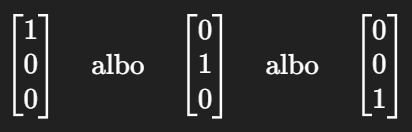
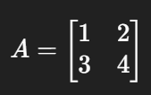
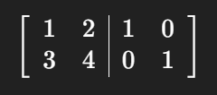
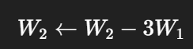
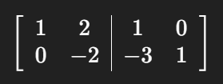
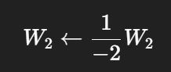
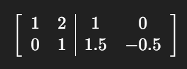
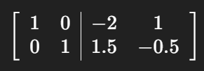
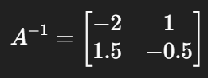

Jasne — rozpiszę to **bardzo prosto**, dokładnie z idei z tablicy.

Chodzi o **znalezienie macierzy odwrotnej metodą Gaussa-Jordana**.

---

# O co chodzi w tej metodzie?

Masz macierz (A).
Chcesz dostać $(A^{-1})$.

Robisz to tak:

1. obok macierzy (A) dopisujesz macierz jednostkową (I),
2. wykonujesz operacje na wierszach tak, żeby z lewej strony zrobić (I),
3. wtedy po prawej stronie wyjdzie $(A^{-1})$.

Czyli startujesz od:

$
[
[A \mid I]
]
$

i chcesz dojść do:

$
[
[I \mid A^{-1}]
]
$

---

# Jakie operacje wolno robić?

Na wierszach wolno:

1. zamieniać dwa wiersze miejscami,
2. mnożyć cały wiersz przez liczbę różną od zera,
3. dodawać do jednego wiersza wielokrotność innego wiersza.

To są dokładnie te operacje, które masz na tablicy.

---

# Co znaczą notatki z tablicy?

Na tablicy masz mniej więcej taki algorytm:

dla każdej kolumny $(i = 0, 1, \dots, n-1)$:

### 1. Sprawdź element główny (A[i][i])

To element na przekątnej.

Jeśli jest równy 0, to:

* szukasz niżej wiersza, gdzie w tej samej kolumnie jest liczba różna od zera,
* zamieniasz wiersze.

Bo nie da się dzielić przez 0.

---

### 2. Podziel cały wiersz przez element główny

Chcesz, żeby na przekątnej pojawiła się jedynka.

Czyli jeśli w wierszu masz np.

$
[
[2\ 4\ 6 \mid 1\ 0\ 0]
]
$

to dzielisz wszystko przez 2 i dostajesz:

$
[
[1\ 2\ 3 \mid 0.5\ 0\ 0]
]
$

---

### 3. Wyzeruj pozostałe liczby w tej kolumnie

Jeśli w tej samej kolumnie nad lub pod jedynką są inne liczby, to trzeba je usunąć.

Czyli:

* bierzesz inny wiersz,
* odejmujesz od niego odpowiednią wielokrotność wiersza z jedynką.

Po to, żeby w tej kolumnie zostało:

* 1 na przekątnej,
* 0 wszędzie indziej.

---

# Na czym polega cały plan?

Dla każdej kolumny robisz z niej taki wygląd:



czyli stopniowo zamieniasz lewą stronę w macierz jednostkową.

---

# Przykład bardzo prosty (2 x 2)

Weźmy:



Dopisujemy macierz jednostkową:



---

## Krok 1 — pierwsza kolumna

Na pozycji ((1,1)) już mamy 1, więc dobrze.

Trzeba wyzerować 3 pod spodem.

Robimy:



Dostajemy:



---

## Krok 2 — druga kolumna

Na przekątnej mamy (-2), chcemy zrobić z tego 1.

Dzielimy drugi wiersz przez (-2):



Dostajemy:



---

## Krok 3 — zerujemy 2 nad jedynką

Robimy:


Dostajemy:



Lewa strona to już macierz jednostkowa, więc prawa strona to odwrotność:



---

# Jak to przełożyć na kod?

Twoje notatki z tablicy odpowiadają dokładnie temu schematowi:

```python
dla i od 0 do n-1:
    jeśli A[i][i] == 0:
        znajdź wiersz niżej i zamień

    podziel cały wiersz i przez A[i][i]

    dla każdego wiersza k != i:
        odejmij od wiersza k wiersz i pomnożony przez A[k][i]
```

---

# Gotowy prosty kod w Pythonie

Bez bibliotek:

```python
def macierz_odwrotna_gauss_jordan(macierz):
    n = len(macierz)

    # sprawdzenie czy macierz jest kwadratowa
    for wiersz in macierz:
        if len(wiersz) != n:
            raise ValueError("Macierz musi być kwadratowa")

    # tworzymy macierz rozszerzoną [A | I]
    rozszerzona = []

    for i in range(n):
        wiersz = []
        for j in range(n):
            wiersz.append(float(macierz[i][j]))

        for j in range(n):
            if i == j:
                wiersz.append(1.0)
            else:
                wiersz.append(0.0)

        rozszerzona.append(wiersz)

    # algorytm Gaussa-Jordana
    for i in range(n):
        # jeśli na przekątnej jest 0, zamień wiersze
        if rozszerzona[i][i] == 0:
            znaleziono = False
            for k in range(i + 1, n):
                if rozszerzona[k][i] != 0:
                    rozszerzona[i], rozszerzona[k] = rozszerzona[k], rozszerzona[i]
                    znaleziono = True
                    break
            if not znaleziono:
                raise ValueError("Macierz nie ma odwrotności")

        # dzielenie całego wiersza przez element główny
        element_glowny = rozszerzona[i][i]
        for j in range(2 * n):
            rozszerzona[i][j] = rozszerzona[i][j] / element_glowny

        # zerowanie pozostałych elementów w tej kolumnie
        for k in range(n):
            if k != i:
                wspolczynnik = rozszerzona[k][i]
                for j in range(2 * n):
                    rozszerzona[k][j] = rozszerzona[k][j] - wspolczynnik * rozszerzona[i][j]

    # wyciągamy prawą stronę
    odwrotna = []
    for i in range(n):
        wiersz = []
        for j in range(n, 2 * n):
            wiersz.append(rozszerzona[i][j])
        odwrotna.append(wiersz)

    return odwrotna
```

---

# Przykład użycia

```python
macierz = [
    [1, 2],
    [3, 4]
]

wynik = macierz_odwrotna_gauss_jordan(macierz)

print("Macierz odwrotna:")
for wiersz in wynik:
    print(wiersz)
```

Wynik:

```python
[-2.0, 1.0]
[1.5, -0.5]
```

---

# Najkrócej jak to zapamiętać

## Gauss-Jordan = 3 rzeczy

dla każdej kolumny:

1. **ustaw jedynkę na przekątnej**
2. **wyzeruj wszystko nad i pod nią**
3. **powtarzaj aż lewa strona stanie się macierzą jednostkową**

Wtedy prawa strona jest macierzą odwrotną.

---

# Co możesz napisać w opisie zadania

> Metoda Gaussa-Jordana polega na rozszerzeniu macierzy (A) o macierz jednostkową (I), a następnie wykonywaniu elementarnych operacji na wierszach tak, aby lewą stronę sprowadzić do macierzy jednostkowej. Po zakończeniu tych operacji prawa strona macierzy rozszerzonej jest macierzą odwrotną $(A^{-1})$.