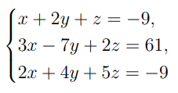
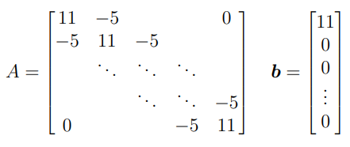

# Zadanie 1

Korzystając z funkcji napisanych na poprzednich zajęciach rozwiąż układy równań liniowych.

## Zadanie 1a



## Jak to rozwiązać metodą z poprzednich zajęć?

Skoro masz już funkcję liczącą macierz odwrotną, to korzystasz ze wzoru:

$
x = A^{-1}b
$

Czyli:

1. liczysz macierz odwrotną (A^{-1}),
2. mnożysz ją przez wektor (b),
3. dostajesz rozwiązanie.

## Jak rozumieć schemat implementacji?

### Krok 1

Tworzysz macierz `A` i wektor `b`.

### Krok 2

Zamieniasz `b` na macierz kolumnową:

$
b =
\begin{bmatrix}
-9 \\
61 \\
-9
\end{bmatrix}
$

bo funkcja mnożenia działa na macierzach.

### Krok 3

Liczysz:

$
A^{-1} \cdot b
$

### Krok 4

Otrzymujesz wynik w postaci macierzy kolumnowej, więc zamieniasz go na zwykły wektor.

## Kod

```python
import time

def zmierz_czas(funkcja, A, b): 
    start = time.perf_counter()
    wynik = funkcja(A, b)
    koniec = time.perf_counter()
    return wynik, koniec - start

def macierz_odwrotna_Gaussa_Jordana(macierz):
    n = len(macierz)

    for wiersz in macierz:
        if len(wiersz) != n:
            raise ValueError("Macierz musi być kwadratowa")

    rozszerzona_macierz = []

    for i in range(n):
        wiersz = []

        for j in range(n):
            wiersz.append(macierz[i][j])
        
        for j in range(n):
            if i == j:
                wiersz.append(1)
            else:
                wiersz.append(0)

        rozszerzona_macierz.append(wiersz)

    for i in range(n):
        if rozszerzona_macierz[i][i] == 0:
            znaleziono = False
            for k in range(i+1, n):
                if rozszerzona_macierz[k][i] != 0:
                    rozszerzona_macierz[i], rozszerzona_macierz[k] = rozszerzona_macierz[k], rozszerzona_macierz[i]
                    znaleziono = True
                    break
            if not znaleziono:
                raise ValueError("Macierz nie ma odwrotności")
            
        element_glowny = rozszerzona_macierz[i][i]
        for j in range(2 * n):
            rozszerzona_macierz[i][j] = rozszerzona_macierz[i][j] / element_glowny

        for k in range(n):
            if k != i:
                wspolczynnik = rozszerzona_macierz[k][i]
                for j in range(2 * n):
                    rozszerzona_macierz[k][j] = rozszerzona_macierz[k][j] - wspolczynnik * rozszerzona_macierz[i][j]

    odwrotna = []
    for i in range(n):
        wiersz = []
        for j in range(n, 2 * n):
            wiersz.append(rozszerzona_macierz[i][j])
        odwrotna.append(wiersz)

    return odwrotna

def mnozenie_macierzy(macierz1, macierz2):
    ilosc_wierszy_macierz1 = len(macierz1)
    ilosc_wierszy_macierz2 = len(macierz2)
    ilosc_kolumn_macierz1 = len(macierz1[0])
    ilosc_kolumn_macierz2 = len(macierz2[0])

    if ilosc_kolumn_macierz1 != ilosc_wierszy_macierz2:
        raise ValueError("Nie da się pomnożyć tych macierzy")
    
    wynik = []
    for i in range(ilosc_wierszy_macierz1):
        wiersz = []
        for j in range(ilosc_kolumn_macierz2):
            suma = 0
            for k in range(ilosc_kolumn_macierz1):
                suma += macierz1[i][k] * macierz2[k][j]
            wiersz.append(suma)
        wynik.append(wiersz)

    return wynik

def rozwiarz_uklad_rownan(macierz_A, wektor_b):
    b_macierz = [[b] for b in wektor_b]

    A_odwrotna = macierz_odwrotna_Gaussa_Jordana(macierz_A)

    wynik = mnozenie_macierzy(A_odwrotna, b_macierz)

    return wynik

A = [
    [1, 2, 1],
    [3, -7, 2],
    [2, 4, 5]
]

b = [-9, 61, -9]

wynik, czas = zmierz_czas(rozwiarz_uklad_rownan, A, b)

print("Rozwiązanie układu równań a):")
print("x =", wynik[0][0])
print("y =", wynik[1][0])
print("z =", wynik[2][0])
print("Czas: ", czas)
```

## Wynik

$
x = 2.0,\qquad y = -7.0,\qquad z = 3.0
$

$
czas = 1.4600111171603203e-05 = 1.4600111171603203 * 10^{-5} = 0.0000146 s = 14.6 mikrosekundy
$

---

## Zadanie 1b



Rozwiązać układ:

$
Ax = b
$

gdzie:

* $(A \in \mathbb{R}^{n \times n})$,
* $(b \in \mathbb{R}^{n \times 1})$,
* $(n \in \{8, 10\})$,

a macierz ma postać trójdiagonalną:

* na przekątnej są (11),
* nad i pod przekątną są (-5),
* reszta elementów to (0).

Wektor:

$
b =
\begin{bmatrix}
11 \\
0 \\
0 \\
\vdots \\
0
\end{bmatrix}
$

## Jak rozumieć tę macierz?

Dla (n=8) macierz wygląda tak:

$
A =
\begin{bmatrix}
11 & -5 & 0 & 0 & 0 & 0 & 0 & 0 \\
-5 & 11 & -5 & 0 & 0 & 0 & 0 & 0 \\
0 & -5 & 11 & -5 & 0 & 0 & 0 & 0 \\
0 & 0 & -5 & 11 & -5 & 0 & 0 & 0 \\
0 & 0 & 0 & -5 & 11 & -5 & 0 & 0 \\
0 & 0 & 0 & 0 & -5 & 11 & -5 & 0 \\
0 & 0 & 0 & 0 & 0 & -5 & 11 & -5 \\
0 & 0 & 0 & 0 & 0 & 0 & -5 & 11
\end{bmatrix}
$

To znaczy:

* główna przekątna ma same `11`,
* sąsiednie przekątne mają `-5`.

## Jak zrobić implementację?

Najpierw trzeba umieć wygenerować taką macierz automatycznie.

## Kod tworzący macierz i wektor

```python
def zeros(n,m):
    macierz = []

    for i in range(n):
        wiersz = []
        for j in range(m):
            wiersz.append(0)
        macierz.append(wiersz)

    return macierz

def tworzenie_macierzy(n):
    A = zeros(n, n)
    b = [11] + [0] * (n - 1)

    for i in range(n):
        for j in range(n):
            if i == j:
                A[i][j] = 11
            elif abs(i - j) == 1:
                A[i][j] = -5
    
    return A, b
```

## Jak rozumieć schemat implementacji?

### Krok 1

Tworzysz pustą macierz `n x n`.

### Krok 2

Jeśli jesteś na przekątnej (`i == j`), wpisujesz `11`.

### Krok 3

Jeśli jesteś tuż obok przekątnej (`abs(i-j) == 1`), wpisujesz `-5`.

### Krok 4

Wektor `b` ma `11` na pierwszej pozycji i same zera dalej.

## Rozwiązanie

Potem rozwiązujesz dokładnie tak samo jak w 1a:

$
x = A^{-1}*b
$

## Kod

```python
n_8_A, n_8_b = tworzenie_macierzy(8)
n_10_A, n_10_b = tworzenie_macierzy(10)

wynik, czas = zmierz_czas(rozwiarz_uklad_rownan, n_8_A, n_8_b)
print("Rozwiązanie układu równań b) n=8:")
for i in range(len(wynik)):
    print(wynik[i])
print("Czas: ", czas)

wynik, czas = zmierz_czas(rozwiarz_uklad_rownan, n_10_A, n_10_b)
print("Rozwiązanie układu równań b) n=10:")
for i in range(len(wynik)):
    print(wynik[i])
print("Czas: ", czas)
```

## Wynik

$
Rozwiązanie \space układu \space równań \space b) \space n=8: \\
[1.4111459559532078] \\
[0.9045211030970575] \\
[0.5788004708603187] \\
[0.36883993279564314] \\
[0.23264738129009646] \\
[0.1429843060425689] \\
[0.0819180920035551] \\
[0.037235496365252314] \\
Czas:  6.560003384947777e-05 \\
Rozwiązanie \space układu \space równań \space b) \space n=10: \\
[1.4117167939551722] \\
[0.905776946701379] \\
[0.5809924887878618] \\
[0.3724065286319164] \\
[0.23830187420235457] \\
[0.15185759461326348] \\
[0.09578483394682505] \\
[0.05886904006975162] \\
[0.03372705420662853] \\
[0.015330479184831151] \\
Czas:  0.00011690007522702217 \\
$

---

## Zadanie 1c

Rozwiązać układ równań, którego współczynniki tworzą macierz gęstą $(10 \times 10)$.

## Co to znaczy macierz gęsta?

Macierz gęsta to taka, w której dużo elementów jest różnych od zera.

To przeciwieństwo macierzy rzadkiej lub trójdiagonalnej.

## Jak to zrobić sensownie?

Najlepiej zbudować macierz, dla której znasz rozwiązanie.
Wtedy łatwo sprawdzić, czy program działa dobrze.

### Pomysł

1. wybierasz macierz gęstą (A),
2. wybierasz znany wektor (x),
3. liczysz:

$
b = Ax
$

4. potem rozwiązujesz układ (Ax = b),
5. i sprawdzasz, czy odzyskałaś swoje (x).

## Kod

```python
def tworzenie_macierzy_gestej(n, m):
    A = zeros(n, m)

    for i in range(n):
        for j in range(m):
            if i == j:
                A[i][j] = 20.0
            else:
                A[i][j] = float(i + j + 1)

    x_prawdziwe = [1.0, 2.0, 3.0, 4.0, 5.0, 6.0, 7.0, 8.0, 9.0, 10.0]

    x_macierz = [[x] for x in x_prawdziwe]
    b_macierz = mnozenie_macierzy(A, x_macierz)

    b = []
    for i in range(len(b_macierz)):
        b.append(b_macierz[i][0])

    return A, b, x_prawdziwe

macierz, wektor, x = tworzenie_macierzy_gestej(10, 10)

wynik, czas = zmierz_czas(rozwiarz_uklad_rownan, macierz, wektor)

print("Rozwiązanie układu równań c):")
for i in range(len(wynik)):
    print(wynik[i])
print("Czas: ", czas)
```

## Jak rozumieć ten schemat?

Nie zgadujesz `b`.
Tworzysz takie `b`, żeby mieć pewność, że rozwiązanie jest znane.

To bardzo wygodne przy testowaniu metod numerycznych.

## Wynik

$
[1.0] \\
[1.9999999999999716] \\
[3.0] \\
[4.0] \\
[5.000000000000057] \\
[5.999999999999972]\\
[7.0]\\
[8.000000000000028]\\
[8.999999999999972]\\
[10.0]\\
Czas:  9.989994578063488e-05
$

> Otrzymane rozwiązanie jest bardzo bliskie wektorowi x = [1,2,3,4,5,6,7,8,9,10], co potwierdza poprawność działania programu. Niewielkie różnice wynikają z błędów zaokrągleń.

---

# Zadanie 2

Napisz funkcję znajdującą rozkład macierzy na iloczyn macierzy trójkątnych:

[
A = LU
]

Następnie użyj jej do rozwiązania układów z zadania 1.

## Co to jest rozkład LU?

Macierz (A) rozkłada się na:

* (L) — macierz dolnotrójkątną,
* (U) — macierz górnotrójkątną.

Czyli:

[
A = LU
]

## Po co to robić?

Bo zamiast rozwiązywać od razu:

[
Ax = b
]

rozbijasz to na dwa prostsze układy:

[
Ly = b
]

a potem:

[
Ux = y
]

## Jak rozumieć schemat implementacji?

### Etap 1 — wyznaczenie `L` i `U`

Budujesz dwie macierze:

* `L` ma jedynki na przekątnej,
* `U` powstaje z odpowiednich wzorów.

### Etap 2 — podstawianie w przód

Rozwiązujesz (Ly=b).

Ponieważ `L` jest dolnotrójkątna, liczysz:

* najpierw (y_1),
* potem (y_2),
* itd.

### Etap 3 — podstawianie w tył

Rozwiązujesz (Ux=y).

Ponieważ `U` jest górnotrójkątna, liczysz:

* najpierw ostatnią niewiadomą,
* potem poprzednią,
* itd.

## Kod

```python
def rozklad_LU(A):
    n = len(A)

    L = zeros(n, n)
    U = zeros(n, n)

    for i in range(n):
        L[i][i] = 1.0

    for i in range(n):
        for j in range(i, n):
            suma = 0.0
            for k in range(i):
                suma += L[i][k] * U[k][j]
            U[i][j] = A[i][j] - suma

        for j in range(i + 1, n):
            suma = 0.0
            for k in range(i):
                suma += L[j][k] * U[k][i]
            L[j][i] = (A[j][i] - suma) / U[i][i]

    return L, U
```

## Rozwiązywanie układu przez LU

```python
def podstawianie_w_przod(L, b):
    n = len(L)
    y = [0.0] * n

    for i in range(n):
        suma = 0.0
        for j in range(i):
            suma += L[i][j] * y[j]
        y[i] = b[i] - suma

    return y


def podstawianie_w_tyl(U, y):
    n = len(U)
    x = [0.0] * n

    for i in range(n - 1, -1, -1):
        suma = 0.0
        for j in range(i + 1, n):
            suma += U[i][j] * x[j]
        x[i] = (y[i] - suma) / U[i][i]

    return x


def rozwiaz_przez_LU(A, b):
    L, U = rozklad_LU(A)
    y = podstawianie_w_przod(L, b)
    x = podstawianie_w_tyl(U, y)
    return x
```

---

# Zadanie 3

Napisz funkcję znajdującą rozkład Choleskiego dla macierzy:

* kwadratowej,
* symetrycznej,
* dodatnio określonej.

Następnie użyj jej do przykładu b) z zadania 1.

## Co to jest rozkład Choleskiego?

Dla odpowiedniej macierzy:

[
A = LL^T
]

gdzie:

* (L) jest macierzą dolnotrójkątną,
* (L^T) jest jej transpozycją.

## Kiedy można go używać?

Tylko gdy macierz jest:

* symetryczna,
* dodatnio określona.

Macierz z zadania 1b spełnia ten warunek.

## Jak rozumieć schemat implementacji?

### Krok 1

Liczysz kolejne elementy macierzy `L`.

### Krok 2

Na przekątnej liczysz pierwiastek z odpowiedniej wartości.

### Krok 3

Poza przekątną liczysz elementy ze wzoru zależnego od już policzonych elementów.

### Krok 4

Rozwiązujesz:
[
Ly=b
]
a potem:
[
L^Tx=y
]

## Kod

```python
def rozklad_Choleskiego(A):
    n = len(A)
    L = zeros(n, n)

    for i in range(n):
        for j in range(i + 1):
            suma = 0.0
            for k in range(j):
                suma += L[i][k] * L[j][k]

            if i == j:
                wartosc = A[i][i] - suma
                if wartosc <= 0:
                    raise ValueError("Macierz nie jest dodatnio określona")
                L[i][j] = wartosc ** 0.5
            else:
                L[i][j] = (A[i][j] - suma) / L[j][j]

    return L
```

## Rozwiązywanie układu

```python
def rozwiaz_przez_Choleskiego(A, b):
    L = rozklad_Choleskiego(A)
    Lt = transpozycja(L)

    y = podstawianie_w_przod(L, b)
    x = podstawianie_w_tyl(Lt, y)

    return x
```

---

# Zadanie 4

Napisz funkcję rozwiązującą układy równań za pomocą eliminacji Gaussa.

## Na czym polega eliminacja Gaussa?

Macierz sprowadzasz do postaci trójkątnej górnej przez zerowanie elementów pod przekątną.

Potem rozwiązujesz układ podstawianiem w tył.

## Jak rozumieć schemat implementacji?

### Etap 1 — eliminacja w przód

Dla każdej kolumny:

* wybierasz wiersz główny,
* zerujesz elementy pod nim.

### Etap 2 — podstawianie w tył

Gdy macierz jest już górnotrójkątna, liczysz niewiadome od końca.

## Kod

```python
def rozwiaz_przez_Gaussa(A, b):
    n = len(A)

    M = kopiuj_macierz(A)
    bb = []
    for x in b:
        bb.append(float(x))

    for i in range(n):
        if M[i][i] == 0:
            znaleziono = False
            for k in range(i + 1, n):
                if M[k][i] != 0:
                    M[i], M[k] = M[k], M[i]
                    bb[i], bb[k] = bb[k], bb[i]
                    znaleziono = True
                    break
            if not znaleziono:
                raise ValueError("Układ nie ma jednoznacznego rozwiązania")

        for k in range(i + 1, n):
            wsp = M[k][i] / M[i][i]
            for j in range(i, n):
                M[k][j] = M[k][j] - wsp * M[i][j]
            bb[k] = bb[k] - wsp * bb[i]

    x = [0.0] * n
    for i in range(n - 1, -1, -1):
        suma = 0.0
        for j in range(i + 1, n):
            suma += M[i][j] * x[j]
        x[i] = (bb[i] - suma) / M[i][i]

    return x
```

---

# Mierzenie czasu

W każdym zadaniu masz porównać czasy.

## Jak rozumieć schemat?

1. zapisujesz czas startu,
2. uruchamiasz metodę,
3. zapisujesz czas końca,
4. odejmujesz.

## Kod

```python
import time

def zmierz_czas(funkcja, A, b):
    start = time.perf_counter()
    wynik = funkcja(A, b)
    koniec = time.perf_counter()
    return wynik, koniec - start
```

---

# Krótki wniosek do wszystkich zadań

Możesz napisać tak:

```markdown
## Wnioski

Wszystkie zastosowane metody prowadzą do tego samego rozwiązania układów równań liniowych, jednak różnią się kosztami obliczeniowymi i warunkami stosowalności.

- Metoda oparta na macierzy odwrotnej jest poprawna, ale najmniej opłacalna obliczeniowo.
- Rozkład LU upraszcza rozwiązanie układu do dwóch prostszych układów trójkątnych.
- Rozkład Choleskiego jest bardzo efektywny, ale można go stosować tylko do macierzy symetrycznych i dodatnio określonych.
- Eliminacja Gaussa jest metodą uniwersalną i jedną z podstawowych metod rozwiązywania układów liniowych.
- Porównanie czasów wykonania pokazuje, które metody są bardziej praktyczne dla większych macierzy.
```

Jeśli chcesz, w następnej wiadomości rozpiszę Ci jeszcze **gotowe osobne notatki Markdown do Zadania 1, 2, 3 i 4**, każdą jako osobną sekcję do sprawozdania.
