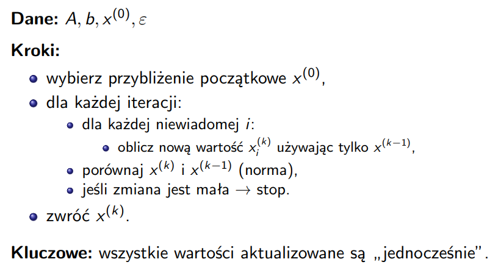

# Zadanie 1

**Napisz program implementujący metodę Jacobiego iteracyjnego rozwiązywania układów równań liniowych, w której warunkiem zatrzymania będzie:**

a) liczba iteracji,  
b) norma wektora powstałego przez odjęcie wektorów określających kolejne przybliżenia,  
c) błąd uzyskanego przybliżenia.

## Co to jest metoda Jacobiego?

Metoda Jacobiego jest metodą iteracyjną, czyli nie liczy rozwiązania od razu, tylko buduje kolejne przybliżenia:

$$
x^{(0)}, x^{(1)}, x^{(2)}, \dots
$$

Każde nowe przybliżenie oblicza się wyłącznie na podstawie poprzedniego.

Dla układu:

$$
Ax = b
$$

każdą niewiadomą w iteracji $k$ obliczamy na podstawie wartości z iteracji poprzedniej, czyli $x^{(k-1)}$.

wzór metody Jacobiego ma postać:

$$
x_i^{(k)} =
\frac{1}{a_{ii}}
\left(
b_i - \sum_{j \ne i} a_{ij}x_j^{(k-1)}
\right)
$$

gdzie:

- $a_{ii}$ - element na przekątnej macierzy,
- $b_i$ - odpowiedni element wektora prawej strony,
- $x_j^{(k-1)}$ - wartości z poprzedniej iteracji.

## Jak rozumieć schemat implementacji?

### Krok 1

Tworzysz wektor początkowy $x^{(0)}$, na przykład:

$$
x^{(0)} = [0,0,0,0]
$$

### Krok 2

Dla każdej iteracji liczysz nowy wektor $x^{(k)}$ na podstawie poprzedniego wektora $x^{(k-1)}$.

### Krok 3

Po każdej iteracji sprawdzasz warunek zatrzymania.

### Krok 4

Jeśli warunek jest spełniony, kończysz obliczenia.



## Warunki zatrzymania

### a) Liczba iteracji

Program kończy działanie po zadanej liczbie kroków.

### b) Iloraz normy różnicy kolejnych przybliżeń i normy bieżącego przybliżenia

Sprawdzasz, czy:

$$
\frac{\|x^{(k)} - x^{(k-1)}\|}{\|x^{(k)}\|} \le \varepsilon
$$

W programie używana jest norma maksimum.  
Jeżeli warunek jest spełniony, uznajesz, że kolejne przybliżenia zmieniają się już bardzo nieznacznie.

### c) Błąd uzyskanego przybliżenia

Jeżeli znasz dokładne rozwiązanie $x^*$, możesz sprawdzać:

$$
\|x^{(k)} - x^*\| < \varepsilon
$$

## Kod

```python
def norma_max(wektor):  # funkcja oblicza normę maksimum wektora
    maksimum = abs(wektor[0])  # jako początkowe maksimum przyjmujemy moduł pierwszego elementu
    for i in range(1, len(wektor)):  # przechodzimy po kolejnych elementach wektora
        if abs(wektor[i]) > maksimum:  # sprawdzamy, czy moduł bieżącego elementu jest większy od dotychczasowego maksimum
            maksimum = abs(wektor[i])  # jeśli tak, aktualizujemy maksimum
    return maksimum  # zwracamy największy moduł elementu wektora


def odejmij_wektory(wektor1, wektor2):  # funkcja odejmuje od siebie dwa wektory o tej samej długości
    wynik = []  # tworzymy pustą listę na wynik odejmowania
    for i in range(len(wektor1)):  # przechodzimy po wszystkich indeksach wektora
        wynik.append(wektor1[i] - wektor2[i])  # dodajemy do wyniku różnicę odpowiednich elementów
    return wynik  # zwracamy wektor różnicy


def wypisz_wektor(wektor, nazwa="x"):  # funkcja wypisuje kolejne współrzędne wektora
    for i in range(len(wektor)):  # przechodzimy po wszystkich elementach wektora
        print(f"{nazwa}{i+1} = {wektor[i]}")  # wypisujemy element w formacie x1, x2, x3 itd.


def jacobi(A, b, x0, max_iter=100, epsilon=1e-3, warunek_stopu="iteracje", rozwiazanie_dokladne=None):  # funkcja realizuje metodę Jacobiego
    n = len(A)  # zapisujemy liczbę równań i niewiadomych
    x_stare = x0[:]  # kopiujemy przybliżenie początkowe do wektora poprzedniej iteracji

    for i in range(n):  # sprawdzamy wszystkie elementy na przekątnej macierzy
        if A[i][i] == 0:  # jeśli na przekątnej pojawi się zero
            raise ValueError("Na przekątnej macierzy nie może być zera")  # przerywamy działanie programu z komunikatem o błędzie

    for krok in range(1, max_iter + 1):  # wykonujemy kolejne iteracje od 1 do maksymalnej liczby iteracji
        x_nowe = [0.0] * n  # tworzymy nowy wektor przybliżenia wypełniony zerami

        for i in range(n):  # przechodzimy po wszystkich równaniach
            suma = 0.0  # zerujemy sumę składników spoza przekątnej dla i-tego równania
            for j in range(n):  # przechodzimy po wszystkich kolumnach macierzy
                if j != i:  # pomijamy element z przekątnej
                    suma += A[i][j] * x_stare[j]  # dodajemy iloczyn współczynnika macierzy i starego przybliżenia

            x_nowe[i] = (b[i] - suma) / A[i][i]  # liczymy nową wartość i-tej niewiadomej ze wzoru Jacobiego

        if warunek_stopu == "iteracje":  # sprawdzamy, czy wybrano warunek stopu oparty na liczbie iteracji
            if krok == max_iter:  # jeśli osiągnięto zadaną liczbę iteracji
                return x_nowe, krok  # zwracamy aktualne przybliżenie i liczbę wykonanych iteracji

        elif warunek_stopu == "roznica":  # sprawdzamy, czy wybrano warunek stopu ze slajdu
            roznica = odejmij_wektory(x_nowe, x_stare)  # obliczamy różnicę kolejnych przybliżeń
            norma_roznicy = norma_max(roznica)  # liczymy normę maksimum tej różnicy
            norma_biezaca = norma_max(x_nowe)  # liczymy normę maksimum bieżącego przybliżenia

            if norma_biezaca == 0:  # sprawdzamy przypadek szczególny, gdy norma bieżącego wektora jest równa zero
                if norma_roznicy <= epsilon:  # jeśli sama norma różnicy spełnia warunek
                    return x_nowe, krok  # zwracamy wynik i numer iteracji
            else:  # w zwykłym przypadku, gdy norma bieżącego przybliżenia nie jest zerowa
                if (norma_roznicy / norma_biezaca) <= epsilon:  # sprawdzamy warunek stopu w postaci ilorazu norm
                    return x_nowe, krok  # zwracamy wynik i numer iteracji

        elif warunek_stopu == "blad":  # sprawdzamy, czy wybrano warunek stopu oparty na błędzie względem rozwiązania dokładnego
            if rozwiazanie_dokladne is None:  # jeśli nie podano rozwiązania dokładnego
                raise ValueError("Dla warunku 'blad' trzeba podać dokładne rozwiązanie")  # zgłaszamy błąd
            blad = odejmij_wektory(x_nowe, rozwiazanie_dokladne)  # obliczamy różnicę między przybliżeniem a rozwiązaniem dokładnym
            if norma_max(blad) < epsilon:  # sprawdzamy, czy norma maksimum błędu jest mniejsza od epsilon
                return x_nowe, krok  # zwracamy wynik i numer iteracji

        x_stare = x_nowe[:]  # po zakończeniu iteracji przepisujemy nowe przybliżenie jako stare

    return x_stare, max_iter  # jeśli nie spełniono warunku stopu wcześniej, zwracamy ostatnie przybliżenie i maksymalną liczbę iteracji


print("--------------------ZADANIE 1--------------------")  # wypisujemy nagłówek zadania

A = [  # definiujemy macierz współczynników układu ze slajdów
    [4.0, -2.0, 0.0, 0.0],  # pierwszy wiersz macierzy A
    [-2.0, 5.0, -1.0, 0.0],  # drugi wiersz macierzy A
    [0.0, -1.0, 4.0, 2.0],  # trzeci wiersz macierzy A
    [0.0, 0.0, 2.0, 3.0]  # czwarty wiersz macierzy A
]

b = [0.0, 2.0, 3.0, -2.0]  # definiujemy wektor prawej strony układu
x0 = [0.0, 0.0, 0.0, 0.0]  # definiujemy przybliżenie początkowe
x_dokladne = [0.5, 1.0, 2.0, -2.0]  # zapisujemy rozwiązanie dokładne dla tego przykładu

print("\nDane:")  # wypisujemy napis informujący o danych wejściowych
print("Macierz A:")  # wypisujemy nagłówek dla macierzy A
for wiersz in A:  # przechodzimy po wszystkich wierszach macierzy
    print(wiersz)  # wypisujemy każdy wiersz macierzy

print("\nWektor b:")  # wypisujemy nagłówek dla wektora b
print(b)  # wypisujemy wektor prawej strony

print("\nPrzybliżenie początkowe x^(0):")  # wypisujemy nagłówek dla przybliżenia początkowego
print(x0)  # wypisujemy wektor początkowy

print("\nDokładne rozwiązanie:")  # wypisujemy nagłówek dla rozwiązania dokładnego
print(x_dokladne)  # wypisujemy rozwiązanie dokładne

print("\n-------------------- a) LICZBA ITERACJI --------------------")  # wypisujemy nagłówek dla punktu a
wynik_a, iteracje_a = jacobi(  # wywołujemy metodę Jacobiego dla warunku stopu opartego na liczbie iteracji
    A, b, x0,  # przekazujemy macierz A, wektor b i przybliżenie początkowe
    max_iter=10,  # ustawiamy liczbę iteracji na 10
    warunek_stopu="iteracje"  # wybieramy warunek stopu oparty na liczbie iteracji
)

print("\nWynik końcowy po zadanej liczbie iteracji:")  # wypisujemy opis wyniku z punktu a
wypisz_wektor(wynik_a)  # wypisujemy końcowy wektor przybliżenia
print("Liczba iteracji:", iteracje_a)  # wypisujemy liczbę wykonanych iteracji

blad_a = odejmij_wektory(wynik_a, x_dokladne)  # obliczamy błąd względem rozwiązania dokładnego dla punktu a
print("Norma błędu względem rozwiązania dokładnego:", norma_max(blad_a))  # wypisujemy normę maksimum błędu

print("\n-------------------- b) WARUNEK ZE SLAJDU --------------------")  # wypisujemy nagłówek dla punktu b
wynik_b, iteracje_b = jacobi(  # wywołujemy metodę Jacobiego dla warunku stopu ze slajdu
    A, b, x0,  # przekazujemy macierz A, wektor b i przybliżenie początkowe
    max_iter=100,  # ustawiamy maksymalną liczbę iteracji na 100
    epsilon=1e-3,  # ustawiamy dokładność zgodną ze slajdem
    warunek_stopu="roznica"  # wybieramy warunek stopu oparty na ilorazie norm
)

print("\nWynik końcowy:")  # wypisujemy opis wyniku z punktu b
wypisz_wektor(wynik_b)  # wypisujemy końcowy wektor przybliżenia
print("Liczba iteracji:", iteracje_b)  # wypisujemy liczbę wykonanych iteracji

blad_b = odejmij_wektory(wynik_b, x_dokladne)  # obliczamy błąd względem rozwiązania dokładnego dla punktu b
print("Norma błędu względem rozwiązania dokładnego:", norma_max(blad_b))  # wypisujemy normę maksimum błędu

print("\n-------------------- c) BŁĄD UZYSKANEGO PRZYBLIŻENIA --------------------")  # wypisujemy nagłówek dla punktu c
wynik_c, iteracje_c = jacobi(  # wywołujemy metodę Jacobiego dla warunku stopu opartego na błędzie
    A, b, x0,  # przekazujemy macierz A, wektor b i przybliżenie początkowe
    max_iter=100,  # ustawiamy maksymalną liczbę iteracji na 100
    epsilon=1e-3,  # ustawiamy dokładność na 10 do potęgi minus 3
    warunek_stopu="blad",  # wybieramy warunek stopu oparty na błędzie względem rozwiązania dokładnego
    rozwiazanie_dokladne=x_dokladne  # przekazujemy rozwiązanie dokładne potrzebne do obliczenia błędu
)

print("\nWynik końcowy:")  # wypisujemy opis wyniku z punktu c
wypisz_wektor(wynik_c)  # wypisujemy końcowy wektor przybliżenia
print("Liczba iteracji:", iteracje_c)  # wypisujemy liczbę wykonanych iteracji

blad_c = odejmij_wektory(wynik_c, x_dokladne)  # obliczamy błąd względem rozwiązania dokładnego dla punktu c
print("Norma błędu względem rozwiązania dokładnego:", norma_max(blad_c))  # wypisujemy normę maksimum błędu
```

---

# Zadanie 2

**Napisz program implementujący metodę Gaussa-Seidla iteracyjnego rozwiązywania układów równań liniowych z analogicznymi warunkami zatrzymania jak w zadaniu 1.**

## Co to jest metoda Gaussa-Seidla?

Metoda Gaussa-Seidla jest podobna do metody Jacobiego, ale ma ważną różnicę:

podczas liczenia nowego przybliżenia wykorzystuje od razu te wartości, które zostały już policzone w bieżącej iteracji.

Każdą niewiadomą w iteracji $k$ obliczamy ze wzoru:

$$
x_i^{(k)} =
\frac{1}{a_{ii}}
\left(
b_i
- \sum_{j=1}^{i-1} a_{ij}x_j^{(k)}
- \sum_{j=i+1}^{n} a_{ij}x_j^{(k-1)}
\right),
\quad i=1,2,\dots,n
$$

dla $i = 1,2,...,n$.

Czyli:

- dla wcześniejszych współrzędnych używamy już **nowych wartości** z iteracji $k$,
- dla późniejszych współrzędnych używamy jeszcze **starych wartości** z iteracji $k-1$.

Dzięki temu metoda Gaussa-Seidla zwykle zbiega szybciej niż metoda Jacobiego.

## Różnica względem metody Jacobiego

W metodzie Jacobiego wszystkie nowe wartości obliczane są wyłącznie na podstawie poprzedniego przybliżenia.

W metodzie Gaussa-Seidla:

- korzystamy z najnowszych dostępnych wartości,
- wartości są aktualizowane **sekwencyjnie**,
- po obliczeniu $x_1^{(k)}$ można od razu użyć go do wyznaczenia $x_2^{(k)}$, potem $x_3^{(k)}$ itd.

## Jak rozumieć schemat implementacji?

### Krok 1

Tworzysz początkowe przybliżenie $x^{(0)}$.

### Krok 2

Dla każdej iteracji przechodzisz po współrzędnych po kolei: $i=1,2,\dots,n$.

### Krok 3

Przy obliczaniu nowej wartości $x_i^{(k)}$ używasz:

- nowych wartości $x_1^{(k)}, x_2^{(k)}, \dots, x_{i-1}^{(k)}$,
- starych wartości $x_{i+1}^{(k-1)}, x_{i+2}^{(k-1)}, \dots, x_n^{(k-1)}$.

### Krok 4

Po zakończeniu całej iteracji sprawdzasz warunek zatrzymania:

- liczba iteracji,
- iloraz normy różnicy kolejnych przybliżeń i normy bieżącego przybliżenia,
- błąd przybliżenia.

## Warunek stosowalności

Aby metoda mogła być wykonywana, na przekątnej macierzy nie może być zera, czyli:

$$
a_{ii} \ne 0 \quad \text{dla wszystkich } i=1,2,\dots,n
$$

## Warunki zatrzymania

### a) Liczba iteracji

Program kończy działanie po zadanej liczbie kroków.

### b) Iloraz normy różnicy kolejnych przybliżeń i normy bieżącego przybliżenia

Zgodnie ze slajdami sprawdzamy warunek:

$$
\frac{\|x^{(k)} - x^{(k-1)}\|}{\|x^{(k)}\|} \le \varepsilon
$$

W programie używana jest norma maksimum.

### c) Błąd uzyskanego przybliżenia

Jeżeli znamy rozwiązanie dokładne $x^*$, możemy sprawdzać:

$$
\|x^{(k)} - x^*\| < \varepsilon
$$

## Przykład użyty w programie

W programie wykorzystano ten sam układ równań co na slajdach:

$$
\begin{cases}
4x_1 - 2x_2 = 0 \\
-2x_1 + 5x_2 - x_3 = 2 \\
-x_2 + 4x_3 + 2x_4 = 3 \\
2x_3 + 3x_4 = -2
\end{cases}
$$

z przybliżeniem początkowym:

$$
x^{(0)} = (0,0,0,0)^T
$$

oraz rozwiązaniem dokładnym:

$$
x^* = (0.5,1,2,-2)^T
$$

Dla warunku ze slajdów przyjęto:

$$
\varepsilon = 10^{-3}
$$

## Kod

```python
def norma_max(wektor):  # definiujemy funkcję obliczającą normę maksimum wektora
    maksimum = abs(wektor[0])  # jako początkowe maksimum przyjmujemy moduł pierwszego elementu
    for i in range(1, len(wektor)):  # przechodzimy po kolejnych elementach wektora
        if abs(wektor[i]) > maksimum:  # sprawdzamy, czy moduł bieżącego elementu jest większy od obecnego maksimum
            maksimum = abs(wektor[i])  # jeśli tak, aktualizujemy wartość maksimum
    return maksimum  # zwracamy największy moduł elementu wektora


def odejmij_wektory(wektor1, wektor2):  # definiujemy funkcję odejmującą od siebie dwa wektory
    wynik = []  # tworzymy pustą listę na wynik odejmowania
    for i in range(len(wektor1)):  # przechodzimy po wszystkich indeksach wektora
        wynik.append(wektor1[i] - wektor2[i])  # dodajemy do wyniku różnicę odpowiednich elementów
    return wynik  # zwracamy obliczony wektor różnicy


def wypisz_wektor(wektor, nazwa="x"):  # definiujemy funkcję do ładnego wypisywania wektora
    for i in range(len(wektor)):  # przechodzimy po wszystkich elementach wektora
        print(f"{nazwa}{i+1} = {wektor[i]}")  # wypisujemy elementy jako x1, x2, x3 itd.


def gauss_seidel(A, b, x0, max_iter=100, epsilon=1e-3, warunek_stopu="iteracje", rozwiazanie_dokladne=None):  # definiujemy funkcję realizującą metodę Gaussa-Seidla
    n = len(A)  # zapisujemy liczbę równań i niewiadomych
    x = x0[:]  # kopiujemy przybliżenie początkowe do wektora roboczego

    for i in range(n):  # przechodzimy po wszystkich elementach przekątnej macierzy
        if A[i][i] == 0:  # sprawdzamy, czy na przekątnej nie ma zera
            raise ValueError("Na przekątnej macierzy nie może być zera")  # jeśli jest zero, zgłaszamy błąd

    for krok in range(1, max_iter + 1):  # wykonujemy kolejne iteracje od 1 do max_iter
        x_stare = x[:]  # zapisujemy kopię poprzedniego przybliżenia

        for i in range(n):  # przechodzimy po wszystkich niewiadomych
            suma1 = 0.0  # zerujemy sumę składników liczonych z nowych wartości
            for j in range(i):  # przechodzimy po indeksach wcześniejszych niż i
                suma1 += A[i][j] * x[j]  # dodajemy składniki z już zaktualizowanych wartości bieżącej iteracji

            suma2 = 0.0  # zerujemy sumę składników liczonych ze starych wartości
            for j in range(i + 1, n):  # przechodzimy po indeksach późniejszych niż i
                suma2 += A[i][j] * x_stare[j]  # dodajemy składniki z poprzedniej iteracji

            x[i] = (b[i] - suma1 - suma2) / A[i][i]  # obliczamy nową wartość x_i zgodnie ze wzorem Gaussa-Seidla

        if warunek_stopu == "iteracje":  # sprawdzamy, czy wybrano warunek stopu oparty na liczbie iteracji
            if krok == max_iter:  # jeśli osiągnięto zadaną liczbę iteracji
                return x, krok  # zwracamy aktualny wynik i liczbę iteracji

        elif warunek_stopu == "roznica":  # sprawdzamy, czy wybrano warunek stopu ze slajdów
            roznica = odejmij_wektory(x, x_stare)  # obliczamy różnicę między nowym i poprzednim przybliżeniem
            norma_roznicy = norma_max(roznica)  # obliczamy normę maksimum tej różnicy
            norma_biezaca = norma_max(x)  # obliczamy normę maksimum bieżącego przybliżenia

            if norma_biezaca == 0:  # sprawdzamy przypadek szczególny, gdy norma bieżącego przybliżenia wynosi zero
                if norma_roznicy <= epsilon:  # jeśli sama norma różnicy spełnia warunek stopu
                    return x, krok  # zwracamy wynik i liczbę iteracji
            else:  # wykonujemy standardowe sprawdzenie warunku stopu
                if (norma_roznicy / norma_biezaca) <= epsilon:  # sprawdzamy iloraz norm zgodnie ze slajdami
                    return x, krok  # zwracamy wynik i liczbę iteracji

        elif warunek_stopu == "blad":  # sprawdzamy, czy wybrano warunek stopu oparty na błędzie względem rozwiązania dokładnego
            if rozwiazanie_dokladne is None:  # jeśli nie podano rozwiązania dokładnego
                raise ValueError("Dla warunku 'blad' trzeba podać dokładne rozwiązanie")  # zgłaszamy błąd
            blad = odejmij_wektory(x, rozwiazanie_dokladne)  # obliczamy wektor błędu względem rozwiązania dokładnego
            if norma_max(blad) < epsilon:  # sprawdzamy, czy norma maksimum błędu jest mniejsza od epsilon
                return x, krok  # zwracamy wynik i liczbę iteracji

        else:  # obsługujemy przypadek niepoprawnej nazwy warunku stopu
            raise ValueError("Niepoprawny warunek stopu")  # zgłaszamy błąd dla nieznanego warunku stopu

    return x, max_iter  # jeśli warunek stopu nie został spełniony wcześniej, zwracamy ostatni wynik i maksymalną liczbę iteracji


A = [  # definiujemy macierz współczynników układu ze slajdów
    [4.0, -2.0, 0.0, 0.0],  # pierwszy wiersz macierzy A
    [-2.0, 5.0, -1.0, 0.0],  # drugi wiersz macierzy A
    [0.0, -1.0, 4.0, 2.0],  # trzeci wiersz macierzy A
    [0.0, 0.0, 2.0, 3.0]  # czwarty wiersz macierzy A
]

b = [0.0, 2.0, 3.0, -2.0]  # definiujemy wektor prawej strony układu
x0 = [0.0, 0.0, 0.0, 0.0]  # definiujemy przybliżenie początkowe x^(0)
x_dokladne = [0.5, 1.0, 2.0, -2.0]  # definiujemy rozwiązanie dokładne tego układu

print("\nDane:")  # wypisujemy nagłówek danych wejściowych
print("Macierz A:")  # wypisujemy napis informujący o macierzy A
for wiersz in A:  # przechodzimy po wszystkich wierszach macierzy
    print(wiersz)  # wypisujemy każdy wiersz macierzy

print("\nWektor b:")  # wypisujemy napis informujący o wektorze b
print(b)  # wypisujemy wektor prawej strony

print("\nPrzybliżenie początkowe x^(0):")  # wypisujemy napis informujący o przybliżeniu początkowym
print(x0)  # wypisujemy wektor początkowy

print("\nDokładne rozwiązanie:")  # wypisujemy napis informujący o rozwiązaniu dokładnym
print(x_dokladne)  # wypisujemy rozwiązanie dokładne

print("\n-------------------- a) LICZBA ITERACJI --------------------")  # wypisujemy nagłówek punktu a
wynik_a, iteracje_a = gauss_seidel(  # wywołujemy metodę Gaussa-Seidla dla warunku stopu opartego na liczbie iteracji
    A, b, x0,  # przekazujemy macierz A, wektor b i przybliżenie początkowe
    max_iter=10,  # ustawiamy liczbę iteracji na 10
    warunek_stopu="iteracje"  # wybieramy warunek stopu oparty na liczbie iteracji
)

print("\nWynik końcowy po zadanej liczbie iteracji:")  # wypisujemy opis wyniku dla punktu a
wypisz_wektor(wynik_a)  # wypisujemy końcowy wektor przybliżenia
print("Liczba iteracji:", iteracje_a)  # wypisujemy liczbę wykonanych iteracji

blad_a = odejmij_wektory(wynik_a, x_dokladne)  # obliczamy błąd względem rozwiązania dokładnego dla punktu a
print("Norma błędu względem rozwiązania dokładnego:", norma_max(blad_a))  # wypisujemy normę maksimum błędu

print("\n-------------------- b) WARUNEK ZE SLAJDU --------------------")  # wypisujemy nagłówek punktu b
wynik_b, iteracje_b = gauss_seidel(  # wywołujemy metodę Gaussa-Seidla dla warunku stopu zgodnego ze slajdami
    A, b, x0,  # przekazujemy macierz A, wektor b i przybliżenie początkowe
    max_iter=100,  # ustawiamy maksymalną liczbę iteracji na 100
    epsilon=1e-3,  # ustawiamy epsilon zgodnie ze slajdami
    warunek_stopu="roznica"  # wybieramy warunek stopu oparty na ilorazie norm
)

print("\nWynik końcowy:")  # wypisujemy opis wyniku dla punktu b
wypisz_wektor(wynik_b)  # wypisujemy końcowy wektor przybliżenia
print("Liczba iteracji:", iteracje_b)  # wypisujemy liczbę wykonanych iteracji

blad_b = odejmij_wektory(wynik_b, x_dokladne)  # obliczamy błąd względem rozwiązania dokładnego dla punktu b
print("Norma błędu względem rozwiązania dokładnego:", norma_max(blad_b))  # wypisujemy normę maksimum błędu

print("\n-------------------- c) BŁĄD UZYSKANEGO PRZYBLIŻENIA --------------------")  # wypisujemy nagłówek punktu c
wynik_c, iteracje_c = gauss_seidel(  # wywołujemy metodę Gaussa-Seidla dla warunku stopu opartego na błędzie dokładnym
    A, b, x0,  # przekazujemy macierz A, wektor b i przybliżenie początkowe
    max_iter=100,  # ustawiamy maksymalną liczbę iteracji na 100
    epsilon=1e-3,  # ustawiamy epsilon na 10 do potęgi minus 3
    warunek_stopu="blad",  # wybieramy warunek stopu oparty na błędzie względem rozwiązania dokładnego
    rozwiazanie_dokladne=x_dokladne  # przekazujemy rozwiązanie dokładne potrzebne do obliczenia błędu
)

print("\nWynik końcowy:")  # wypisujemy opis wyniku dla punktu c
wypisz_wektor(wynik_c)  # wypisujemy końcowy wektor przybliżenia
print("Liczba iteracji:", iteracje_c)  # wypisujemy liczbę wykonanych iteracji

blad_c = odejmij_wektory(wynik_c, x_dokladne)  # obliczamy błąd względem rozwiązania dokładnego dla punktu c
print("Norma błędu względem rozwiązania dokładnego:", norma_max(blad_c))  # wypisujemy normę maksimum błędu
```

### Jeśli trzeba **wyświetlić wszystkie iteracje** to zmienić fragment:

```python
x[i] = (b[i] - suma1 - suma2) / A[i][i]

        if warunek_stopu == "iteracje":
            if krok == max_iter:
                return x, krok

        elif warunek_stopu == "roznica":
            roznica = odejmij_wektory(x, x_stare)
            norma_roznicy = norma_max(roznica)
            norma_biezaca = norma_max(x)
```

na:

```python
 x[i] = (b[i] - suma1 - suma2) / A[i][i]

        roznica = odejmij_wektory(x, x_stare)
        norma_roznicy = norma_max(roznica)

        print(f"\nIteracja {krok}:")
        wypisz_wektor(x)
        print("Norma maksimum różnicy:", norma_roznicy)

        if warunek_stopu == "iteracje":
            if krok == max_iter:
                return x, krok

        elif warunek_stopu == "roznica":
            norma_biezaca = norma_max(x)

            if norma_biezaca == 0:
                if norma_roznicy <= epsilon:
```

---

# Zadanie 3

**Sprawdź zbieżność układu pod kątem metod z zadania 1 oraz 2.**

Układ do testowania:

$$
\begin{cases}
4x_1 - 2x_2 = 0, \\
-2x_1 + 5x_2 - x_3 = 2, \\
-x_2 + 4x_3 + 2x_4 = 3, \\
2x_3 + 3x_4 = -2.
\end{cases}
$$

## Zapis macierzowy układu

Macierz współczynników:

$$
A =
\begin{bmatrix}
4 & -2 & 0 & 0 \\
-2 & 5 & -1 & 0 \\
0 & -1 & 4 & 2 \\
0 & 0 & 2 & 3
\end{bmatrix}
$$

Wektor prawej strony:

$$
b =
\begin{bmatrix}
0 \\
2 \\
3 \\
-2
\end{bmatrix}
$$

Dokładne rozwiązanie tego układu jest równe:

$$
x^* =
\begin{bmatrix}
0.5 \\
1 \\
2 \\
-2
\end{bmatrix}
$$

## Co sprawdzamy w tym zadaniu?

W zadaniu 1 używaliśmy **metody Jacobiego**, a w zadaniu 2 **metody Gaussa-Seidla**.
Teraz nie liczymy kolejnych iteracji, tylko sprawdzamy, **czy te metody powinny być zbieżne** dla danego układu.

Na slajdach pojawia się ogólna postać metody iteracyjnej:

$$
x^{(k)} = W x^{(k-1)} + Z
$$

Najważniejsze pytanie brzmi:

> czy kolejne iteracje prowadzą do rozwiązania?

Według slajdów zależy to od macierzy iteracji (W).
W praktyce używamy warunku:

$$
||W|| < 1
$$

W tej notatce korzystamy z **normy wierszowej**:

$$
\|W\|_{\infty} = \max_i \sum_{j=1}^{n} |w_{ij}|
$$

Jeżeli:

$$
||W||_\infty < 1
$$

to metoda powinna być zbieżna.

## 1. Metoda Jacobiego

Dla metody Jacobiego macierz iteracji wyznaczamy dokładnie z wzoru ze slajdu:

$$
W_{ij} =
\begin{cases}
0 & \text{gdy } i=j, \\
-\dfrac{a_{ij}}{a_{ii}} & \text{gdy } i \ne j
\end{cases}
$$

Dla naszego układu otrzymujemy:

$$
W_J =
\begin{bmatrix}
0 & \frac12 & 0 & 0 \\
\frac25 & 0 & \frac15 & 0 \\
0 & \frac14 & 0 & -\frac12 \\
0 & 0 & -\frac23 & 0
\end{bmatrix}
$$

Teraz liczymy normę wierszową:

* wiersz 1:
  $$
  0 + \frac12 + 0 + 0 = \frac12
  $$

* wiersz 2:
  $$
  \frac25 + 0 + \frac15 + 0 = \frac35
  $$

* wiersz 3:
  $$
  0 + \frac14 + 0 + \frac12 = \frac34
  $$

* wiersz 4:
  $$
  0 + 0 + \frac23 + 0 = \frac23
  $$

Zatem:

$$
|W_J|_\infty =
\max\left(
\frac12,\frac35,\frac34,\frac23
\right)
=
\frac34
= 0.75
$$

Ponieważ:

$$
||W_J||_\infty < 1
$$

to **metoda Jacobiego jest zbieżna**.

## 2. Metoda Gaussa-Seidla

Dla metody Gaussa-Seidla na slajdach mamy wzór:

$$
(L + D)x^{(k)} = -Ux^{(k-1)} + b
$$

gdzie:

* $L$ — macierz trójkątna dolna,
* $D$ — macierz diagonalna,
* $U$ — macierz trójkątna górna.

Po przekształceniu dostajemy:

$$
x^{(k)} = -(L + D)^{-1}U,x^{(k-1)} + (L + D)^{-1}b
$$

Stąd macierz iteracji dla Gaussa-Seidla ma postać:

$$
W_{GS} = -(L + D)^{-1}U
$$

To jest ważna różnica względem Jacobiego:

* dla Jacobiego mamy prosty wzór element po elemencie,
* dla Gaussa-Seidla trzeba skorzystać z rozkładu macierzy $A$ na części $L$, $D$, $U$.

Dla naszego układu otrzymujemy:

$$
W_{GS} =
\begin{bmatrix}
0 & \frac12 & 0 & 0 \\
0 & \frac15 & \frac15 & 0 \\
0 & \frac1{20} & \frac1{20} & -\frac12 \\
0 & -\frac1{30} & -\frac1{30} & \frac13
\end{bmatrix}
$$

Liczymy normę wierszową:

* wiersz 1:
  $$
  0 + \frac12 + 0 + 0 = \frac12
  $$

* wiersz 2:
  $$
  0 + \frac15 + \frac15 + 0 = \frac25
  $$

* wiersz 3:
  $$
  0 + \frac1{20} + \frac1{20} + \frac12 = \frac35
  $$

* wiersz 4:
  $$
  0 + \frac1{30} + \frac1{30} + \frac13 = \frac25
  $$

Zatem:

$$
|W_{GS}|_\infty =
\max\left(
\frac12,\frac25,\frac35,\frac25
\right)
=
\frac35
= 0.6
$$

Ponieważ:

$$
|W_{GS}|_\infty < 1
$$

to **metoda Gaussa-Seidla jest zbieżna**.

---

## Porównanie obu metod

Otrzymaliśmy:

$$
|W_J|_\infty = 0.75
$$

oraz

$$
|W_{GS}|_\infty = 0.6
$$

Obie metody są zbieżne, ale ponieważ:

$$
0.6 < 0.75
$$

to metoda Gaussa-Seidla powinna zbiegać szybciej niż metoda Jacobiego.
Zgadza się to z wcześniejszymi obserwacjami z zadań 1 i 2.

## Kod

```python
print("--------------------ZADANIE 3--------------------")  # wypisujemy nagłówek zadania 3

def zeros(n, m):  # definiujemy funkcję tworzącą macierz n x m wypełnioną zerami
    macierz = []  # tworzymy pustą listę na całą macierz
    for i in range(n):  # wykonujemy pętlę po wszystkich wierszach
        wiersz = []  # tworzymy pustą listę na jeden wiersz
        for j in range(m):  # wykonujemy pętlę po wszystkich kolumnach
            wiersz.append(0.0)  # dodajemy do wiersza element 0.0
        macierz.append(wiersz)  # dodajemy gotowy wiersz do macierzy
    return macierz  # zwracamy utworzoną macierz zerową

def wypisz_macierz(macierz):  # definiujemy funkcję do wypisywania macierzy
    for wiersz in macierz:  # przechodzimy po wszystkich wierszach macierzy
        print(wiersz)  # wypisujemy bieżący wiersz

def norma_wierszowa_macierzy(macierz):  # definiujemy funkcję liczącą normę wierszową macierzy
    maksimum = 0.0  # ustawiamy początkowe maksimum na 0
    for i in range(len(macierz)):  # przechodzimy po wszystkich wierszach macierzy
        suma = 0.0  # zerujemy sumę modułów elementów w bieżącym wierszu
        for j in range(len(macierz[i])):  # przechodzimy po wszystkich elementach bieżącego wiersza
            suma += abs(macierz[i][j])  # dodajemy moduł bieżącego elementu do sumy
        if suma > maksimum:  # sprawdzamy, czy suma z tego wiersza jest większa od dotychczasowego maksimum
            maksimum = suma  # aktualizujemy maksimum
    return maksimum  # zwracamy największą sumę modułów z wierszy

def macierz_iteracji_jacobiego(A):  # definiujemy funkcję wyznaczającą macierz iteracji metody Jacobiego
    n = len(A)  # zapisujemy rozmiar macierzy A
    W = zeros(n, n)  # tworzymy pustą macierz iteracji W o rozmiarze n x n

    for i in range(n):  # przechodzimy po wszystkich wierszach macierzy
        for j in range(n):  # przechodzimy po wszystkich kolumnach macierzy
            if i == j:  # sprawdzamy, czy jesteśmy na przekątnej
                W[i][j] = 0.0  # na przekątnej wpisujemy 0 zgodnie ze wzorem dla Jacobiego
            else:  # w przeciwnym wypadku jesteśmy poza przekątną
                W[i][j] = -A[i][j] / A[i][i]  # wpisujemy wartość -a_ij / a_ii zgodnie ze wzorem ze slajdu

    return W  # zwracamy macierz iteracji Jacobiego

def rozwiaz_uklad_dolnotrojkatny(LD, b):  # definiujemy funkcję rozwiązującą układ dolnotrójkątny LDx=b
    n = len(LD)  # zapisujemy rozmiar macierzy
    x = [0.0] * n  # tworzymy wektor rozwiązania wypełniony zerami

    for i in range(n):  # przechodzimy po kolejnych równaniach od góry do dołu
        suma = 0.0  # zerujemy sumę znanych składników
        for j in range(i):  # przechodzimy po wcześniej obliczonych elementach rozwiązania
            suma += LD[i][j] * x[j]  # dodajemy składniki z już wyznaczonych wartości
        x[i] = (b[i] - suma) / LD[i][i]  # obliczamy bieżący element rozwiązania przez podstawianie w przód

    return x  # zwracamy wyznaczony wektor rozwiązania

def macierz_iteracji_gaussa_seidla(A):  # definiujemy funkcję wyznaczającą macierz iteracji metody Gaussa-Seidla
    n = len(A)  # zapisujemy rozmiar macierzy A

    LD = zeros(n, n)  # tworzymy pustą macierz dla części L + D
    U = zeros(n, n)  # tworzymy pustą macierz dla części U

    for i in range(n):  # przechodzimy po wszystkich wierszach macierzy A
        for j in range(n):  # przechodzimy po wszystkich kolumnach macierzy A
            if j <= i:  # sprawdzamy, czy element należy do dolnej części wraz z przekątną
                LD[i][j] = A[i][j]  # przepisujemy element do macierzy LD
            else:  # w przeciwnym wypadku element należy do części górnej
                U[i][j] = A[i][j]  # przepisujemy element do macierzy U

    W = zeros(n, n)  # tworzymy pustą macierz iteracji Gaussa-Seidla

    for kolumna in range(n):  # przechodzimy po kolejnych kolumnach macierzy W
        prawa_strona = []  # tworzymy pustą listę na prawą stronę układu pomocniczego
        for i in range(n):  # przechodzimy po wszystkich wierszach
            prawa_strona.append(-U[i][kolumna])  # budujemy prawą stronę jako przeciwną kolumnę macierzy U

        rozwiazanie = rozwiaz_uklad_dolnotrojkatny(LD, prawa_strona)  # rozwiązujemy układ (L+D)x = -u_k dla bieżącej kolumny

        for i in range(n):  # przechodzimy po wszystkich wierszach rozwiązania
            W[i][kolumna] = rozwiazanie[i]  # wpisujemy obliczoną kolumnę do macierzy iteracji W

    return W  # zwracamy macierz iteracji Gaussa-Seidla

A = [  # definiujemy macierz współczynników układu
    [4.0, -2.0, 0.0, 0.0],  # pierwszy wiersz macierzy A
    [-2.0, 5.0, -1.0, 0.0],  # drugi wiersz macierzy A
    [0.0, -1.0, 4.0, 2.0],  # trzeci wiersz macierzy A
    [0.0, 0.0, 2.0, 3.0]  # czwarty wiersz macierzy A
]

print("\nMacierz A:")  # wypisujemy nagłówek dla macierzy A
wypisz_macierz(A)  # wypisujemy macierz A

print("\n-------------------- METODA JACOBIEGO --------------------")  # wypisujemy nagłówek sekcji dla metody Jacobiego
WJ = macierz_iteracji_jacobiego(A)  # wyznaczamy macierz iteracji Jacobiego
print("Macierz iteracyjna W_J:")  # wypisujemy nagłówek dla macierzy W_J
wypisz_macierz(WJ)  # wypisujemy macierz iteracji Jacobiego

norma_WJ = norma_wierszowa_macierzy(WJ)  # obliczamy normę wierszową macierzy iteracji Jacobiego
print("Norma wierszowa ||W_J|| =", norma_WJ)  # wypisujemy wartość normy macierzy W_J

if norma_WJ < 1:  # sprawdzamy warunek zbieżności dla Jacobiego
    print("Metoda Jacobiego jest zbieżna, ponieważ ||W_J|| < 1.")  # wypisujemy pozytywny wniosek
else:  # w przeciwnym przypadku
    print("Metoda Jacobiego może nie być zbieżna, ponieważ ||W_J|| >= 1.")  # wypisujemy negatywny wniosek

print("\n-------------------- METODA GAUSSA-SEIDLA --------------------")  # wypisujemy nagłówek sekcji dla metody Gaussa-Seidla
WGS = macierz_iteracji_gaussa_seidla(A)  # wyznaczamy macierz iteracji Gaussa-Seidla
print("Macierz iteracyjna W_GS:")  # wypisujemy nagłówek dla macierzy W_GS
wypisz_macierz(WGS)  # wypisujemy macierz iteracji Gaussa-Seidla

norma_WGS = norma_wierszowa_macierzy(WGS)  # obliczamy normę wierszową macierzy iteracji Gaussa-Seidla
print("Norma wierszowa ||W_GS|| =", norma_WGS)  # wypisujemy wartość normy macierzy W_GS

if norma_WGS < 1:  # sprawdzamy warunek zbieżności dla Gaussa-Seidla
    print("Metoda Gaussa-Seidla jest zbieżna, ponieważ ||W_GS|| < 1.")  # wypisujemy pozytywny wniosek
else:  # w przeciwnym przypadku
    print("Metoda Gaussa-Seidla może nie być zbieżna, ponieważ ||W_GS|| >= 1.")  # wypisujemy negatywny wniosek

print("\n-------------------- WNIOSEK KOŃCOWY --------------------")  # wypisujemy nagłówek końcowego wniosku
print("Zbieżność metod z zadania 1 i 2 badamy przez normę macierzy iteracji.")  # wypisujemy ogólną informację o sposobie badania zbieżności
print("Dla Jacobiego sprawdzamy macierz W_J.")  # wypisujemy informację dotyczącą metody Jacobiego
print("Dla Gaussa-Seidla sprawdzamy macierz W_GS.")  # wypisujemy informację dotyczącą metody Gaussa-Seidla
print("Jeżeli ||W|| < 1, to metoda jest zbieżna.")  # wypisujemy końcowe kryterium zbieżności
```

---

## Wnioski

W zadaniu 3 zbieżność badamy zgodnie ze slajdami przez macierz iteracji (W) i warunek:

$$
|W| < 1
$$

Dla badanego układu:

* dla metody Jacobiego:
  $$
  |W_J|_\infty = 0.75 < 1
  $$

* dla metody Gaussa-Seidla:
  $$
  |W_{GS}|_\infty = 0.6 < 1
  $$

Oznacza to, że:

* metoda Jacobiego jest zbieżna,
* metoda Gaussa-Seidla jest zbieżna,
* metoda Gaussa-Seidla powinna zbiegać szybciej niż metoda Jacobiego.