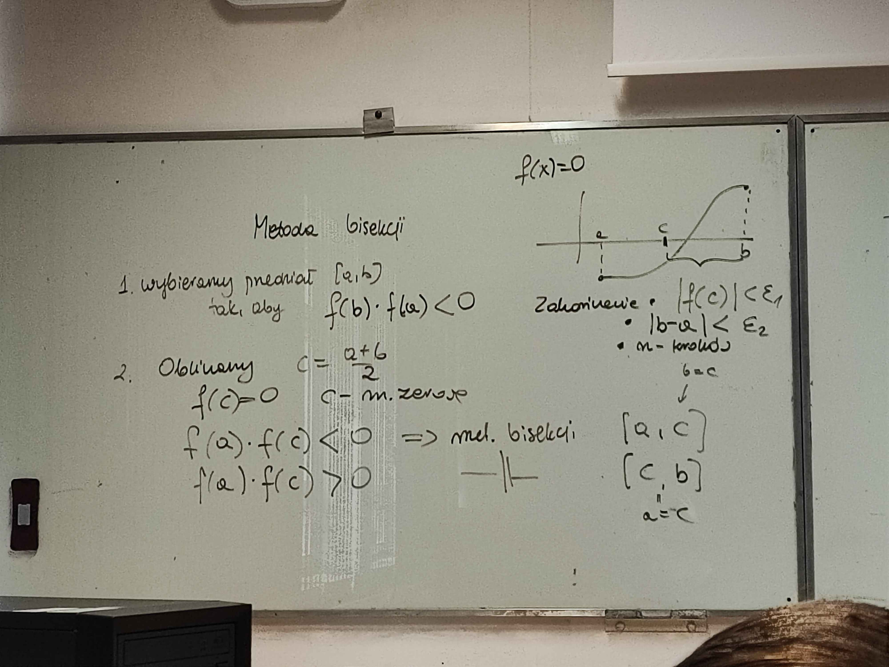
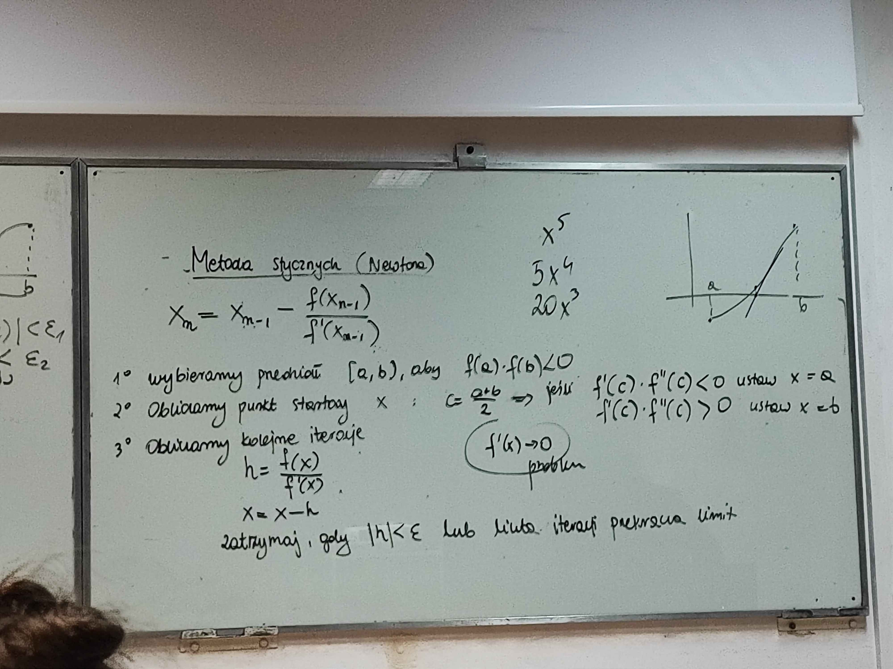
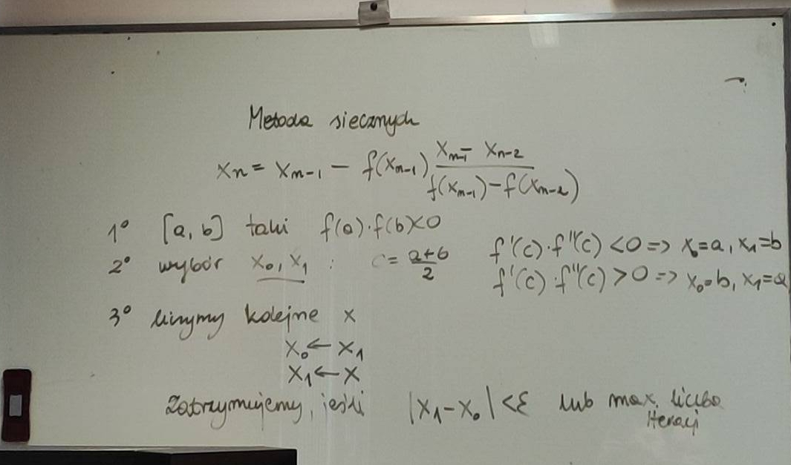

# Zadanie 1

**Napisz program implementujący metodę bisekcji. Program przetestuj dla
następujących funkcji:**

a)
$
f(x) = x^2 - 4, x \in <0; 2.2>
$

b)
$
f(x) = \sin x - \frac{1}{2}, x \in <0; 2.2>
$

## Co to jest metoda bisekcji?

Metoda bisekcji służy do wyznaczania miejsca zerowego funkcji w przedziale $[a,b]$, w którym funkcja zmienia znak.

Zakładamy więc, że:

$$
f(a)\cdot f(b)<0
$$

co oznacza, że w przedziale $[a,b]$ znajduje się co najmniej jedno miejsce zerowe.

Metoda polega na wielokrotnym dzieleniu przedziału na połowy i wybieraniu tej części, w której nadal występuje zmiana znaku.

## Obliczanie kolejnych przybliżeń

W prezentacji przyjęto, że:

- początkowo mamy dwa końce przedziału izolacji pierwiastka,
- dla kolejnych kroków iteracji $i=3,4,\dots$ nowe przybliżenie wyznaczamy jako średnią dwóch wybranych punktów.

Nową wartość obliczamy ze wzoru:

$$
x_i=\frac{x_{i-1}+x_k}{2}
$$

gdzie $k$ jest jedną z wartości $\{i-3, i-2\}$, a wybór $k$ jest taki, aby spełnione były warunki:

$$
|x_i-x_{i-1}|=|x_i-x_k|
$$

oraz

$$
f(x_{i-1})\cdot f(x_k)<0
$$

co wskazuje na obecność pierwiastka w tym przedziale.

W praktyce oznacza to, że w każdym kroku bierzemy **punkt środkowy aktualnego przedziału**:

$$
x_i=\frac{a+b}{2}
$$

albo równoważnie, zgodnie z praktyczną uwagą ze slajdów:

$$
x_i=a+\frac{b-a}{2}
$$

Ten drugi zapis jest wygodniejszy numerycznie.

## Jak działa metoda krok po kroku?

1. Wybieramy przedział $[a,b]$, w którym funkcja zmienia znak.
2. Obliczamy punkt środkowy:
   $$
   x=\frac{a+b}{2}
   $$
3. Sprawdzamy znak funkcji w punkcie środkowym.
4. Jeśli znak funkcji w $a$ i w $x$ jest różny, to nowym przedziałem jest $[a,x]$.
5. W przeciwnym razie nowym przedziałem jest $[x,b]$.
6. Powtarzamy kroki aż do spełnienia wybranego warunku stopu.

W każdej iteracji przedział izolacji pierwiastka zmniejsza się o połowę, więc z każdym krokiem przybliżenie staje się dokładniejsze.

## Kryteria zakończenia iteracji

W prezentacji podano trzy możliwe kryteria zakończenia obliczeń metodą bisekcji:

### 1. Zadana liczba kroków — iteracji

Program kończy działanie po wykonaniu określonej liczby iteracji.

### 2. Dostatecznie mały błąd

Program kończy działanie, gdy oszacowanie błędu przybliżenia jest wystarczająco małe.

Na slajdzie błąd zapisano jako:

$$
|x_i-x^*|<\frac{b-a}{2^{i-2}}
$$

co pokazuje, że wraz z kolejnymi iteracjami przybliżenie jest coraz dokładniejsze.

### 3. Wartość funkcji dostatecznie bliska zeru

Program kończy działanie, gdy:

$$
|f(x_i)|<\varepsilon
$$

czyli gdy wartość funkcji w aktualnym punkcie jest już bardzo bliska zeru.

## Wyznaczanie błędu metody bisekcji

Na slajdach dokładność przybliżenia w $i$-tym kroku określono wzorem:

$$
|x_i-x^*|<\frac{b-a}{2^{i-2}}
$$

Oznacza to, że błąd maleje wraz z liczbą iteracji.

Na przykład po 12 krokach:

$$
|x_{12}-x^*|<\frac{b-a}{2^{12-2}}
$$

## Praktyczne uwagi

W prezentacji podano też kilka praktycznych wskazówek:

- metoda bisekcji daje **jedno miejsce zerowe**, a nie wszystkie miejsca zerowe w całym przedziale,
- przez błędy zaokrągleń otrzymanie dokładnie \(f(x)=0\) jest mało prawdopodobne, więc nie powinno to być jedyne kryterium zakończenia,
- punkt środkowy lepiej liczyć ze wzoru
  $$
  a+\frac{b-a}{2}
  $$
  niż
  $$
  \frac{a+b}{2}
  $$
- zmianę znaku wygodnie sprawdzać przez porównanie znaków:
  $$
  sgn(f(x_i)) \ne sgn(f(x_j))
  $$
  zamiast przez mnożenie:
  $$
  f(x_i)\cdot f(x_j)<0
  $$

## Program

```python
import math  # importujemy moduł math, ponieważ będzie potrzebny do funkcji sin

def sgn(x):  # definiujemy funkcję zwracającą znak liczby
    if x > 0:  # sprawdzamy, czy liczba jest dodatnia
        return 1  # jeśli tak, zwracamy 1
    elif x < 0:  # sprawdzamy, czy liczba jest ujemna
        return -1  # jeśli tak, zwracamy -1
    else:  # w przeciwnym razie liczba jest równa zero
        return 0  # zwracamy 0

def bisekcja(f, a, b, max_iter=100, epsilon=1e-3, warunek_stopu="iteracje"):  # definiujemy funkcję realizującą metodę bisekcji
    if f(b) * f(a) >= 0:  # sprawdzamy, czy na końcach przedziału nie ma takiego samego znaku
        raise ValueError("Na krańcach przedziału funkcja musi mieć przeciwne znaki.")  # jeśli znak się nie zmienia, zgłaszamy błąd

    a0 = a  # zapamiętujemy początkowy lewy koniec przedziału do wzoru na błąd
    b0 = b  # zapamiętujemy początkowy prawy koniec przedziału do wzoru na błąd
    historia = []  # tworzymy pustą listę, w której będziemy zapisywać kolejne kroki metody

    x1 = a  # zgodnie z numeracją ze slajdów przyjmujemy pierwszy punkt jako lewy koniec przedziału
    x2 = b  # zgodnie z numeracją ze slajdów przyjmujemy drugi punkt jako prawy koniec przedziału

    historia.append([1, a, b, x1, f(x1), None])  # zapisujemy do historii krok 1
    historia.append([2, a, b, x2, f(x2), None])  # zapisujemy do historii krok 2

    if warunek_stopu == "iteracje" and max_iter == 1:  # sprawdzamy, czy użytkownik chce zakończyć po pierwszym kroku
        return x1, historia  # zwracamy pierwszy punkt i historię
    if warunek_stopu == "iteracje" and max_iter == 2:  # sprawdzamy, czy użytkownik chce zakończyć po drugim kroku
        return x2, historia  # zwracamy drugi punkt i historię

    for i in range(3, max_iter + 1):  # wykonujemy kolejne kroki od i=3 zgodnie z numeracją ze slajdów
        miejsce_zerowe = a + ((b - a) / 2.0)  # obliczamy punkt środkowy przedziału w postaci zalecanej na slajdach

        fa = f(a)  # obliczamy wartość funkcji w lewym końcu przedziału
        fc = f(miejsce_zerowe)  # obliczamy wartość funkcji w punkcie środkowym

        blad = (b0 - a0) / (2 ** (i - 2))  # obliczamy oszacowanie błędu dokładnie według wzoru ze slajdu

        historia.append([i, a, b, miejsce_zerowe, fc, blad])  # zapisujemy aktualny krok do historii

        if warunek_stopu == "iteracje":  # sprawdzamy, czy wybrano warunek stopu oparty na liczbie iteracji
            if i == max_iter:  # jeśli osiągnięto zadaną liczbę iteracji
                return miejsce_zerowe, historia  # zwracamy aktualne przybliżenie i historię

        elif warunek_stopu == "blad":  # sprawdzamy, czy wybrano warunek stopu oparty na błędzie
            if blad < epsilon:  # jeśli oszacowanie błędu jest mniejsze od zadanej tolerancji
                return miejsce_zerowe, historia  # zwracamy aktualne przybliżenie i historię

        elif warunek_stopu == "wartosc":  # sprawdzamy, czy wybrano warunek stopu oparty na wartości funkcji
            if abs(fc) < epsilon:  # jeśli wartość funkcji jest dostatecznie bliska zeru
                return miejsce_zerowe, historia  # zwracamy aktualne przybliżenie i historię

        else:  # jeśli podano niepoprawny napis określający warunek stopu
            raise ValueError("Niepoprawny warunek stopu.")  # zgłaszamy błąd

        if fc == 0:  # sprawdzamy, czy udało się trafić dokładnie w miejsce zerowe
            return miejsce_zerowe, historia  # jeśli tak, od razu kończymy działanie

        if sgn(fa) != sgn(fc):  # sprawdzamy zgodnie ze slajdem, czy między a i punktem środkowym następuje zmiana znaku
            b = miejsce_zerowe  # jeśli tak, nowym prawym końcem przedziału staje się punkt środkowy
        else:  # w przeciwnym razie pierwiastek znajduje się w drugiej połowie przedziału
            a = miejsce_zerowe  # nowym lewym końcem przedziału staje się punkt środkowy

    return miejsce_zerowe, historia  # jeśli pętla się zakończy, zwracamy ostatnie przybliżenie i historię

def wypisz_historie(historia):  # definiujemy funkcję wypisującą historię działania metody
    print("i         a           b           x          f(x)        blad")  # wypisujemy nagłówek tabeli
    for krok in historia:  # przechodzimy po wszystkich zapisanych krokach
        print(  # wypisujemy pojedynczy wiersz historii
            f"{krok[0]} "  # wypisujemy numer iteracji
            f"{krok[1]} "  # wypisujemy lewy koniec przedziału
            f"{krok[2]} "  # wypisujemy prawy koniec przedziału
            f"{krok[3]} "  # wypisujemy aktualne przybliżenie
            f"{krok[4]} "  # wypisujemy wartość funkcji w punkcie przybliżonym
            f"{krok[5]}"  # wypisujemy oszacowanie błędu
        )  # kończymy wypisywanie jednego wiersza

def f1(x):  # definiujemy pierwszą funkcję testową
    return x**2 - 4  # zwracamy wartość funkcji x^2 - 4

def f2(x):  # definiujemy drugą funkcję testową
    return math.sin(x) - 0.5  # zwracamy wartość funkcji sin(x) - 1/2

print("-------------------- ZADANIE 1 --------------------")  # wypisujemy nagłówek zadania

print("\n==================== FUNKCJA a) ====================")  # wypisujemy nagłówek dla funkcji a)
print("f(x) = x^2 - 4, przedział [0, 2.2]")  # wypisujemy opis funkcji i przedziału

wynik_a_iter, historia_a_iter = bisekcja(f1, 0.0, 2.2, max_iter=12, warunek_stopu="iteracje")  # uruchamiamy metodę bisekcji dla funkcji a) z warunkiem liczby iteracji
print("\nWarunek stopu: liczba iteracji")  # wypisujemy nazwę wybranego warunku stopu
wypisz_historie(historia_a_iter)  # wypisujemy pełną historię iteracji
print("Przybliżony pierwiastek:", wynik_a_iter)  # wypisujemy wyznaczone przybliżenie miejsca zerowego
print("f(x) =", f1(wynik_a_iter))  # wypisujemy wartość funkcji w znalezionym punkcie

wynik_a_blad, historia_a_blad = bisekcja(f1, 0.0, 2.2, epsilon=1e-3, warunek_stopu="blad")  # uruchamiamy metodę bisekcji dla funkcji a) z warunkiem małego błędu
print("\nWarunek stopu: dostatecznie mały błąd")  # wypisujemy nazwę wybranego warunku stopu
print("Przybliżony pierwiastek:", wynik_a_blad)  # wypisujemy wyznaczone przybliżenie miejsca zerowego
print("f(x) =", f1(wynik_a_blad))  # wypisujemy wartość funkcji w znalezionym punkcie
print("Liczba iteracji:", len(historia_a_blad))  # wypisujemy liczbę zapisanych kroków

wynik_a_wartosc, historia_a_wartosc = bisekcja(f1, 0.0, 2.2, epsilon=1e-3, warunek_stopu="wartosc")  # uruchamiamy metodę bisekcji dla funkcji a) z warunkiem małej wartości funkcji
print("\nWarunek stopu: wartość funkcji bliska zeru")  # wypisujemy nazwę wybranego warunku stopu
print("Przybliżony pierwiastek:", wynik_a_wartosc)  # wypisujemy wyznaczone przybliżenie miejsca zerowego
print("f(x) =", f1(wynik_a_wartosc))  # wypisujemy wartość funkcji w znalezionym punkcie
print("Liczba iteracji:", len(historia_a_wartosc))  # wypisujemy liczbę zapisanych kroków

print("\n==================== FUNKCJA b) ====================")  # wypisujemy nagłówek dla funkcji b)
print("f(x) = sin(x) - 1/2, przedział [0, 2.2]")  # wypisujemy opis funkcji i przedziału

wynik_b_iter, historia_b_iter = bisekcja(f2, 0.0, 2.2, max_iter=12, warunek_stopu="iteracje")  # uruchamiamy metodę bisekcji dla funkcji b) z warunkiem liczby iteracji
print("\nWarunek stopu: liczba iteracji")  # wypisujemy nazwę wybranego warunku stopu
wypisz_historie(historia_b_iter)  # wypisujemy pełną historię iteracji
print("Przybliżony pierwiastek:", wynik_b_iter)  # wypisujemy wyznaczone przybliżenie miejsca zerowego
print("f(x) =", f2(wynik_b_iter))  # wypisujemy wartość funkcji w znalezionym punkcie

wynik_b_blad, historia_b_blad = bisekcja(f2, 0.0, 2.2, epsilon=1e-3, warunek_stopu="blad")  # uruchamiamy metodę bisekcji dla funkcji b) z warunkiem małego błędu
print("\nWarunek stopu: dostatecznie mały błąd")  # wypisujemy nazwę wybranego warunku stopu
print("Przybliżony pierwiastek:", wynik_b_blad)  # wypisujemy wyznaczone przybliżenie miejsca zerowego
print("f(x) =", f2(wynik_b_blad))  # wypisujemy wartość funkcji w znalezionym punkcie
print("Liczba iteracji:", len(historia_b_blad))  # wypisujemy liczbę zapisanych kroków

wynik_b_wartosc, historia_b_wartosc = bisekcja(f2, 0.0, 2.2, epsilon=1e-3, warunek_stopu="wartosc")  # uruchamiamy metodę bisekcji dla funkcji b) z warunkiem małej wartości funkcji
print("\nWarunek stopu: wartość funkcji bliska zeru")  # wypisujemy nazwę wybranego warunku stopu
print("Przybliżony pierwiastek:", wynik_b_wartosc)  # wypisujemy wyznaczone przybliżenie miejsca zerowego
print("f(x) =", f2(wynik_b_wartosc))  # wypisujemy wartość funkcji w znalezionym punkcie
print("Liczba iteracji:", len(historia_b_wartosc))  # wypisujemy liczbę zapisanych kroków
```



---

## Wnioski

Metoda bisekcji polega na wielokrotnym dzieleniu przedziału na połowy i wybieraniu tej części, w której funkcja zmienia znak. Dzięki temu kolejne przybliżenia coraz bardziej zbliżają się do miejsca zerowego.

W programie zastosowano trzy warunki zakończenia obliczeń zgodne ze slajdami:

- zadana liczba iteracji,
- dostatecznie mały błąd,
- wartość funkcji dostatecznie bliska zeru.

Dla funkcji:

$$
f(x)=x^2-4
$$

w przedziale $[0,2.2]$ metoda prowadzi do pierwiastka bliskiego wartości:

$$
x=2
$$

Dla funkcji:

$$
f(x)=\sin x-\frac12
$$

w przedziale $[0,2.2]$ metoda prowadzi do pierwiastka bliskiego wartości:

$$
x\approx 0.5236
$$

czyli do wartości:

$$
x=\frac{\pi}{6}
$$

---

# Zadanie 2

**Napisz program implementujący metodę Newtona (czyli metodę stycznych). Program przetestuj dla funkcji z zadania 1.**

Rozważane funkcje:

a)
$$
f(x)=x^2-4,\quad x\in<0,2.2>
$$

b)
$$
f(x)=\sin x-\frac12,\quad x\in<0,2.2>
$$



## Co to jest metoda Newtona?

Metoda stycznych, nazywana też metodą Newtona, służy do przybliżonego wyznaczania miejsca zerowego funkcji $f(x)$, czyli rozwiązania równania:

$$
f(x)=0
$$

Metoda polega na konstruowaniu kolejnych punktów będących miejscami zerowymi stycznych do wykresu funkcji.

Na slajdach wzór iteracyjny zapisano jako:

$$
x_i=x_{i-1}-\frac{f(x_{i-1})}{f'(x_{i-1})},
\qquad i=2,3,4,\dots
$$

Oznacza to, że mając poprzednie przybliżenie $x_{i-1}$, obliczamy nowe przybliżenie $x_i$ korzystając z wartości funkcji i jej pochodnej w punkcie $x_{i-1}$.

## Jak rozumieć wzór metody Newtona?

W każdym kroku obliczamy poprawkę:

$$
h=\frac{f(x)}{f'(x)}
$$

a następnie nowe przybliżenie:

$$
x=x-h
$$

Jeżeli punkt $x$ jest blisko rzeczywistego pierwiastka, to metoda zwykle bardzo szybko poprawia wynik.

## Wybór przedziału startowego

Zgodnie z tablicą najpierw wybieramy przedział:

$$
[a,b]
$$

taki, że:

$$
f(a)\cdot f(b)<0
$$

To oznacza, że na końcach przedziału funkcja ma przeciwne znaki, więc w przedziale znajduje się miejsce zerowe.

## Wybór pierwszego przybliżenia

Na slajdach podano, że pierwsze przybliżenie $x_1$ często wybieramy z końców przedziału $[a,b]$. Kryterium wyboru zależy od znaku iloczynu:

$$
f'(x)\cdot f''(x)
$$

Dla $x\in[a,b]$:

- jeżeli
  $$
  f'(x)\cdot f''(x)<0
  $$
  to wybieramy:
  $$
  x_1=a
  $$

- jeżeli
  $$
  f'(x)\cdot f''(x)>0
  $$
  to wybieramy:
  $$
  x_1=b
  $$

Na tablicy do praktycznego sprawdzenia tego warunku przyjęto punkt:

$$
c=\frac{a+b}{2}
$$

i badano znak iloczynu:

$$
f'(c)\cdot f''(c)
$$

W programie zastosowano właśnie ten sposób.

## Kolejne iteracje

Po wybraniu punktu startowego obliczamy kolejne kroki metodą:

$$
h=\frac{f(x)}{f'(x)}
$$

$$
x=x-h
$$

Jest to ta sama metoda co wzór ze slajdów:

$$
x_i=x_{i-1}-\frac{f(x_{i-1})}{f'(x_{i-1})}
$$

tylko zapisana w wygodniejszej postaci programistycznej.

## Oszacowanie błędu

Na slajdach zapisano, że błąd przybliżenia można oszacować przez różnicę kolejnych przybliżeń:

$$
\Delta \approx |x_i-x_{i-1}|
$$

W programie ta różnica jest reprezentowana przez wartość:

$$
|h|
$$

ponieważ:

$$
x_i=x_{i-1}-h
$$

czyli:

$$
|x_i-x_{i-1}|=|h|
$$

## Warunek zakończenia obliczeń

Na slajdach podano warunek stopu:

$$
|x_i-x_{i-1}|<\varepsilon
$$

W programie sprawdzamy równoważnie:

$$
|h|<\varepsilon
$$

Obliczenia przerywamy również wtedy, gdy liczba iteracji przekroczy zadany limit.

## Potencjalne problemy

Na slajdach oraz tablicy zaznaczono, że problem pojawia się wtedy, gdy:

$$
f'(x)=0
$$

Wtedy nie można wykonać kroku Newtona, ponieważ wystąpiłoby dzielenie przez zero:

$$
\frac{f(x)}{f'(x)}
$$

Dlatego program sprawdza ten przypadek i zgłasza błąd.

Dodatkowo metoda może być rozbieżna, jeśli punkt startowy jest źle dobrany lub funkcja nie jest dostatecznie „gładka” w otoczeniu pierwiastka.

## Pochodne dla funkcji z zadania

### a) Funkcja
$$
f(x)=x^2-4
$$

Pochodna pierwsza:

$$
f'(x)=2x
$$

Pochodna druga:

$$
f''(x)=2
$$

### b) Funkcja
$$
f(x)=\sin x-\frac12
$$

Pochodna pierwsza:

$$
f'(x)=\cos x
$$

Pochodna druga:

$$
f''(x)=-\sin x
$$

## Kod

```python
import math  # importujemy moduł math, ponieważ będzie potrzebny do funkcji trygonometrycznych

def newton(f, a, b, df, ddf, max_iter=100, epsilon=1e-3):  # definiujemy funkcję realizującą metodę Newtona
    lista_iteracji = []  # tworzymy pustą listę, w której będziemy zapisywać kolejne iteracje

    if f(a) * f(b) >= 0:  # sprawdzamy warunek z tablicy, że na krańcach przedziału funkcja ma mieć przeciwne znaki
        raise ValueError("Na krańcach przedziału funkcja musi mieć przeciwne znaki.")  # jeśli warunek nie jest spełniony, zgłaszamy błąd
    
    c = (a+b) / 2.0  # obliczamy środek przedziału zgodnie z pomysłem z tablicy
    iloczyn_pochodnych = df(c) * ddf(c)  # obliczamy iloczyn pochodnej pierwszej i drugiej w punkcie c

    x = 0.0  # tworzymy zmienną na punkt startowy

    if iloczyn_pochodnych < 0:  # sprawdzamy pierwszy przypadek ze slajdu
        x = a  # jeśli iloczyn jest ujemny, wybieramy lewy koniec przedziału jako pierwsze przybliżenie
    elif iloczyn_pochodnych > 0:  # sprawdzamy drugi przypadek ze slajdu
        x = b  # jeśli iloczyn jest dodatni, wybieramy prawy koniec przedziału jako pierwsze przybliżenie
    else:  # obsługujemy przypadek, w którym iloczyn pochodnych jest równy zero
        raise ValueError("Nie można jednoznacznie wybrać punktu startowego, bo f'(c) * f''(c) = 0.")  # zgłaszamy błąd, bo reguła wyboru nie rozstrzyga

    punkt_startowy = x  # zapamiętujemy wybrany punkt startowy do późniejszego wypisania

    for i in range(1, max_iter+1):  # wykonujemy kolejne iteracje od 1 do ustalonego limitu
        fx = f(x)  # obliczamy wartość funkcji w aktualnym punkcie
        dfx = df(x)  # obliczamy wartość pochodnej pierwszej w aktualnym punkcie

        if dfx == 0:  # sprawdzamy przypadek problematyczny zaznaczony na tablicy i slajdach
            raise ValueError("Pochodna f'(x) = 0, metoda Newtona nie może wykonać kolejnego kroku.")  # jeśli pochodna jest zerowa, nie da się obliczyć następnego kroku
        
        h = fx / dfx  # obliczamy poprawkę h zgodnie ze wzorem z tablicy
        x_nowe = x - h  # obliczamy nowe przybliżenie według wzoru Newtona

        lista_iteracji.append([i, x, fx, dfx, h, x_nowe])  # zapisujemy bieżącą iterację do historii

        if abs(h) < epsilon:  # sprawdzamy warunek stopu zgodny ze slajdem |x_i - x_{i-1}| < epsilon
            return punkt_startowy, x_nowe, lista_iteracji  # jeśli poprawka jest wystarczająco mała, kończymy obliczenia i zwracamy wynik
        
        x = x_nowe  # aktualizujemy punkt, żeby przejść do następnej iteracji

    return punkt_startowy, x, lista_iteracji  # jeśli osiągnięto limit iteracji, zwracamy ostatnie przybliżenie i historię

def wypisz_historie(historia):  # definiujemy funkcję wypisującą zapisane iteracje
    print("i        x               f(x)            f'(x)            h               x_nowe")  # wypisujemy nagłówek tabeli
    for krok in historia:  # przechodzimy po wszystkich iteracjach zapisanych w historii
        print(  # wypisujemy jeden wiersz tabeli
            f"{krok[0]:<2} "  # wypisujemy numer iteracji
            f"{krok[1]:>14.10f} "  # wypisujemy aktualne przybliżenie x
            f"{krok[2]:>14.10f} "  # wypisujemy wartość funkcji f(x)
            f"{krok[3]:>14.10f} "  # wypisujemy wartość pochodnej f'(x)
            f"{krok[4]:>14.10f} "  # wypisujemy poprawkę h
            f"{krok[5]:>14.10f}"  # wypisujemy nowe przybliżenie x_nowe
        )  # kończymy wypisywanie jednego wiersza

def f1(x):  # definiujemy funkcję z punktu a)
    return x**2 - 4  # zwracamy wartość funkcji x^2 - 4

def df1(x):  # definiujemy pochodną pierwszą funkcji z punktu a)
    return 2*x  # zwracamy wartość pochodnej 2x

def ddf1(x):  # definiujemy pochodną drugą funkcji z punktu a)
    return 2  # zwracamy wartość pochodnej drugiej równej 2

def f2(x):  # definiujemy funkcję z punktu b)
    return math.sin(x) - 0.5  # zwracamy wartość funkcji sin(x) - 1/2

def df2(x):  # definiujemy pochodną pierwszą funkcji z punktu b)
    return math.cos(x)  # zwracamy wartość pochodnej cos(x)

def ddf2(x):  # definiujemy pochodną drugą funkcji z punktu b)
    return -math.sin(x)  # zwracamy wartość pochodnej drugiej -sin(x)

print("-------------------- ZADANIE 2 --------------------")  # wypisujemy nagłówek zadania

print("\n==================== FUNKCJA a) ====================")  # wypisujemy nagłówek dla funkcji a)
print("f(x) = x^2 - 4, przedział [0, 2.2]")  # wypisujemy opis funkcji a) i przedziału

punkt_startowy_a, wynik_a, historia_a = newton(f1, 0.0, 2.2, df1, ddf1, max_iter=100, epsilon=1e-3)  # uruchamiamy metodę Newtona dla funkcji a)
print("Punkt startowy x0 =", punkt_startowy_a)  # wypisujemy wybrany punkt startowy
wypisz_historie(historia_a)  # wypisujemy pełną historię iteracji
print("Przybliżony pierwiastek:", wynik_a)  # wypisujemy końcowe przybliżenie pierwiastka
print("f(x) =", f1(wynik_a))  # wypisujemy wartość funkcji w znalezionym punkcie
print("Liczba iteracji:", len(historia_a))  # wypisujemy liczbę wykonanych iteracji

print("\n==================== FUNKCJA b) ====================")  # wypisujemy nagłówek dla funkcji b)
print("f(x) = sin(x) - 1/2, przedział [0, 2.2]")  # wypisujemy opis funkcji b) i przedziału

punkt_startowy_b, wynik_b, historia_b = newton(f2, 0.0, 2.2, df2, ddf2, max_iter=100, epsilon=1e-3)  # uruchamiamy metodę Newtona dla funkcji b)
print("Punkt startowy x0 =", punkt_startowy_b)  # wypisujemy wybrany punkt startowy
wypisz_historie(historia_b)  # wypisujemy pełną historię iteracji
print("Przybliżony pierwiastek:", wynik_b)  # wypisujemy końcowe przybliżenie pierwiastka
print("f(x) =", f2(wynik_b))  # wypisujemy wartość funkcji w znalezionym punkcie
print("Liczba iteracji:", len(historia_b))  # wypisujemy liczbę wykonanych iteracji
```

---

## Wnioski

Metoda Newtona wykorzystuje styczne do wykresu funkcji do budowy kolejnych przybliżeń pierwiastka równania \(f(x)=0\). Jej wzór iteracyjny ma postać:

$$
x_i=x_{i-1}-\frac{f(x_{i-1})}{f'(x_{i-1})}
$$

W zadaniu punkt startowy wybierany jest na podstawie znaku iloczynu:

$$
f'(c)\cdot f''(c)
$$

gdzie:

$$
c=\frac{a+b}{2}
$$

Następnie w każdej iteracji obliczana jest poprawka:

$$
h=\frac{f(x)}{f'(x)}
$$

i nowe przybliżenie:

$$
x=x-h
$$

Warunek zakończenia obliczeń oparto na slajdzie:

$$
|x_i-x_{i-1}|<\varepsilon
$$

czyli w programie równoważnie:

$$
|h|<\varepsilon
$$

Dla funkcji:

$$
f(x)=x^2-4
$$

metoda prowadzi do pierwiastka bliskiego wartości:

$$
x=2
$$

Dla funkcji:

$$
f(x)=\sin x-\frac12
$$

metoda prowadzi do pierwiastka bliskiego wartości:

$$
x\approx 0.5236
$$

czyli:

$$
x=\frac{\pi}{6}
$$

Oznacza to, że program działa poprawnie i realizuje metodę Newtona zgodnie z algorytmem przedstawionym na tablicy oraz slajdach.

---

# Zadanie 3

**Napisz program implementujący metodę siecznych. Program przetestuj dla funkcji z zadania 1.**

Rozważane funkcje:

a)
$$
f(x)=x^2-4,\quad x\in<0,2.2>
$$

b)
$$
f(x)=\sin x-\frac12,\quad x\in<0,2.2>
$$



## Co to jest metoda siecznych?

Metoda siecznych służy do przybliżania miejsca zerowego równania:

$$
f(x)=0
$$

W metodzie tej zamiast stycznej, jak w metodzie Newtona, wykorzystuje się **sieczną** przechodzącą przez dwa kolejne punkty wykresu funkcji:

$$
(x_i,f(x_i)) \quad \text{oraz} \quad (x_{i-1},f(x_{i-1}))
$$

Punkt przecięcia tej siecznej z osią $x$ daje kolejne przybliżenie pierwiastka.

Na slajdach wzór metody zapisano jako:

$$
x_{i+1}=x_i-f(x_i)\cdot \frac{x_i-x_{i-1}}{f(x_i)-f(x_{i-1})},
\qquad i=2,3,4,\dots
$$

## Interpretacja wzoru

W każdym kroku korzystamy z dwóch ostatnich przybliżeń:
- $x_{i-1}$,
- $x_i$,

i na ich podstawie wyznaczamy nowe przybliżenie $x_{i+1}$.

Metoda nie wymaga liczenia pochodnej funkcji, co jest jej dużą zaletą.

## Wybór przedziału i punktów startowych

Na tablicy podano, że najpierw wybieramy przedział:

$$
[a,b]
$$

taki, że:

$$
f(a)\cdot f(b)<0
$$

Następnie wybieramy punkty startowe $x_0$ i $x_1$.

Do ich wyboru wykorzystujemy, podobnie jak w metodzie Newtona, znak iloczynu:

$$
f'(c)\cdot f''(c)
$$

gdzie:

$$
c=\frac{a+b}{2}
$$

Zgodnie z tablicą:

- jeżeli
  $$
  f'(c)\cdot f''(c)<0
  $$
  to przyjmujemy:
  $$
  x_0=a,\quad x_1=b
  $$

- jeżeli
  $$
  f'(c)\cdot f''(c)>0
  $$
  to przyjmujemy:
  $$
  x_0=b,\quad x_1=a
  $$

## Kolejne iteracje

Po wybraniu punktów startowych liczymy kolejne przybliżenia ze wzoru:

$$
x_{i+1}=x_i-f(x_i)\cdot \frac{x_i-x_{i-1}}{f(x_i)-f(x_{i-1})}
$$

Następnie przesuwamy punkty:
- stare $x_i$ staje się nowym $x_{i-1}$,
- nowe $x_{i+1}$ staje się nowym $x_i$.

## Oszacowanie błędu

Na slajdach błąd przybliżenia oszacowano wzorem:

$$
\Delta \approx |x_{i+1}-x_i|
$$

W programie właśnie ta różnica jest używana jako miara dokładności.

## Warunek stopu

Na tablicy zapisano, że obliczenia kończymy, gdy:

$$
|x_1-x_0|<\varepsilon
$$

W praktyce w kolejnych iteracjach sprawdzamy równoważnie:

$$
|x_{i+1}-x_i|<\varepsilon
$$

czyli różnicę między nowym a poprzednim przybliżeniem.

Drugim warunkiem zakończenia jest przekroczenie maksymalnej liczby iteracji.

## Potencjalne problemy

Na slajdach podano, że metoda siecznych:
- nie wymaga pochodnej do wyznaczania kolejnych przybliżeń,
- może nie być zbieżna dla niektórych wyborów punktów startowych,
- zwykle wymaga więcej iteracji niż metoda Newtona,
- nie pilnuje przedziału tak jak metoda bisekcji, więc może wyjść poza zadany przedział.

Dlatego dobór punktów startowych ma duże znaczenie.

W tym zadaniu punkty startowe są wybierane automatycznie na podstawie znaku iloczynu:

$$
f'(c)\cdot f''(c),
\qquad c=\frac{a+b}{2}
$$

Trzeba jednak pamiętać, że nawet jeśli początkowo wybieramy punkty z przedziału \([a,b]\), to kolejne przybliżenia metody siecznych nie muszą już pozostać w tym przedziale.

## Pochodne potrzebne do wyboru punktów startowych

Mimo że sama metoda siecznych nie używa pochodnych do liczenia kolejnych iteracji, w tym zadaniu są one potrzebne do wyboru punktów startowych zgodnie z tablicą.

### a) Funkcja
$$
f(x)=x^2-4
$$

Pochodna pierwsza:

$$
f'(x)=2x
$$

Pochodna druga:

$$
f''(x)=2
$$

### b) Funkcja
$$
f(x)=\sin x-\frac12
$$

Pochodna pierwsza:

$$
f'(x)=\cos x
$$

Pochodna druga:

$$
f''(x)=-\sin x
$$

## Kod

```python
import math  # importujemy moduł math, ponieważ będzie potrzebny do funkcji trygonometrycznych

def sieczne(f, a, b, df, ddf, max_iter=100, epsilon=1e-3):  # definiujemy funkcję realizującą metodę siecznych
    lista_iteracji = []  # tworzymy pustą listę, w której będziemy zapisywać kolejne iteracje metody

    if f(a) * f(b) >= 0:  # sprawdzamy, czy na krańcach przedziału funkcja ma przeciwne znaki
        raise ValueError("Na krańcach przedziału funkcja musi mieć przeciwne znaki.")  # jeśli nie, zgłaszamy błąd
    
    c = (a+b) / 2.0  # obliczamy środek przedziału [a,b]
    iloczyn_pochodnych = df(c) * ddf(c)  # obliczamy iloczyn pochodnej pierwszej i drugiej w punkcie c

    if iloczyn_pochodnych < 0:  # sprawdzamy pierwszy przypadek wyboru punktów startowych z tablicy
        x0 = a  # jeśli iloczyn jest ujemny, pierwszy punkt startowy ustawiamy jako a
        x1 = b  # jeśli iloczyn jest ujemny, drugi punkt startowy ustawiamy jako b
    elif iloczyn_pochodnych > 0:  # sprawdzamy drugi przypadek wyboru punktów startowych z tablicy
        x0 = b  # jeśli iloczyn jest dodatni, pierwszy punkt startowy ustawiamy jako b
        x1 = a  # jeśli iloczyn jest dodatni, drugi punkt startowy ustawiamy jako a
    else:  # obsługujemy przypadek, gdy iloczyn pochodnych jest równy zero
        raise ValueError("Nie można jednoznacznie wybrać punktu startowego, bo f'(c) * f''(c) = 0.")  # zgłaszamy błąd

    x0_startowy = x0  # zapamiętujemy początkową wartość x0 do późniejszego wypisania
    x1_startowy = x1  # zapamiętujemy początkową wartość x1 do późniejszego wypisania

    for i in range(1, max_iter+1):  # wykonujemy kolejne iteracje od 1 do maksymalnej liczby iteracji
        fx0 = f(x0)  # obliczamy wartość funkcji w punkcie x0
        fx1 = f(x1)  # obliczamy wartość funkcji w punkcie x1

        if fx1 - fx0 == 0:  # sprawdzamy, czy mianownik we wzorze metody siecznych nie jest równy zero
            raise ValueError("Mianownik jest równy zero, metoda siecznych nie może wykonać kolejnego kroku.")  # jeśli jest, zgłaszamy błąd
        
        x_nowe = x1 - fx1 * ((x1 - x0) / (fx1 - fx0))  # obliczamy nowe przybliżenie według wzoru metody siecznych

        lista_iteracji.append([i, x0, x1, fx0, fx1, x_nowe])  # zapisujemy dane z bieżącej iteracji do listy historii

        if abs(x_nowe - x1) < epsilon:  # sprawdzamy warunek stopu oparty na różnicy kolejnych przybliżeń
            return x0_startowy, x1_startowy, x0, x1, lista_iteracji  # jeśli warunek jest spełniony, kończymy i zwracamy wyniki
        
        x0 = x1  # przesuwamy punkt x0, ustawiając go na poprzednie x1
        x1 = x_nowe  # przesuwamy punkt x1, ustawiając go na nowe przybliżenie

    return x0_startowy, x1_startowy, x0, x1, lista_iteracji  # jeśli osiągnięto limit iteracji, zwracamy ostatnie wyniki

def wypisz_historie(historia):  # definiujemy funkcję do wypisywania historii iteracji
    print("i        x0              x1              f(x0)           f(x1)           x_nowe")  # wypisujemy nagłówek tabeli
    for krok in historia:  # przechodzimy po wszystkich zapisanych iteracjach
        print(  # wypisujemy jeden wiersz tabeli
            f"{krok[0]:<2} "  # wypisujemy numer iteracji
            f"{krok[1]:>14.10f} "  # wypisujemy wartość x0
            f"{krok[2]:>14.10f} "  # wypisujemy wartość x1
            f"{krok[3]:>14.10f} "  # wypisujemy wartość f(x0)
            f"{krok[4]:>14.10f} "  # wypisujemy wartość f(x1)
            f"{krok[5]:>14.10f}"  # wypisujemy nowe przybliżenie x_nowe
        )  # kończymy wypisywanie pojedynczego wiersza

def f1(x):  # definiujemy pierwszą funkcję testową
    return x**2 - 4  # zwracamy wartość funkcji x^2 - 4

def df1(x):  # definiujemy pochodną pierwszą funkcji f1
    return 2*x  # zwracamy wartość pochodnej 2x

def ddf1(x):  # definiujemy pochodną drugą funkcji f1
    return 2  # zwracamy wartość pochodnej drugiej równej 2

def f2(x):  # definiujemy drugą funkcję testową
    return math.sin(x) - 0.5  # zwracamy wartość funkcji sin(x) - 1/2

def df2(x):  # definiujemy pochodną pierwszą funkcji f2
    return math.cos(x)  # zwracamy wartość pochodnej cos(x)

def ddf2(x):  # definiujemy pochodną drugą funkcji f2
    return -math.sin(x)  # zwracamy wartość pochodnej drugiej -sin(x)

print("-------------------- ZADANIE 3 --------------------")  # wypisujemy nagłówek zadania

print("\n==================== FUNKCJA a) ====================")  # wypisujemy nagłówek dla funkcji a)
print("f(x) = x^2 - 4, przedział [0, 2.2]")  # wypisujemy opis pierwszej funkcji i jej przedziału

x0a, x1a, wynik0_a, wynik1_a, historia_a = sieczne(f1, 0.0, 2.2, df1, ddf1, max_iter=100, epsilon=1e-3)  # uruchamiamy metodę siecznych dla funkcji a)
print("Punkty startowe: x0 =", x0a, ", x1 =", x1a)  # wypisujemy wybrane punkty startowe
wypisz_historie(historia_a)  # wypisujemy historię iteracji dla funkcji a)
print("Ostatnie przybliżenia:", wynik0_a, wynik1_a)  # wypisujemy dwa ostatnie przybliżenia
print("Przybliżony pierwiastek:", wynik1_a)  # wypisujemy końcowe przybliżenie miejsca zerowego
print("f(x) =", f1(wynik1_a))  # wypisujemy wartość funkcji w znalezionym punkcie
print("Liczba iteracji:", len(historia_a))  # wypisujemy liczbę wykonanych iteracji

print("\n==================== FUNKCJA b) ====================")  # wypisujemy nagłówek dla funkcji b)
print("f(x) = sin(x) - 1/2, przedział [0, 2.2]")  # wypisujemy opis drugiej funkcji i jej przedziału

x0b, x1b, wynik0_b, wynik1_b, historia_b = sieczne(f2, 0.0, 2.2, df2, ddf2, max_iter=100, epsilon=1e-3)  # uruchamiamy metodę siecznych dla funkcji b)
print("Punkty startowe: x0 =", x0b, ", x1 =", x1b)  # wypisujemy wybrane punkty startowe
wypisz_historie(historia_b)  # wypisujemy historię iteracji dla funkcji b)
print("Ostatnie przybliżenia:", wynik0_b, wynik1_b)  # wypisujemy dwa ostatnie przybliżenia
print("Przybliżony pierwiastek:", wynik1_b)  # wypisujemy końcowe przybliżenie miejsca zerowego
print("f(x) =", f2(wynik1_b))  # wypisujemy wartość funkcji w znalezionym punkcie
print("Liczba iteracji:", len(historia_b))  # wypisujemy liczbę wykonanych iteracji
```

## Wnioski

Metoda siecznych wykorzystuje dwa kolejne przybliżenia pierwiastka i na ich podstawie wyznacza następne przybliżenie, korzystając z równania siecznej przechodzącej przez punkty wykresu funkcji.

Jej wzór iteracyjny ma postać:

$$
x_{i+1}=x_i-f(x_i)\cdot \frac{x_i-x_{i-1}}{f(x_i)-f(x_{i-1})}
$$

W zadaniu punkty startowe dla funkcji a) dobrano zgodnie z tablicą, wykorzystując znak iloczynu:

$$
f'(c)\cdot f''(c)
$$

gdzie:

$$
c=\frac{a+b}{2}
$$

Błąd przybliżenia szacujemy wzorem ze slajdów:

$$
\Delta \approx |x_{i+1}-x_i|
$$

Dla funkcji:

$$
f(x)=x^2-4
$$

metoda prowadzi do pierwiastka bliskiego wartości:

$$
x=2
$$

Dla funkcji:

$$
f(x)=\sin x-\frac12
$$

metoda przy punktach startowych wybranych automatycznie z przedziału $[0,2.2]$ może wyjść poza ten przedział. W takim przypadku otrzymane przybliżenia mogą zbiegać do innego miejsca zerowego funkcji niż to, które leży w badanym przedziale.

Oznacza to, że metoda siecznych realizuje poprawnie wzór iteracyjny i może być zbieżna, ale nie zachowuje własności izolacji pierwiastka tak jak metoda bisekcji. Dlatego przy interpretacji wyników trzeba uwzględniać, że otrzymane przybliżenie nie musi należeć do początkowego przedziału $[a,b]$.