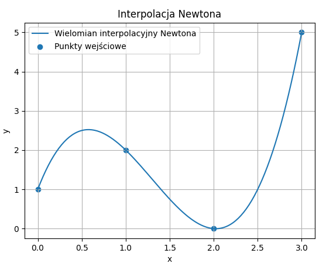

# Zadanie 1

**Napisz program implementujący rozwinięcie funkcji eksponencjalnej w szereg Maclaurina. Porównaj wyniki oraz czas wykonania z funkcją biblioteczną.**

## Co to jest szereg Maclaurina dla funkcji eksponencjalnej?

Funkcja eksponencjalna ma rozwinięcie w szereg Maclaurina:

$$
e^x=\sum_{k=0}^{\infty}\frac{x^k}{k!}
$$

W praktyce w programie nie liczymy nieskończenie wielu składników, tylko bierzemy **sumę skończoną** do pewnego wybranego $n$:

$$
e^x \approx \sum_{k=0}^{n}\frac{x^k}{k!}
$$

Oznacza to, że przybliżamy wartość funkcji $e^x$ przez sumę:

$$
1+x+\frac{x^2}{2!}+\frac{x^3}{3!}+\dots+\frac{x^n}{n!}
$$

Im większa wartość $n$, tym zwykle dokładniejsze przybliżenie.

## Jak działa obliczanie kolejnych wyrazów?

Na slajdzie podano ważną wskazówkę, że nie warto w każdej iteracji osobno liczyć:
- potęgi $x^k$,
- silni $k!$.

Zamiast tego korzystamy z zależności:

$$
\frac{x^k}{k!}=\frac{x^{k-1}}{(k-1)!}\cdot\frac{x}{k}
$$

Dzięki temu każdy kolejny wyraz szeregu obliczamy z poprzedniego.

Jeżeli oznaczymy:

$$
\text{wyraz}_{k-1}=\frac{x^{k-1}}{(k-1)!}
$$

to następny wyraz jest równy:

$$
\text{wyraz}_k=\text{wyraz}_{k-1}\cdot\frac{x}{k}
$$

To właśnie realizuje program.

## Dlaczego to jest lepsze?

Takie podejście:
- jest szybsze,
- nie wymaga funkcji `pow()`,
- nie wymaga osobnego liczenia silni,
- jest zgodne z metodą pokazaną na slajdzie.

## Porównanie z funkcją biblioteczną

W zadaniu trzeba porównać wynik z funkcją biblioteczną.  
W Pythonie używamy do tego:

```python
math.exp(x)
```

Porównujemy:
- otrzymaną wartość,
- błąd bezwzględny,
- czas wykonania.

Błąd bezwzględny liczymy jako:

$$
|\,\text{wynik Maclaurina} - \text{wynik biblioteczny}\,|
$$

## Pomiar czasu

Czas wykonania mierzony jest za pomocą:

```python
time.perf_counter()
```

Aby pomiar był bardziej wiarygodny, obliczenia wykonywane są wiele razy, a następnie mierzony jest łączny czas.

## Kod

```python
import time, math  # importujemy moduły time i math, ponieważ będą potrzebne do pomiaru czasu oraz funkcji bibliotecznej exp

def exp_maclaurin(x, n):  # definiujemy funkcję obliczającą przybliżenie e^x za pomocą szeregu Maclaurina
    suma = 1.0  # ustawiamy początkową sumę równą 1, ponieważ pierwszy wyraz szeregu to x^0 / 0! = 1
    wyraz = 1.0  # ustawiamy pierwszy wyraz szeregu na 1, aby z niego wyznaczać kolejne składniki

    for k in range(1, n+1):  # przechodzimy po kolejnych wyrazach szeregu od 1 do n
        wyraz = wyraz * (x / k)  # obliczamy następny wyraz z poprzedniego według zależności x^k/k! = x^(k-1)/(k-1)! * x/k
        suma += wyraz  # dodajemy nowo obliczony wyraz do sumy

    return suma  # zwracamy końcową wartość przybliżenia szeregu

def porownaj_exp(x, n, liczba_powtorzen=100000):  # definiujemy funkcję porównującą wynik i czas działania z funkcją biblioteczną
    start = time.perf_counter()  # zapisujemy moment rozpoczęcia pomiaru czasu dla metody Maclaurina
    for _ in range(liczba_powtorzen):  # wykonujemy obliczenia wiele razy, aby pomiar czasu był bardziej wiarygodny
        wynik_maclaurin = exp_maclaurin(x, n)  # obliczamy wartość e^x za pomocą własnej funkcji
    czas_maclaurin = time.perf_counter() - start  # obliczamy czas wykonania metody Maclaurina

    start = time.perf_counter()  # zapisujemy moment rozpoczęcia pomiaru czasu dla funkcji bibliotecznej
    for _ in range(liczba_powtorzen):  # wykonujemy funkcję biblioteczną wiele razy
        wynik_biblioteczny = math.exp(x)  # obliczamy wartość e^x za pomocą funkcji bibliotecznej
    czas_biblioteczny = time.perf_counter() - start  # obliczamy czas wykonania funkcji bibliotecznej

    blad = abs(wynik_maclaurin - wynik_biblioteczny)  # liczymy błąd bezwzględny między obiema metodami

    print(f"x = {x}, n = {n}")  # wypisujemy aktualną wartość x oraz liczbę składników użytych w sumie
    print(f"Wynik Maclaurina:   {wynik_maclaurin}")  # wypisujemy wynik uzyskany z szeregu Maclaurina
    print(f"Wynik biblioteczny: {wynik_biblioteczny}")  # wypisujemy wynik uzyskany z funkcji bibliotecznej
    print(f"Błąd bezwzględny:   {blad}")  # wypisujemy obliczony błąd bezwzględny
    print(f"Czas Maclaurina:    {czas_maclaurin:.10f} s")  # wypisujemy czas wykonania metody Maclaurina
    print(f"Czas biblioteczny:  {czas_biblioteczny:.10f} s")  # wypisujemy czas wykonania funkcji bibliotecznej
    print("-" * 50)  # wypisujemy linię oddzielającą kolejne testy

print("-------------------- ZADANIE 1 --------------------")  # wypisujemy nagłówek zadania

porownaj_exp(1.0, 10)  # porównujemy obie metody dla x = 1.0 i n = 10
porownaj_exp(2.0, 15)  # porównujemy obie metody dla x = 2.0 i n = 15
porownaj_exp(-1.0, 15)  # porównujemy obie metody dla x = -1.0 i n = 15
porownaj_exp(5.0, 25)  # porównujemy obie metody dla x = 5.0 i n = 25
```

## Wnioski

Funkcję eksponencjalną można skutecznie aproksymować za pomocą skończonego szeregu Maclaurina:

$$
e^x \approx \sum_{k=0}^{n}\frac{x^k}{k!}
$$

W programie kolejne składniki szeregu obliczane są z poprzednich według zależności:

$$
\frac{x^k}{k!}=\frac{x^{k-1}}{(k-1)!}\cdot\frac{x}{k}
$$

Dzięki temu nie trzeba w każdej iteracji osobno liczyć potęg i silni, co przyspiesza obliczenia.

Porównanie z funkcją biblioteczną `math.exp(x)` pokazuje, że:
- wyniki szeregu Maclaurina są bardzo zbliżone do wartości dokładnych,
- błąd maleje wraz ze wzrostem liczby składników,
- funkcja biblioteczna zwykle działa szybciej, ponieważ jest zoptymalizowana.

Oznacza to, że program poprawnie realizuje rozwinięcie funkcji eksponencjalnej w szereg Maclaurina oraz umożliwia porównanie dokładności i czasu wykonania z funkcją biblioteczną.

## Finalnie masz policzyć dla wybranych wartości (x):

### 1. Przybliżenie funkcji $(e^x)$

czyli:

$
e^x \approx \sum_{k=0}^{n}\frac{x^k}{k!}
$

na przykład dla:

* $x=1$,
* $x=2$,
* $x=-1$,
* $x=5$,

i dla wybranego $n$, np. 10, 15, 25.

### 2. Wartość dokładniejszą z funkcji bibliotecznej

czyli:

$
\texttt{math.exp(x)}
$

### 3. Błąd bezwzględny

czyli różnicę między tym, co policzyła Twoja funkcja, a funkcją biblioteczną:

$
|,\text{wynik Maclaurina} - \text{wynik biblioteczny},|
$

### 4. Czas wykonania obu metod

czyli:

* czas obliczania Twojej funkcji `exp_maclaurin(x, n)`,
* czas obliczania `math.exp(x)`.

## Czyli w tabelce albo w wynikach końcowych masz mieć dla każdego testu:

* wartość $x$,
* liczbę wyrazów $n$,
* wynik z szeregu Maclaurina,
* wynik z funkcji bibliotecznej,
* błąd bezwzględny,
* czas Twojej metody,
* czas funkcji bibliotecznej.

## Najkrócej

Finalnie masz policzyć:

$
\sum_{k=0}^{n}\frac{x^k}{k!}
$

a potem porównać to z:

$
e^x
$

z biblioteki.

---

# Zadanie 2

**Napisz program implementujący rozwinięcie funkcji sinus w szereg Maclaurina. Porównaj wyniki oraz czas wykonania z funkcją biblioteczną.**

## Co mamy policzyć?

Chcemy obliczyć wartość funkcji:

$$
\sin x
$$

nie używając od razu funkcji bibliotecznej `math.sin(x)`, tylko korzystając ze **szeregu Maclaurina**.

Potem mamy porównać:
- wynik otrzymany z naszego programu,
- wynik z funkcji bibliotecznej,
- błąd,
- czas wykonania obu metod.

## Wzór ze slajdu

Na slajdzie funkcja sinus została zapisana tak:

$$
\sin x = \sum_{k=1}^{\infty} (-1)^{k-1}\frac{x^{2k-1}}{(2k-1)!}
$$

W praktyce, w programie, nie liczymy nieskończenie wielu składników, tylko bierzemy sumę skończoną do pewnego $n$:

$$
\sin x \approx \sum_{k=1}^{n} (-1)^{k-1}\frac{x^{2k-1}}{(2k-1)!}
$$

To oznacza, że liczymy kolejno:

$$
\sin x \approx x - \frac{x^3}{3!} + \frac{x^5}{5!} - \frac{x^7}{7!} + \dots
$$

## Dlaczego na innych materiałach może być inny wzór?

Czasem ten sam szereg zapisuje się w trochę inny sposób:

$$
\sin x = \sum_{k=0}^{\infty} (-1)^k \frac{x^{2k+1}}{(2k+1)!}
$$

To **nie jest inny szereg**, tylko ten sam zapisany z innym początkiem indeksowania.

### Związek między tymi zapisami

Jeżeli we wzorze ze slajdu mamy:

$$
\sum_{k=1}^{\infty} (-1)^{k-1}\frac{x^{2k-1}}{(2k-1)!}
$$

to po zmianie numeracji indeksu dostajemy:

$$
\sum_{k=0}^{\infty} (-1)^k \frac{x^{2k+1}}{(2k+1)!}
$$

Oba wzory opisują dokładnie to samo:

$$
x - \frac{x^3}{3!} + \frac{x^5}{5!} - \frac{x^7}{7!} + \dots
$$

W tej notatce trzymamy się **wzoru ze slajdu**, czyli sumy od $k=1$ do $n$.

## Łopatologicznie: co robi program?

Program:
1. bierze liczbę $x$,
2. liczy przybliżenie $\sin x$ ze wzoru ze slajdu,
3. porównuje je z `math.sin(x)`,
4. liczy błąd bezwzględny,
5. mierzy czas działania obu metod.

## Jak liczone są kolejne składniki?

Pierwszy składnik szeregu to:

$$
x
$$

czyli dla \(k=1\):

$$
(-1)^{1-1}\frac{x^{2\cdot1-1}}{(2\cdot1-1)!}
=
\frac{x^1}{1!}=x
$$

Następny składnik to:

$$
\frac{x^3}{3!}
$$

kolejny:

$$
\frac{x^5}{5!}
$$

i tak dalej.

W programie nie liczymy za każdym razem wszystkiego od początku, tylko każdy następny składnik wyznaczamy z poprzedniego.

Jeżeli mamy już:

$$
\frac{x^{2k-3}}{(2k-3)!}
$$

to następny składnik bez znaku można policzyć jako:

$$
\frac{x^{2k-1}}{(2k-1)!}
=
\frac{x^{2k-3}}{(2k-3)!}\cdot \frac{x^2}{(2k-2)(2k-1)}
$$

To właśnie robi program.

## Po co jest redukcja argumentu modulo $2\pi$?

Na slajdzie była wskazówka:

$$
x \mapsto x \bmod 2\pi
$$

czyli zamieniamy $x$ na resztę z dzielenia przez $2\pi$.

Dlaczego?

Bo dla bardzo dużych wartości $x$ szereg Maclaurina może zbiegać wolniej.  
Sinus jest funkcją okresową, więc:

$$
\sin x = \sin(x \bmod 2\pi)
$$

Dzięki temu liczymy tę samą wartość, ale dla mniejszego argumentu.

## Co oznaczają zmienne w programie?

- `suma` — aktualna suma wszystkich składników szeregu,
- `wyraz` — aktualny składnik szeregu bez znaku,
- `znak` — pilnuje, czy mamy dodać, czy odjąć dany składnik,
- `n` — liczba składników zgodnie ze wzorem ze slajdu od $k=1$ do $k=n$.

To znaczy:
- pierwszy składnik $k=1$ jest dodany od razu jako `x`,
- pętla liczy składniki od $k=2$ do $k=n$.

Czyli program jest zgodny ze wzorem:

$$
\sum_{k=1}^{n} (-1)^{k-1}\frac{x^{2k-1}}{(2k-1)!}
$$

## Jak liczony jest błąd?

Błąd bezwzględny liczymy jako:

$$
\left| \text{wynik Maclaurina} - \text{wynik biblioteczny} \right|
$$

Im mniejszy błąd, tym lepsze przybliżenie.

## Jak liczony jest czas?

Czas działania mierzony jest funkcją:

```python
time.perf_counter()
```

Żeby pomiar był bardziej sensowny, każda metoda wykonywana jest bardzo wiele razy.

## Kod

```python
import math, time  # importujemy moduły math i time, ponieważ będą potrzebne do funkcji sin, liczby pi oraz pomiaru czasu

def sin_maclaurin(x, n):  # definiujemy funkcję obliczającą przybliżenie sin(x) za pomocą szeregu Maclaurina
    x = x % (2 * math.pi)  # redukujemy argument modulo 2pi, aby dla dużych x obliczenia były stabilniejsze i szybsze

    suma = x  # ustawiamy początkową sumę równą x, ponieważ pierwszy składnik szeregu dla k=1 to właśnie x
    wyraz = x  # ustawiamy pierwszy wyraz szeregu na x, aby z niego wyznaczać kolejne składniki
    znak = -1.0  # ustawiamy znak kolejnego składnika na minus, bo po x występuje -x^3/3!

    for k in range(2, n + 1):  # przechodzimy po kolejnych składnikach szeregu od k=2 do k=n
        wyraz = wyraz * x * x / ((2 * k - 2) * (2 * k - 1))  # obliczamy kolejny składnik bez znaku z poprzedniego składnika
        suma += znak * wyraz  # dodajemy lub odejmujemy aktualny składnik zgodnie z aktualnym znakiem
        znak = -znak  # zmieniamy znak na przeciwny, aby kolejne składniki miały znaki naprzemienne

    return suma  # zwracamy końcowe przybliżenie funkcji sinus

def porownaj_sin(x, n, liczba_powtorzen=100000):  # definiujemy funkcję porównującą wynik i czas działania z funkcją biblioteczną
    start = time.perf_counter()  # zapisujemy moment rozpoczęcia pomiaru czasu dla naszej metody
    for _ in range(liczba_powtorzen):  # wykonujemy obliczenia wiele razy, aby pomiar czasu był bardziej wiarygodny
        wynik_maclaurin = sin_maclaurin(x, n)  # obliczamy wartość sin(x) za pomocą własnej funkcji
    czas_maclaurin = time.perf_counter() - start  # obliczamy całkowity czas działania naszej metody

    start = time.perf_counter()  # zapisujemy moment rozpoczęcia pomiaru czasu dla funkcji bibliotecznej
    for _ in range(liczba_powtorzen):  # wykonujemy funkcję biblioteczną wiele razy
        wynik_biblioteczny = math.sin(x)  # obliczamy wartość sin(x) za pomocą funkcji bibliotecznej
    czas_biblioteczny = time.perf_counter() - start  # obliczamy całkowity czas działania funkcji bibliotecznej

    blad = abs(wynik_maclaurin - wynik_biblioteczny)  # liczymy błąd bezwzględny między obiema metodami

    print(f"x = {x}, n = {n}")  # wypisujemy aktualną wartość x oraz liczbę składników użytych w szeregu
    print(f"Wynik Maclaurina:   {wynik_maclaurin}")  # wypisujemy wynik uzyskany z szeregu Maclaurina
    print(f"Wynik biblioteczny: {wynik_biblioteczny}")  # wypisujemy wynik uzyskany z funkcji bibliotecznej
    print(f"Błąd bezwzględny:   {blad}")  # wypisujemy błąd bezwzględny
    print(f"Czas Maclaurina:    {czas_maclaurin:.10f} s")  # wypisujemy czas działania naszej metody
    print(f"Czas biblioteczny:  {czas_biblioteczny:.10f} s")  # wypisujemy czas działania funkcji bibliotecznej
    print("-" * 50)  # wypisujemy linię oddzielającą kolejne testy


print("-------------------- ZADANIE 2 --------------------")  # wypisujemy nagłówek zadania

porownaj_sin(0.5, 10)  # porównujemy obie metody dla x = 0.5 i n = 10
porownaj_sin(1.0, 10)  # porównujemy obie metody dla x = 1.0 i n = 10
porownaj_sin(math.pi / 2, 12)  # porównujemy obie metody dla x = pi/2 i n = 12
porownaj_sin(10.0, 15)  # porównujemy obie metody dla x = 10.0 i n = 15
```

## Wnioski

Funkcję sinus można aproksymować za pomocą szeregu Maclaurina:

$$
\sin x \approx \sum_{k=1}^{n} (-1)^{k-1}\frac{x^{2k-1}}{(2k-1)!}
$$

Program liczy kolejne składniki szeregu rekurencyjnie, dzięki czemu nie trzeba osobno wyznaczać każdej potęgi i każdej silni.

Dodatkowo dla dużych wartości argumentu zastosowano redukcję:

$$
x \mapsto x \bmod 2\pi
$$

co poprawia praktyczne działanie programu.

Porównanie z funkcją biblioteczną `math.sin(x)` pokazuje, że:
- wyniki uzyskane z szeregu Maclaurina są bardzo zbliżone do wartości bibliotecznych,
- błąd maleje przy większej liczbie składników,
- funkcja biblioteczna zwykle działa szybciej, ponieważ jest gotową, zoptymalizowaną implementacją.

Oznacza to, że program poprawnie realizuje aproksymację funkcji sinus za pomocą szeregu Maclaurina i poprawnie porównuje ją z funkcją biblioteczną.

---

# Zadanie 3

**Napisz funkcję wyznaczającą współczynniki wielomianu interpolacyjnego Newtona dla stablicowanych wartości pewnej funkcji.**

## O co chodzi w tym zadaniu?

Mamy dane punkty, czyli wartości funkcji w wybranych miejscach:

$$
(x_0,f(x_0)),\ (x_1,f(x_1)),\ (x_2,f(x_2)),\dots
$$

Chcemy na ich podstawie zbudować **wielomian interpolacyjny Newtona**, czyli taki wielomian, który przechodzi dokładnie przez te punkty.

Nie liczymy jeszcze wartości wielomianu dla dowolnego $x$.  
W tym zadaniu mamy policzyć tylko jego **współczynniki**.

## Postać wielomianu Newtona

Wielomian interpolacyjny Newtona ma postać:

$$
P(x)=a_0+a_1(x-x_0)+a_2(x-x_0)(x-x_1)+a_3(x-x_0)(x-x_1)(x-x_2)+\dots
$$

Czyli:
- $a_0$ to pierwszy współczynnik,
- $a_1$ to drugi współczynnik,
- $a_2$ to trzeci współczynnik,
- itd.

W tym zadaniu mamy właśnie znaleźć liczby:

$$
a_0,\ a_1,\ a_2,\ a_3,\dots
$$

## Skąd biorą się współczynniki?

Współczynniki liczymy za pomocą **ilorazów różnicowych**.

Na slajdzie jest zapisane:

$$
a_k=f[x_0,x_1,\dots,x_k]
$$

To znaczy:
- $a_0=f[x_0]=f(x_0)$
- $a_1=f[x_0,x_1]$
- $a_2=f[x_0,x_1,x_2]$
- $a_3=f[x_0,x_1,x_2,x_3]$

## Łopatologicznie: jak to liczymy?

### Krok 1 — pierwszy współczynnik

Pierwszy współczynnik jest najprostszy:

$$
a_0=f(x_0)
$$

Czyli po prostu bierzemy pierwszą wartość funkcji.

### Krok 2 — ilorazy pierwszego rzędu

Liczymy:

$$
f[x_0,x_1]=\frac{f(x_1)-f(x_0)}{x_1-x_0}
$$

$$
f[x_1,x_2]=\frac{f(x_2)-f(x_1)}{x_2-x_1}
$$

$$
f[x_2,x_3]=\frac{f(x_3)-f(x_2)}{x_3-x_2}
$$

Pierwszy z nich daje nam:

$$
a_1=f[x_0,x_1]
$$

### Krok 3 — ilorazy drugiego rzędu

Teraz używamy wyników z poprzedniego kroku:

$$
f[x_0,x_1,x_2]=\frac{f[x_1,x_2]-f[x_0,x_1]}{x_2-x_0}
$$

$$
f[x_1,x_2,x_3]=\frac{f[x_2,x_3]-f[x_1,x_2]}{x_3-x_1}
$$

Pierwszy z nich daje:

$$
a_2=f[x_0,x_1,x_2]
$$

### Krok 4 — iloraz trzeciego rzędu

Na końcu liczymy:

$$
f[x_0,x_1,x_2,x_3]
=
\frac{f[x_1,x_2,x_3]-f[x_0,x_1,x_2]}{x_3-x_0}
$$

i to jest:

$$
a_3=f[x_0,x_1,x_2,x_3]
$$

## Dlaczego w programie wystarcza jedna tablica?

Na slajdzie jest wskazówka:

- użyj jednej tablicy do przechowywania współczynników,
- algorytm działa **od końca**.

To oznacza, że nie musimy tworzyć osobnej dużej tabeli ilorazów różnicowych.  
Możemy wziąć listę wartości `y` i stopniowo ją nadpisywać.

Na początku:

```python
a = y.copy()
```

czyli w tablicy `a` mamy:

$$
[f(x_0),\ f(x_1),\ f(x_2),\ f(x_3)]
$$

Potem:
- po pierwszym przebiegu część z tych wartości zamienia się w ilorazy pierwszego rzędu,
- po drugim przebiegu pojawiają się ilorazy drugiego rzędu,
- po trzecim przebiegu pojawia się iloraz trzeciego rzędu.

Na końcu w tablicy `a` dostajemy gotowe współczynniki:

$$
[a_0,\ a_1,\ a_2,\ a_3]
$$

## Dlaczego liczymy „od końca”?

Na slajdzie jest wzór:

$$
a_i=\frac{a_i-a_{i-1}}{x_i-x_{i-j}}
$$

Jeśli liczylibyśmy od początku, to zniszczylibyśmy wartości, które są jeszcze potrzebne.

Dlatego pętla wewnętrzna idzie od końca:

```python
for i in range(n - 1, j - 1, -1):
```

Dzięki temu:
- najpierw używamy starych wartości,
- dopiero potem je nadpisujemy.

## Co oznaczają dane w programie?

Mamy:

```python
x = [0.0, 1.0, 2.0, 3.0]
y = [1.0, 2.0, 0.0, 5.0]
```

To oznacza, że znamy punkty:

$$
(0,1),\ (1,2),\ (2,0),\ (3,5)
$$

Szukamy współczynników wielomianu Newtona przechodzącego przez te cztery punkty.

## Jakie powinny wyjść współczynniki?

Dla tych danych otrzymujemy:

$$
a_0=1
$$

$$
a_1=1
$$

$$
a_2=-1.5
$$

$$
a_3=\frac{5}{3}\approx 1.6666666667
$$

Czyli wielomian Newtona ma postać:

$$
P(x)=1+1(x-0)-1.5(x-0)(x-1)+\frac{5}{3}(x-0)(x-1)(x-2)
$$

## Złożoność obliczeniowa

Na slajdzie jest podane:

$$
O(n^2)
$$

To znaczy, że liczba operacji rośnie w przybliżeniu jak kwadrat liczby punktów.

## Kod

```python
def wspolczynniki_newtona(x, y):  # definiujemy funkcję obliczającą współczynniki wielomianu Newtona
    n = len(x)  # zapisujemy liczbę węzłów interpolacji

    if len(y) != n:  # sprawdzamy, czy lista wartości y ma taką samą długość jak lista x
        raise ValueError("Listy x i y muszą mieć taką samą długość.")  # jeśli nie, zgłaszamy błąd

    a = y.copy()  # tworzymy kopię listy y, ponieważ w tej jednej tablicy będziemy nadpisywać kolejne ilorazy różnicowe

    for j in range(1, n):  # przechodzimy po kolejnych rzędach ilorazów różnicowych: 1, 2, 3, ...
        for i in range(n - 1, j - 1, -1):  # przechodzimy od końca, żeby nie nadpisać wartości potrzebnych jeszcze w danym kroku
            if x[i] == x[i - j]:  # sprawdzamy, czy nie pojawił się zerowy mianownik
                raise ValueError("Wartości x muszą być różne.")  # jeśli dwa węzły są takie same, zgłaszamy błąd
            a[i] = (a[i] - a[i - 1]) / (x[i] - x[i - j])  # liczymy nowy iloraz różnicowy według wzoru ze slajdu

    return a  # zwracamy tablicę współczynników Newtona


print("-------------------- ZADANIE 3 --------------------")  # wypisujemy nagłówek zadania

x = [0.0, 1.0, 2.0, 3.0]  # definiujemy węzły interpolacji x0, x1, x2, x3
y = [1.0, 2.0, 0.0, 5.0]  # definiujemy odpowiadające im wartości funkcji f(x0), f(x1), f(x2), f(x3)

a = wspolczynniki_newtona(x, y)  # wywołujemy funkcję i obliczamy współczynniki wielomianu Newtona

print("Węzły x:", x)  # wypisujemy listę węzłów x
print("Wartości y:", y)  # wypisujemy listę wartości funkcji
print("Współczynniki wielomianu Newtona:")  # wypisujemy nagłówek dla współczynników
for i in range(len(a)):  # przechodzimy po wszystkich współczynnikach
    print(f"a{i} = {a[i]}")  # wypisujemy każdy współczynnik osobno jako a0, a1, a2, ...
```

## Wnioski

W zadaniu obliczamy współczynniki wielomianu interpolacyjnego Newtona na podstawie stablicowanych wartości funkcji.

Współczynniki te wyznaczamy metodą ilorazów różnicowych:

$$
a_k=f[x_0,x_1,\dots,x_k]
$$

Program działa zgodnie ze slajdem:
- używa jednej tablicy,
- nadpisuje wartości,
- liczy od końca,
- ma złożoność \(O(n^2)\).

Dla danych:

$$
(0,1),\ (1,2),\ (2,0),\ (3,5)
$$

otrzymujemy współczynniki:

$$
a_0=1,\quad a_1=1,\quad a_2=-1.5,\quad a_3=\frac53
$$

Oznacza to, że program poprawnie wyznacza współczynniki wielomianu Newtona.

---

# Zadanie 4

**Napisz funkcję umożliwiającą obliczanie wartości wielomianu interpolacyjnego Newtona. Zastosuj algorytm analogiczny do schematu Hornera.**

## O co chodzi w tym zadaniu?

W poprzednim zadaniu wyznaczyliśmy współczynniki wielomianu Newtona:

$$
a_0,\ a_1,\ a_2,\ a_3,\dots
$$

Teraz chcemy zrobić następny krok, czyli:

- wziąć te współczynniki,
- wybrać punkt $X$,
- policzyć wartość wielomianu interpolacyjnego Newtona w tym punkcie.

Czyli zamiast budować cały wielomian „na piechotę”, chcemy tylko obliczyć:

$$
P(X)
$$

---

## Postać wielomianu Newtona

Wielomian interpolacyjny Newtona ma postać:

$$
P(x)=a_0+a_1(x-x_0)+a_2(x-x_0)(x-x_1)+a_3(x-x_0)(x-x_1)(x-x_2)+\dots
$$

Dla większej liczby składników taki zapis robi się niewygodny do liczenia, bo:
- jest dużo nawiasów,
- trzeba mnożyć wiele razy te same wyrażenia,
- łatwo się pomylić.

Dlatego stosujemy **algorytm analogiczny do schematu Hornera**.

## Co pokazuje slajd?

Na slajdzie zapisano schemat Hornera dla postaci Newtona:

$$
P(x)=a_n+(x-x_{n-1})(a_{n-1}+(x-x_{n-2})(\dots))
$$

To znaczy, że nie liczymy wielomianu od początku, tylko **idziemy od końca**.

Na slajdzie jest też podany krok algorytmu:

$$
result = result \cdot (X - x_i) + a_i
$$

To jest najważniejszy wzór w tym zadaniu.

## Łopatologicznie: jak to działa?

Załóżmy, że mamy 4 współczynniki:

$$
a_0,\ a_1,\ a_2,\ a_3
$$

Wtedy zamiast liczyć:

$$
P(x)=a_0+a_1(x-x_0)+a_2(x-x_0)(x-x_1)+a_3(x-x_0)(x-x_1)(x-x_2)
$$

przepisujemy to w wygodniejszej postaci:

$$
P(x)=a_0+(x-x_0)\left(a_1+(x-x_1)\left(a_2+a_3(x-x_2)\right)\right)
$$

I teraz liczymy od środka:

### Krok 1
Zaczynamy od ostatniego współczynnika:

$$
P=a_3
$$

### Krok 2
Potem:

$$
P=P(x-x_2)+a_2
$$

### Krok 3
Potem:

$$
P=P(x-x_1)+a_1
$$

### Krok 4
Na końcu:

$$
P=P(x-x_0)+a_0
$$

I to już daje wartość wielomianu w punkcie $x$.

## Dlaczego to jest podobne do schematu Hornera?

W zwykłym schemacie Hornera też liczymy od końca i stopniowo składamy wielomian.

Tutaj robimy bardzo podobnie, tylko zamiast zwykłych potęg $x$, pojawiają się przesunięcia:

$$
(X-x_i)
$$

Dlatego na slajdzie jest napisane, że to jest **algorytm analogiczny do schematu Hornera**.

## Co robi funkcja `wartosc_wielomianu_newtona`?

Ta funkcja:
1. bierze węzły $x_0,x_1,\dots$,
2. bierze wcześniej policzone współczynniki $a_0,a_1,\dots$,
3. bierze punkt $X$,
4. oblicza wartość wielomianu $P(X)$.

## Po co w tym kodzie jest jeszcze funkcja `wspolczynniki_newtona`?

Bo żeby policzyć wartość wielomianu Newtona, musimy najpierw znać jego współczynniki.

Dlatego:
- funkcja `wspolczynniki_newtona(x, y)` bierze dane punktowe i wyznacza współczynniki,
- funkcja `wartosc_wielomianu_newtona(x_wezly, a, X)` używa tych współczynników do policzenia wartości wielomianu w punkcie $X$.

## Co oznaczają dane z programu?

Mamy:

$$
x=[0,1,2,3]
$$

oraz:

$$
y=[1,2,0,5]
$$

To oznacza, że znamy punkty:

$$
(0,1),\ (1,2),\ (2,0),\ (3,5)
$$

Na ich podstawie tworzymy wielomian interpolacyjny Newtona.

Potem wybieramy punkt:

$$
X=1.5
$$

i chcemy obliczyć:

$$
P(1.5)
$$

czyli wartość wielomianu w tym punkcie.

## Jakie współczynniki wychodzą dla tych danych?

Dla tych danych współczynniki Newtona są równe:

$$
a_0=1
$$

$$
a_1=1
$$

$$
a_2=-1.5
$$

$$
a_3=\frac{5}{3}\approx 1.6666666667
$$

## Jak wygląda liczenie wartości wielomianu dla $X=1.5$?

Zaczynamy od:

$$
P=a_3=\frac{5}{3}
$$

Potem:

$$
P=P(1.5-2)+a_2
$$

Potem:

$$
P=P(1.5-1)+a_1
$$

Potem:

$$
P=P(1.5-0)+a_0
$$

Po wykonaniu tych kroków dostajemy wartość wielomianu w punkcie $X=1.5$.

## Złożoność obliczeniowa

Na slajdzie jest podane:

$$
O(n)
$$

To znaczy, że po wyznaczeniu współczynników wartość wielomianu liczymy bardzo szybko - liczba operacji rośnie liniowo wraz z liczbą współczynników.

## Kod

```python
def wspolczynniki_newtona(x, y):  # definiujemy funkcję wyznaczającą współczynniki wielomianu Newtona
    n = len(x)  # zapisujemy liczbę węzłów interpolacji

    if len(y) != n:  # sprawdzamy, czy liczba wartości y jest taka sama jak liczba węzłów x
        raise ValueError("Listy x i y muszą mieć taką samą długość.")  # jeśli długości się różnią, zgłaszamy błąd

    a = y.copy()  # tworzymy kopię listy y, ponieważ w tej tablicy będziemy nadpisywać kolejne ilorazy różnicowe

    for j in range(1, n):  # przechodzimy po kolejnych rzędach ilorazów różnicowych
        for i in range(n - 1, j - 1, -1):  # liczymy od końca, żeby nie nadpisać wartości potrzebnych jeszcze w tym samym kroku
            if x[i] == x[i - j]:  # sprawdzamy, czy nie pojawił się zerowy mianownik
                raise ValueError("Wartości x muszą być różne.")  # jeśli dwa węzły są takie same, zgłaszamy błąd
            a[i] = (a[i] - a[i - 1]) / (x[i] - x[i - j])  # liczymy nowy iloraz różnicowy według wzoru Newtona

    return a  # zwracamy tablicę współczynników Newtona


def wartosc_wielomianu_newtona(x_wezly, a, X):  # definiujemy funkcję obliczającą wartość wielomianu Newtona w punkcie X
    n = len(a)  # zapisujemy liczbę współczynników wielomianu

    if len(x_wezly) != n:  # sprawdzamy, czy liczba węzłów x jest zgodna z liczbą współczynników
        raise ValueError("Liczba węzłów x i liczba współczynników musi być taka sama.")  # jeśli nie, zgłaszamy błąd

    wynik = a[n - 1]  # zaczynamy od ostatniego współczynnika, zgodnie ze schematem Hornera dla postaci Newtona

    for i in range(n - 2, -1, -1):  # przechodzimy od przedostatniego współczynnika do pierwszego
        wynik = wynik * (X - x_wezly[i]) + a[i]  # wykonujemy krok schematu: wynik = wynik * (X - x_i) + a_i

    return wynik  # zwracamy obliczoną wartość wielomianu w punkcie X

print("-------------------- ZADANIE 4 --------------------")  # wypisujemy nagłówek zadania

x = [0.0, 1.0, 2.0, 3.0]  # definiujemy węzły interpolacji
y = [1.0, 2.0, 0.0, 5.0]  # definiujemy wartości funkcji w tych węzłach

a = wspolczynniki_newtona(x, y)  # obliczamy współczynniki wielomianu Newtona na podstawie danych punktów

X = 1.5  # wybieramy punkt, w którym chcemy policzyć wartość wielomianu
wartosc = wartosc_wielomianu_newtona(x, a, X)  # obliczamy wartość wielomianu Newtona w punkcie X

print("Węzły x:", x)  # wypisujemy węzły interpolacji
print("Wartości y:", y)  # wypisujemy wartości funkcji
print("Współczynniki Newtona:", a)  # wypisujemy obliczone współczynniki wielomianu Newtona
print("Punkt X:", X)  # wypisujemy punkt, w którym liczymy wartość wielomianu
print("Wartość wielomianu w punkcie X:", wartosc)  # wypisujemy końcowy wynik obliczeń
```

## Wnioski

W zadaniu obliczamy wartość wielomianu interpolacyjnego Newtona w wybranym punkcie $X$.

Nie liczymy wielomianu bezpośrednio z pełnego wzoru, tylko stosujemy algorytm analogiczny do schematu Hornera:

$$
result = result\cdot (X-x_i)+a_i
$$

Obliczenia wykonujemy od końca, zaczynając od ostatniego współczynnika.

Dzięki temu:
- obliczenia są prostsze,
- nie trzeba ręcznie rozwijać wszystkich nawiasów,
- algorytm działa szybko, w czasie:

$$
O(n)
$$

Dla danych punktów:

$$
(0,1),\ (1,2),\ (2,0),\ (3,5)
$$

najpierw wyznaczamy współczynniki Newtona, a następnie obliczamy wartość wielomianu w punkcie:

$$
X=1.5
$$

Program poprawnie realizuje schemat Hornera dla postaci Newtona i poprawnie wyznacza wartość wielomianu interpolacyjnego.

---

# Zadanie 5*

**Rozwiązania dwóch poprzednich zadań wykorzystaj do narysowania wykresu wielomianu interpolacyjnego (zaznaczając również punktami zaobserwowane wartości funkcji).**



Do tego wykresu możesz wpisać takie wnioski:

* Wielomian interpolacyjny Newtona przechodzi dokładnie przez wszystkie zadane punkty wejściowe: ((0,1)), ((1,2)), ((2,0)), ((3,5)). To potwierdza poprawność interpolacji.
* Krzywa między punktami jest gładka, co pokazuje, że wielomian dobrze odtwarza przebieg funkcji zadanej w punktach tablicowych.
* W badanym przykładzie wielomian najpierw rośnie, następnie maleje do minimum w pobliżu punktu ((2,0)), a potem znowu rośnie.
* Wykres potwierdza, że funkcje z zadań 3 i 4 działają poprawnie, ponieważ współczynniki Newtona zostały dobrze wyznaczone, a wartości wielomianu poprawnie obliczone.
* Interpolacja Newtona pozwala nie tylko odtworzyć wartości w danych punktach, ale także oszacować wartości funkcji pomiędzy nimi.

## O co chodzi w tym zadaniu?

W zadaniu 3 wyznaczaliśmy **współczynniki wielomianu interpolacyjnego Newtona**.

W zadaniu 4 liczyliśmy **wartość tego wielomianu w wybranym punkcie $X$**.

W zadaniu 5 robimy kolejny krok:
- bierzemy wiele punktów z badanego przedziału,
- dla każdego z nich liczymy wartość wielomianu,
- na tej podstawie rysujemy wykres,
- dodatkowo zaznaczamy punkty wejściowe, z których wielomian został utworzony.

Czyli w praktyce:
- **punkty wejściowe** pokazują dane,
- **krzywa** pokazuje wielomian interpolacyjny Newtona.

## Co wykorzystujemy z poprzednich zadań?

### Z zadania 3
Bierzemy funkcję, która liczy współczynniki Newtona:

$$
a_0,\ a_1,\ a_2,\dots
$$

czyli funkcję:

```python
wspolczynniki_newtona(x, y)
```

### Z zadania 4
Bierzemy funkcję, która dla danego punktu $X$ liczy wartość wielomianu:

$$
P(X)
$$

czyli funkcję:

```python
wartosc_wielomianu_newtona(x_wezly, a, X)
```

## Co robimy nowego w zadaniu 5?

W zadaniu 4 liczyliśmy wartość wielomianu tylko dla jednego punktu, np.:

$$
X=1.5
$$

Tutaj chcemy narysować cały wykres, więc musimy policzyć wartości wielomianu **dla wielu punktów**.

Na przykład:
- $X_1$,
- $X_2\),
- $X_3$,
- $\dots$

Dla każdego z tych punktów liczymy:

$$
Y_i=P(X_i)
$$

Potem:
- wszystkie punkty $(X_i, Y_i)$ łączymy linią,
- a oryginalne punkty danych zaznaczamy osobno.

## Dlaczego wykres przechodzi przez punkty wejściowe?

Bo wielomian interpolacyjny Newtona jest zbudowany dokładnie tak, aby spełniać warunki:

$$
P(x_0)=y_0,\quad P(x_1)=y_1,\quad P(x_2)=y_2,\dots
$$

To oznacza, że wykres wielomianu musi przejść przez wszystkie zadane punkty.

Jeżeli tak się dzieje, to znaczy, że:
- współczynniki zostały policzone poprawnie,
- wartość wielomianu też jest liczona poprawnie.

## Jak wygląda algorytm zadania 5?

### Krok 1
Podajemy punkty wejściowe:

$$
(x_0,y_0),\ (x_1,y_1),\dots
$$

### Krok 2
Liczymy współczynniki Newtona:

$$
a_0,\ a_1,\ a_2,\dots
$$

### Krok 3
Wybieramy dużo punktów z przedziału od najmniejszego do największego $x$.

### Krok 4
Dla każdego punktu liczymy wartość wielomianu Newtona.

### Krok 5
Rysujemy:
- wykres wielomianu,
- punkty wejściowe.

## Dane użyte w programie

W programie przyjęto punkty:

$$
(0,1),\ (1,2),\ (2,0),\ (3,5)
$$

czyli:

```python
x = [0.0, 1.0, 2.0, 3.0]
y = [1.0, 2.0, 0.0, 5.0]
```

Na ich podstawie budowany jest wielomian interpolacyjny Newtona.

## Co powinno wyjść na wykresie?

Na wykresie powinno być widać:
- krzywą wielomianu interpolacyjnego,
- punkty wejściowe.

Krzywa powinna przechodzić dokładnie przez punkty:
- $(0,1)$,
- $(1,2)$,
- $(2,0)$,
- $(3,5)$.

Jeżeli tak jest, to wykres jest poprawny.

## Kod

```python
import matplotlib.pyplot as plt  # importujemy moduł matplotlib do rysowania wykresów

def wspolczynniki_newtona(x, y):  # definiujemy funkcję wyznaczającą współczynniki wielomianu Newtona
    n = len(x)  # zapisujemy liczbę węzłów interpolacji

    if len(y) != n:  # sprawdzamy, czy liczba wartości y jest taka sama jak liczba węzłów x
        raise ValueError("Listy x i y muszą mieć taką samą długość.")  # jeśli długości się różnią, zgłaszamy błąd

    a = y.copy()  # tworzymy kopię listy y, ponieważ w tej tablicy będziemy nadpisywać kolejne ilorazy różnicowe

    for j in range(1, n):  # przechodzimy po kolejnych rzędach ilorazów różnicowych
        for i in range(n - 1, j - 1, -1):  # liczymy od końca, żeby nie nadpisać wartości potrzebnych jeszcze w tym samym kroku
            if x[i] == x[i - j]:  # sprawdzamy, czy nie pojawił się zerowy mianownik
                raise ValueError("Wartości x muszą być różne.")  # jeśli dwa węzły są takie same, zgłaszamy błąd
            a[i] = (a[i] - a[i - 1]) / (x[i] - x[i - j])  # liczymy nowy iloraz różnicowy według wzoru Newtona

    return a  # zwracamy tablicę współczynników Newtona


def wartosc_wielomianu_newtona(x_wezly, a, X):  # definiujemy funkcję liczącą wartość wielomianu Newtona w punkcie X
    n = len(a)  # zapisujemy liczbę współczynników

    if len(x_wezly) != n:  # sprawdzamy, czy liczba węzłów x jest zgodna z liczbą współczynników
        raise ValueError("Liczba węzłów x i liczba współczynników musi być taka sama.")  # jeśli nie, zgłaszamy błąd

    wynik = a[n - 1]  # zaczynamy od ostatniego współczynnika, zgodnie ze schematem Hornera dla postaci Newtona

    for i in range(n - 2, -1, -1):  # przechodzimy od przedostatniego współczynnika do pierwszego
        wynik = wynik * (X - x_wezly[i]) + a[i]  # wykonujemy krok schematu Hornera dla wielomianu Newtona

    return wynik  # zwracamy obliczoną wartość wielomianu


print("-------------------- ZADANIE 5 --------------------")  # wypisujemy nagłówek zadania

x = [0.0, 1.0, 2.0, 3.0]  # definiujemy węzły interpolacji
y = [1.0, 2.0, 0.0, 5.0]  # definiujemy wartości funkcji w tych punktach

a = wspolczynniki_newtona(x, y)  # obliczamy współczynniki wielomianu Newtona

x_min = min(x)  # wyznaczamy najmniejszą wartość x, od której zaczniemy rysowanie wykresu
x_max = max(x)  # wyznaczamy największą wartość x, na której skończymy rysowanie wykresu

x_wykres = []  # tworzymy pustą listę na punkty x użyte do rysowania wykresu
y_wykres = []  # tworzymy pustą listę na odpowiadające im wartości wielomianu

liczba_punktow = 200  # ustalamy, w ilu punktach chcemy policzyć wielomian, aby wykres był gładki

for i in range(liczba_punktow + 1):  # przechodzimy po wszystkich punktach, w których będziemy liczyć wielomian
    X = x_min + (x_max - x_min) * i / liczba_punktow  # wyznaczamy kolejny punkt X równomiernie rozmieszczony w badanym przedziale
    Y = wartosc_wielomianu_newtona(x, a, X)  # obliczamy wartość wielomianu Newtona w punkcie X
    x_wykres.append(X)  # dodajemy punkt X do listy punktów wykresu
    y_wykres.append(Y)  # dodajemy obliczoną wartość Y do listy wartości wykresu

plt.plot(x_wykres, y_wykres, label="Wielomian interpolacyjny Newtona")  # rysujemy krzywą wielomianu interpolacyjnego
plt.scatter(x, y, label="Punkty wejściowe")  # zaznaczamy na wykresie oryginalne punkty wejściowe

plt.title("Interpolacja Newtona")  # ustawiamy tytuł wykresu
plt.xlabel("x")  # ustawiamy podpis osi poziomej
plt.ylabel("y")  # ustawiamy podpis osi pionowej
plt.legend()  # wyświetlamy legendę
plt.grid(True)  # włączamy siatkę pomocniczą na wykresie
plt.show()  # wyświetlamy gotowy wykres
```

## Wnioski

W zadaniu 5 wykorzystano rozwiązania z zadań 3 i 4:
- z zadania 3 do wyznaczenia współczynników wielomianu Newtona,
- z zadania 4 do obliczania wartości wielomianu w wybranych punktach.

Następnie policzono wartości wielomianu w wielu punktach badanego przedziału i narysowano jego wykres.

Na wykresie zaznaczono:
- **punkty wejściowe**,
- **wielomian interpolacyjny Newtona**.

Otrzymany wykres jest poprawny, jeśli krzywa przechodzi dokładnie przez wszystkie zadane punkty.  
W tym zadaniu tak właśnie się dzieje, więc można stwierdzić, że:
- współczynniki Newtona zostały wyznaczone poprawnie,
- wartość wielomianu jest liczona poprawnie,
- wizualizacja została wykonana poprawnie.