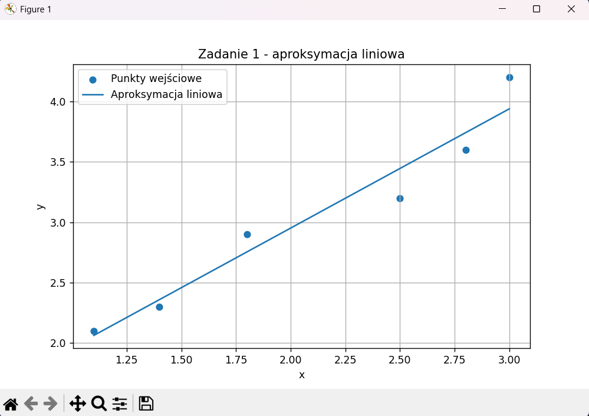
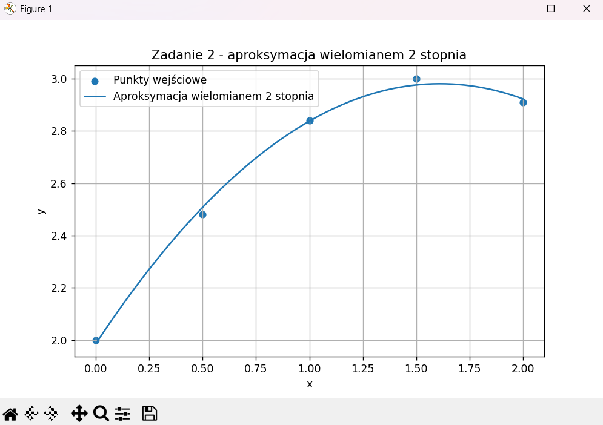

# Zadanie 1

**Napisz program implementujący aproksymację średniokwadratową liniową dla zbioru punktów**
$
\
\{(1.1, 2.1),\ (1.4, 2.3),\ (1.8, 2.9),\ (2.5, 3.2),\ (2.8, 3.6),\ (3.0, 4.2)\}.
\
$

## Na czym polega aproksymacja średniokwadratowa?

Aproksymacja średniokwadratowa, nazywana też **metodą najmniejszych kwadratów**, polega na znalezieniu takiej funkcji $F(x)$, która jak najlepiej przybliża dane punkty.

Dla zbioru punktów $(x_i,y_i)$, gdzie:

$$
y_i=f(x_i),
$$

szukamy funkcji $F(x)$, dla której wyrażenie:

$$
\|F-f\|_2=\sum_{i=1}^{n} w(x_i)(F(x_i)-y_i)^2
$$

osiąga minimum.

W slajdach przyjęto uproszczenie:

$
w(x)=1,
$

więc minimalizujemy po prostu sumę kwadratów odchyleń wartości aproksymacji od danych punktów.

## Aproksymacja liniowa

Najprostszym przypadkiem aproksymacji średniokwadratowej jest **aproksymacja liniowa**.

Szukamy prostej postaci:

$$
F(x)=ax+b
$$

takiej, aby minimalizować funkcję:

$$
h(a,b)=\sum_{i=1}^{n}(ax_i+b-y_i)^2.
$$

Oznacza to, że chcemy dobrać współczynniki $a$ i $b$ tak, aby suma kwadratów błędów była jak najmniejsza.

## Skąd biorą się wzory na $a$ i $b$?

Po obliczeniu pochodnych cząstkowych funkcji $h(a,b)$ i po przekształceniach dostajemy wzory:

$$
a=\frac{nA-BC}{nD-B^2},
\qquad
b=\frac{CD-AB}{nD-B^2},
$$

gdzie:

$$
A=\sum_{i=1}^{n} x_i y_i,
\qquad
B=\sum_{i=1}^{n} x_i,
\qquad
C=\sum_{i=1}^{n} y_i,
\qquad
D=\sum_{i=1}^{n} x_i^2.
$$

To właśnie te wielkości oblicza program.

## Dane z zadania

Mamy punkty:

$$
(1.1,2.1),\ (1.4,2.3),\ (1.8,2.9),\ (2.5,3.2),\ (2.8,3.6),\ (3.0,4.2)
$$

czyli:

- $x_1=1.1,\ y_1=2.1$
- $x_2=1.4,\ y_2=2.3$
- $x_3=1.8,\ y_3=2.9$
- $x_4=2.5,\ y_4=3.2$
- $x_5=2.8,\ y_5=3.6$
- $x_6=3.0,\ y_6=4.2$

Liczba punktów wynosi:

$$
n=6
$$

## Obliczenie sum pomocniczych

Liczymy zgodnie ze wzorami ze slajdu:

### Suma $A$

$$
A=\sum x_i y_i
$$

$$
A=1.1\cdot2.1+1.4\cdot2.3+1.8\cdot2.9+2.5\cdot3.2+2.8\cdot3.6+3.0\cdot4.2
$$

$$
A=2.31+3.22+5.22+8.00+10.08+12.60=41.43
$$

### Suma $B$

$$
B=\sum x_i
$$

$$
B=1.1+1.4+1.8+2.5+2.8+3.0=12.6
$$

### Suma $C$

$$
C=\sum y_i
$$

$$
C=2.1+2.3+2.9+3.2+3.6+4.2=18.3
$$

### Suma $D$

$$
D=\sum x_i^2
$$

$$
D=1.1^2+1.4^2+1.8^2+2.5^2+2.8^2+3.0^2
$$

$$
D=1.21+1.96+3.24+6.25+7.84+9.00=29.5
$$

## Obliczenie współczynników prostej

Podstawiamy do wzorów:

$$
a=\frac{nA-BC}{nD-B^2}
$$

$$
a=\frac{6\cdot41.43-12.6\cdot18.3}{6\cdot29.5-12.6^2}
$$

$$
a=\frac{248.58-230.58}{177-158.76}
$$

$$
a=\frac{18}{18.24}=0.9868421052631579
$$

Teraz współczynnik $b$:

$$
b=\frac{CD-AB}{nD-B^2}
$$

$$
b=\frac{18.3\cdot29.5-41.43\cdot12.6}{177-158.76}
$$

$$
b=\frac{539.85-522.018}{18.24}
$$

$$
b=\frac{17.832}{18.24}=0.9776315789473676
$$

## Otrzymana prosta aproksymacyjna

Zatem szukana prosta ma postać:

$$
F(x)=0.9868421052631579x+0.9776315789473676
$$

## Obliczenie sumy kwadratów błędów

Na końcu program liczy wartość funkcji błędu:

$$
h(a,b)=\sum_{i=1}^{n}(ax_i+b-y_i)^2
$$

Dla naszej prostej:

$$
h=\sum_{i=1}^{6}(0.9868421052631579x_i+0.9776315789473676-y_i)^2
$$

Program oblicza tę wartość automatycznie.  
Dla tych danych wychodzi:

$$
h \approx 0.17447368421052628
$$

## Kod

```python
print("-------------------- ZADANIE 1 --------------------")  # wypisujemy nagłówek zadania

punkty = [(1, 1), (3, 12), (5, 25), (7, 38)]  # zapisujemy punkty z zadania w postaci par (x, y)

n = len(punkty)  # obliczamy liczbę punktów, czyli n

A = 0.0  # tworzymy zmienną A na sumę iloczynów x_i * y_i
B = 0.0  # tworzymy zmienną B na sumę x_i
C = 0.0  # tworzymy zmienną C na sumę y_i
D = 0.0  # tworzymy zmienną D na sumę x_i^2

for x, y in punkty:  # przechodzimy po wszystkich punktach z listy
    B += x  # dodajemy bieżące x do sumy B = suma x_i
    C += y  # dodajemy bieżące y do sumy C = suma y_i
    D += x * x  # dodajemy kwadrat bieżącego x do sumy D = suma x_i^2
    A += x * y  # dodajemy iloczyn x * y do sumy A = suma x_i y_i

a = (n * A - B * C) / (n * D - B * B)  # obliczamy współczynnik a ze wzoru ze slajdu
b = (C * D - A * B) / (n * D - B * B)  # obliczamy współczynnik b ze wzoru ze slajdu

print("Współczynniki prostej aproksymacyjnej:")  # wypisujemy nagłówek dla współczynników
print("a =", a)  # wypisujemy obliczoną wartość współczynnika a
print("b =", b)  # wypisujemy obliczoną wartość współczynnika b

print("\nProsta aproksymacyjna:")  # wypisujemy nagłówek dla równania prostej
print(f"y = {a} * x + {b}")  # wypisujemy równanie wyznaczonej prostej aproksymacyjnej

h = 0.0  # tworzymy zmienną h na sumę kwadratów błędów, czyli wartość funkcji błędu
for x, y in punkty:  # ponownie przechodzimy po wszystkich punktach
    h += (a * x + b - y) ** 2  # dodajemy kwadrat różnicy między wartością z prostej a wartością rzeczywistą y

print("\nSuma kwadratów błędów:")  # wypisujemy nagłówek dla wartości błędu
print(h)  # wypisujemy końcową wartość funkcji błędu h(a,b)
```

## Wnioski

W zadaniu wyznaczono prostą aproksymacyjną metodą najmniejszych kwadratów dla punktów:

$
(1,1),\ (3,12),\ (5,25),\ (7,38).
$

Na podstawie wzorów ze slajdów obliczono:

$
a=6.2,\qquad b=-5.8.
$

Otrzymana prosta aproksymacyjna ma więc postać:

$
F(x)=6.2x-5.8.
$

Suma kwadratów błędów wynosi:

$
h=4.8.
$

Oznacza to, że prosta $F(x)=6.2x-5.8$ jest najlepszym liniowym przybliżeniem danych punktów w sensie metody najmniejszych kwadratów.

---

# Zadanie 2

**Napisz program implementujący aproksymację średniokwadratową wielomianem drugiego stopnia dla zbioru punktów**
$
\{(0,2),\ (0.5,2.48),\ (1,2.84),\ (1.5,3),\ (2,2.91)\}.
$

## Na czym polega aproksymacja wielomianowa?

W aproksymacji średniokwadratowej szukamy funkcji $F(x)$, która możliwie najlepiej przybliża dane punkty.

Przyjmujemy ogólną postać funkcji aproksymującej:

$$
F(x)=a_0\phi_0(x)+a_1\phi_1(x)+\dots+a_m\phi_m(x),
$$

gdzie dla uproszczenia:

$$
\phi_k(x)=x^k.
$$

Zadaniem jest minimalizacja funkcji błędu:

$$
h(a_0,a_1,\dots,a_m)=\sum_{i=1}^{n}\left(\sum_{j=0}^{m} a_j x_i^j-y_i\right)^2.
$$

## Układ równań ze slajdów

Ze slajdów wynika, że dla każdego:

$$
i=0,1,\dots,m
$$

otrzymujemy układ $m+1$ równań z $m+1$ niewiadomymi:

$$
\frac{\partial h}{\partial a_i}
=
2\sum_{i=1}^{n}
\left(
\sum_{j=0}^{m} a_j x_i^j-y_i
\right)x_i^i
=0.
$$

Jest to wzór ogólny dla aproksymacji wielomianowej.

## Zastosowanie do tego zadania

W tym zadaniu szukamy wielomianu drugiego stopnia, więc:

$$
m=2.
$$

Oznacza to, że funkcja aproksymująca ma postać:

$$
F(x)=a_0+a_1x+a_2x^2.
$$

W programie ten sam wielomian zapisujemy równoważnie jako:

$$
F(x)=ax^2+bx+c,
$$

gdzie:

- $a=a_2$
- $b=a_1$
- $c=a_0$

Po podstawieniu do wzoru ogólnego funkcja błędu przyjmuje postać:

$$
h(a_0,a_1,a_2)=\sum_{i=1}^{n}(a_0+a_1x_i+a_2x_i^2-y_i)^2.
$$

W zapisie używanym w programie jest to równoważnie:

$$
h(a,b,c)=\sum_{i=1}^{n}(ax_i^2+bx_i+c-y_i)^2.
$$

## Układ równań dla wielomianu drugiego stopnia

Dla wielomianu drugiego stopnia:

$$
F(x)=ax^2+bx+c
$$

ze slajdów otrzymujemy układ równań:

$$
a\sum_{i=1}^{n}x_i^4+b\sum_{i=1}^{n}x_i^3+c\sum_{i=1}^{n}x_i^2=\sum_{i=1}^{n}x_i^2y_i,
$$

$$
a\sum_{i=1}^{n}x_i^3+b\sum_{i=1}^{n}x_i^2+c\sum_{i=1}^{n}x_i=\sum_{i=1}^{n}x_iy_i,
$$

$$
a\sum_{i=1}^{n}x_i^2+b\sum_{i=1}^{n}x_i+nc=\sum_{i=1}^{n}y_i.
$$

Program właśnie buduje ten układ równań i rozwiązuje go metodą Gaussa.

## Dane z zadania

Mamy punkty:

$$
(0,2),\ (0.5,2.48),\ (1,2.84),\ (1.5,3),\ (2,2.91)
$$

czyli:

- $x_1=0,\ y_1=2$
- $x_2=0.5,\ y_2=2.48$
- $x_3=1,\ y_3=2.84$
- $x_4=1.5,\ y_4=3$
- $x_5=2,\ y_5=2.91$

Liczba punktów wynosi:

$$
n=5
$$

## Obliczenie sum pomocniczych

Liczymy sumy potrzebne do zbudowania układu równań.

### Suma $\sum x_i$

$$
\sum x_i=0+0.5+1+1.5+2=5
$$

### Suma $\sum x_i^2$

$$
\sum x_i^2=0^2+0.5^2+1^2+1.5^2+2^2
$$

$$
\sum x_i^2=0+0.25+1+2.25+4=7.5
$$

### Suma $\sum x_i^3$

$$
\sum x_i^3=0^3+0.5^3+1^3+1.5^3+2^3
$$

$$
\sum x_i^3=0+0.125+1+3.375+8=12.5
$$

### Suma $\sum x_i^4$

$$
\sum x_i^4=0^4+0.5^4+1^4+1.5^4+2^4
$$

$$
\sum x_i^4=0+0.0625+1+5.0625+16=22.125
$$

### Suma $\sum y_i$

$$
\sum y_i=2+2.48+2.84+3+2.91=13.23
$$

### Suma $\sum x_i y_i$

$$
\sum x_i y_i=0\cdot2+0.5\cdot2.48+1\cdot2.84+1.5\cdot3+2\cdot2.91
$$

$$
\sum x_i y_i=0+1.24+2.84+4.5+5.82=14.4
$$

### Suma $\sum x_i^2 y_i$

$$
\sum x_i^2 y_i=0^2\cdot2+0.5^2\cdot2.48+1^2\cdot2.84+1.5^2\cdot3+2^2\cdot2.91
$$

$$
\sum x_i^2 y_i=0+0.62+2.84+6.75+11.64=21.85
$$

## Budowa układu równań

Podstawiamy obliczone sumy do wzorów:

$$
22.125a+12.5b+7.5c=21.85
$$

$$
12.5a+7.5b+5c=14.4
$$

$$
7.5a+5b+5c=13.23
$$

W postaci macierzowej:

$$
\begin{bmatrix}
22.125 & 12.5 & 7.5 \\
12.5 & 7.5 & 5 \\
7.5 & 5 & 5
\end{bmatrix}
\cdot
\begin{bmatrix}
a \\
b \\
c
\end{bmatrix}
=
\begin{bmatrix}
21.85 \\
14.4 \\
13.23
\end{bmatrix}
$$

## Rozwiązanie układu

Po rozwiązaniu układu równań otrzymujemy:

$$
a=-\frac{67}{175}\approx -0.38285714285714284
$$

$$
b=\frac{2159}{1750}\approx 1.2337142857142858
$$

$$
c=\frac{6953}{3500}\approx 1.9865714285714287
$$

## Otrzymany wielomian aproksymacyjny

Zatem szukany wielomian ma postać:

$$
F(x)=-0.38285714285714284x^2+1.2337142857142858x+1.9865714285714287
$$

## Obliczenie sumy kwadratów błędów

Na końcu program liczy wartość funkcji błędu.

Zgodnie ze slajdami w postaci ogólnej:

$$
h(a_0,a_1,\dots,a_m)=\sum_{i=1}^{n}\left(\sum_{j=0}^{m} a_j x_i^j-y_i\right)^2.
$$

W tym zadaniu, dla wielomianu drugiego stopnia, mamy:

$$
h(a_0,a_1,a_2)=\sum_{i=1}^{n}(a_0+a_1x_i+a_2x_i^2-y_i)^2.
$$

W zapisie używanym w programie jest to równoważnie:

$$
h(a,b,c)=\sum_{i=1}^{n}(ax_i^2+bx_i+c-y_i)^2.
$$

Dla otrzymanego wielomianu:

$$
h=\sum_{i=1}^{5}\left(-0.38285714285714284x_i^2+1.2337142857142858x_i+1.9865714285714287-y_i\right)^2
$$

Program oblicza tę wartość automatycznie.  
Dla tych danych wychodzi:

$$
h \approx 0.00170285714285714
$$

czyli dokładnie:

$$
h=\frac{149}{87500}
$$

## Kod

```python
print("-------------------- ZADANIE 2 --------------------")  # wypisujemy nagłówek zadania

punkty = [(0.0, 2.0), (0.5, 2.48), (1.0, 2.84), (1.5, 3.0), (2.0, 2.91)]  # zapisujemy punkty z zadania jako pary (x, y)

def rozwiaz_uklad_gaussa(macierz, wyrazy_wolne):  # definiujemy funkcję rozwiązującą układ równań metodą Gaussa
    n = len(wyrazy_wolne)  # zapisujemy liczbę równań i niewiadomych

    for i in range(n):  # przechodzimy po kolejnych kolumnach i wierszach eliminacji
        if macierz[i][i] == 0:  # sprawdzamy, czy na przekątnej nie pojawiło się zero
            raise ValueError("Na przekątnej pojawiło się zero - nie można wykonać eliminacji Gaussa.")  # jeśli tak, zgłaszamy błąd

        for j in range(i + 1, n):  # przechodzimy po wierszach poniżej aktualnego wiersza
            wspolczynnik = macierz[j][i] / macierz[i][i]  # obliczamy współczynnik potrzebny do wyzerowania elementu pod przekątną

            for k in range(i, n):  # przechodzimy po elementach aktualnego wiersza od kolumny i do końca
                macierz[j][k] = macierz[j][k] - wspolczynnik * macierz[i][k]  # zerujemy elementy pod przekątną w macierzy

            wyrazy_wolne[j] = wyrazy_wolne[j] - wspolczynnik * wyrazy_wolne[i]  # wykonujemy tę samą operację na wektorze wyrazów wolnych

    rozwiazanie = [0.0] * n  # tworzymy listę na rozwiązanie układu

    for i in range(n - 1, -1, -1):  # wykonujemy podstawianie wsteczne od ostatniego równania do pierwszego
        suma = 0.0  # tworzymy zmienną na sumę znanych składników
        for j in range(i + 1, n):  # przechodzimy po współczynnikach przy już wyznaczonych niewiadomych
            suma += macierz[i][j] * rozwiazanie[j]  # dodajemy do sumy iloczyny współczynników i znanych rozwiązań

        rozwiazanie[i] = (wyrazy_wolne[i] - suma) / macierz[i][i]  # obliczamy bieżącą niewiadomą

    return rozwiazanie  # zwracamy listę rozwiązań układu

n = len(punkty)  # obliczamy liczbę punktów

suma_x = 0.0  # tworzymy zmienną na sumę x_i
suma_x2 = 0.0  # tworzymy zmienną na sumę x_i^2
suma_x3 = 0.0  # tworzymy zmienną na sumę x_i^3
suma_x4 = 0.0  # tworzymy zmienną na sumę x_i^4
suma_y = 0.0  # tworzymy zmienną na sumę y_i
suma_xy = 0.0  # tworzymy zmienną na sumę x_i y_i
suma_x2y = 0.0  # tworzymy zmienną na sumę x_i^2 y_i

for x, y in punkty:  # przechodzimy po wszystkich punktach z listy
    suma_x += x  # dodajemy bieżące x do sumy x_i
    suma_x2 += x ** 2  # dodajemy bieżące x^2 do sumy x_i^2
    suma_x3 += x ** 3  # dodajemy bieżące x^3 do sumy x_i^3
    suma_x4 += x ** 4  # dodajemy bieżące x^4 do sumy x_i^4
    suma_y += y  # dodajemy bieżące y do sumy y_i
    suma_xy += x * y  # dodajemy iloczyn x*y do sumy x_i y_i
    suma_x2y += x ** 2 * y  # dodajemy iloczyn x^2*y do sumy x_i^2 y_i

macierz_ukladu = [  # budujemy macierz układu równań zgodnie ze slajdami
    [suma_x4, suma_x3, suma_x2],  # pierwszy wiersz odpowiada równaniu z sumami x_i^4, x_i^3 i x_i^2
    [suma_x3, suma_x2, suma_x],  # drugi wiersz odpowiada równaniu z sumami x_i^3, x_i^2 i x_i
    [suma_x2, suma_x, n]  # trzeci wiersz odpowiada równaniu z sumami x_i^2, x_i i n
]

wyrazy_wolne = [suma_x2y, suma_xy, suma_y]  # budujemy wektor prawej strony układu równań

macierz_kopia = []  # tworzymy pustą listę na kopię macierzy układu
for wiersz in macierz_ukladu:  # przechodzimy po wszystkich wierszach macierzy układu
    macierz_kopia.append(wiersz.copy())  # dodajemy kopię wiersza, aby nie zmieniać oryginalnej macierzy

wyrazy_wolne_kopia = wyrazy_wolne.copy()  # tworzymy kopię wektora wyrazów wolnych, aby nie zmieniać oryginału

rozwiazanie = rozwiaz_uklad_gaussa(macierz_kopia, wyrazy_wolne_kopia)  # rozwiązujemy układ równań metodą Gaussa

a = rozwiazanie[0]  # pierwszy element rozwiązania to współczynnik a przy x^2
b = rozwiazanie[1]  # drugi element rozwiązania to współczynnik b przy x
c = rozwiazanie[2]  # trzeci element rozwiązania to współczynnik c wyrazu wolnego

print("Współczynniki wielomianu aproksymacyjnego:")  # wypisujemy nagłówek dla współczynników
print("a =", a)  # wypisujemy współczynnik a
print("b =", b)  # wypisujemy współczynnik b
print("c =", c)  # wypisujemy współczynnik c

print("\nWielomian aproksymacyjny:")  # wypisujemy nagłówek dla równania wielomianu
print(f"y = {a} * x^2 + {b} * x + {c}")  # wypisujemy równanie wielomianu aproksymacyjnego

h = 0.0  # tworzymy zmienną h na sumę kwadratów błędów
for x, y in punkty:  # przechodzimy po wszystkich punktach
    h += (a * x**2 + b * x + c - y) ** 2  # dodajemy kwadrat różnicy między wartością z wielomianu a wartością rzeczywistą

print("\nSuma kwadratów błędów:")  # wypisujemy nagłówek dla błędu
print(h)  # wypisujemy końcową wartość funkcji błędu
```

## Wnioski

W zadaniu wyznaczono wielomian aproksymacyjny drugiego stopnia metodą najmniejszych kwadratów dla punktów:

$$
(0,2),\ (0.5,2.48),\ (1,2.84),\ (1.5,3),\ (2,2.91).
$$

Na podstawie wzorów ze slajdów zbudowano układ równań:

$$
a\sum x_i^4+b\sum x_i^3+c\sum x_i^2=\sum x_i^2y_i,
$$

$$
a\sum x_i^3+b\sum x_i^2+c\sum x_i=\sum x_iy_i,
$$

$$
a\sum x_i^2+b\sum x_i+nc=\sum y_i,
$$

a następnie rozwiązano go metodą Gaussa.

Otrzymane współczynniki są równe:

$$
a=-\frac{67}{175},\qquad b=\frac{2159}{1750},\qquad c=\frac{6953}{3500},
$$

czyli w przybliżeniu:

$$
a\approx -0.38285714285714284,
$$

$$
b\approx 1.2337142857142858,
$$

$$
c\approx 1.9865714285714287.
$$

Zatem wielomian aproksymacyjny ma postać:

$$
F(x)=-0.38285714285714284x^2+1.2337142857142858x+1.9865714285714287.
$$

Suma kwadratów błędów wynosi:

$$
h \approx 0.00170285714285714.
$$

Oznacza to, że otrzymany wielomian bardzo dobrze przybliża dane punkty.

---
# Zadanie 3

**Napisz funkcję, która dla zadanego zbioru punktów oraz stopnia wielomianu optymalnego wyznaczy współczynniki wielomianu oraz błąd aproksymacji metodą najmniejszych kwadratów.**

## O co chodzi w tym zadaniu?

Zadanie 3 jest uogólnieniem zadań 1 i 2.

W zadaniu 1 szukaliśmy prostej:

$$
F(x)=ax+b
$$

czyli wielomianu stopnia 1.

W zadaniu 2 szukaliśmy wielomianu drugiego stopnia:

$$
F(x)=ax^2+bx+c
$$

W zadaniu 3 mamy napisać funkcję, która zrobi to samo, ale dla **dowolnego stopnia wielomianu** podanego przez użytkownika.

Czyli jeśli podamy:

- `stopien = 1`, funkcja wyznaczy prostą,
- `stopien = 2`, funkcja wyznaczy wielomian kwadratowy,
- `stopien = 3`, funkcja wyznaczy wielomian trzeciego stopnia,
- itd.

## Wzór ogólny ze slajdów

Na slajdach funkcja aproksymująca ma postać:

$$
F(x)=a_0\phi_0(x)+a_1\phi_1(x)+\dots+a_m\phi_m(x),
$$

gdzie dla uproszczenia przyjmujemy:

$$
\phi_k(x)=x^k.
$$

Wtedy funkcję aproksymującą można zapisać jako wielomian:

$$
F(x)=a_0+a_1x+a_2x^2+\dots+a_mx^m.
$$

Współczynniki:

$$
a_0,a_1,a_2,\dots,a_m
$$

są szukanymi współczynnikami wielomianu aproksymacyjnego.

## Funkcja błędu

Zgodnie ze slajdami minimalizujemy funkcję błędu:

$$
h(a_0,a_1,\dots,a_m)=\sum_{i=1}^{n}\left(\sum_{j=0}^{m}a_jx_i^j-y_i\right)^2.
$$

Oznacza to, że dla każdego punktu sprawdzamy różnicę między:

- wartością wielomianu w punkcie \(x_i\),
- wartością rzeczywistą \(y_i\),

a potem sumujemy kwadraty tych różnic.

## Układ równań normalnych

Ze slajdów wynika, że aby znaleźć najlepsze współczynniki, trzeba rozwiązać układ równań:

$$
\sum_{j=0}^{m}a_j\sum_{i=1}^{n}x_i^{j+k}
=
\sum_{i=1}^{n}x_i^k y_i,
$$

dla:

$$
k=0,1,\dots,m.
$$

To oznacza, że dla wielomianu stopnia \(m\) powstaje układ:

$$
m+1
$$

równań z:

$$
m+1
$$

niewiadomymi.

## Jak program buduje układ równań?

Program tworzy macierz układu:

$$
A
$$

oraz wektor wyrazów wolnych:

$$
B.
$$

Elementy macierzy są liczone ze wzoru:

$$
A_{k,j}=\sum_{i=1}^{n}x_i^{k+j}
$$

a elementy wektora prawej strony:

$$
B_k=\sum_{i=1}^{n}x_i^k y_i.
$$

Dzięki temu program sam tworzy układ równań dla dowolnego stopnia wielomianu.

## Dane użyte w przykładzie

W programie użyto punktów z zadania 2:

$$
(0,2),\ (0.5,2.48),\ (1,2.84),\ (1.5,3),\ (2,2.91)
$$

oraz stopnia:

$$
m=2.
$$

Czyli szukamy wielomianu:

$$
F(x)=a_0+a_1x+a_2x^2.
$$

Dla tego przykładu wynik powinien zgadzać się z zadaniem 2, tylko współczynniki są zapisane w innej kolejności.

W zadaniu 2 pisaliśmy:

$$
F(x)=ax^2+bx+c.
$$

W zadaniu 3 piszemy:

$$
F(x)=a_0+a_1x+a_2x^2.
$$

Zatem:

$$
a_0=c,\qquad a_1=b,\qquad a_2=a.
$$

## Wynik dla danych z programu

Dla danych:

$$
(0,2),\ (0.5,2.48),\ (1,2.84),\ (1.5,3),\ (2,2.91)
$$

oraz stopnia:

$$
m=2
$$

otrzymujemy:

$$
a_0\approx 1.9865714285714287
$$

$$
a_1\approx 1.2337142857142858
$$

$$
a_2\approx -0.38285714285714284
$$

czyli:

$$
F(x)=1.9865714285714287+1.2337142857142858x-0.38285714285714284x^2.
$$

Po uporządkowaniu według malejących potęg:

$$
F(x)=-0.38285714285714284x^2+1.2337142857142858x+1.9865714285714287.
$$

Suma kwadratów błędów wynosi:

$$
h\approx 0.00170285714285714.
$$

## Kod

```python
print("-------------------- ZADANIE 3 --------------------")  # wypisujemy nagłówek zadania

def rozwiaz_uklad_gaussa(macierz, wyrazy_wolne):  # definiujemy funkcję rozwiązującą układ równań metodą Gaussa
    n = len(wyrazy_wolne)  # zapisujemy liczbę równań i niewiadomych

    for i in range(n):  # przechodzimy po kolejnych kolumnach eliminacji
        if macierz[i][i] == 0:  # sprawdzamy, czy element główny na przekątnej nie jest zerem
            raise ValueError("Na przekątnej pojawiło się zero - nie można wykonać eliminacji Gaussa.")  # jeśli jest zero, zgłaszamy błąd

        for j in range(i + 1, n):  # przechodzimy po wierszach znajdujących się pod aktualnym wierszem
            wspolczynnik = macierz[j][i] / macierz[i][i]  # obliczamy współczynnik potrzebny do wyzerowania elementu pod przekątną

            for k in range(i, n):  # przechodzimy po elementach aktualnego wiersza od kolumny i do końca
                macierz[j][k] = macierz[j][k] - wspolczynnik * macierz[i][k]  # wykonujemy eliminację, czyli zerujemy element pod przekątną

            wyrazy_wolne[j] = wyrazy_wolne[j] - wspolczynnik * wyrazy_wolne[i]  # wykonujemy tę samą operację na wektorze wyrazów wolnych

    rozwiazanie = [0.0] * n  # tworzymy listę na rozwiązanie układu

    for i in range(n - 1, -1, -1):  # wykonujemy podstawianie wsteczne od ostatniego równania do pierwszego
        suma = 0.0  # tworzymy zmienną pomocniczą na sumę znanych składników
        for j in range(i + 1, n):  # przechodzimy po niewiadomych, które zostały już obliczone
            suma += macierz[i][j] * rozwiazanie[j]  # dodajemy iloczyny współczynników i znanych rozwiązań

        rozwiazanie[i] = (wyrazy_wolne[i] - suma) / macierz[i][i]  # obliczamy bieżącą niewiadomą

    return rozwiazanie  # zwracamy rozwiązanie układu


def aproksymacja_najmniejszych_kwadratow(punkty, stopien):  # definiujemy funkcję aproksymacji dla dowolnego stopnia wielomianu
    liczba_wspolczynnikow = stopien + 1  # obliczamy liczbę współczynników, bo dla stopnia m mamy m+1 współczynników

    macierz_ukladu = []  # tworzymy pustą macierz układu równań
    wyrazy_wolne = []  # tworzymy pusty wektor wyrazów wolnych

    for i in range(liczba_wspolczynnikow):  # tworzymy kolejne równania układu
        wiersz = []  # tworzymy pusty wiersz macierzy

        for j in range(liczba_wspolczynnikow):  # tworzymy kolejne elementy w danym wierszu macierzy
            suma = 0.0  # zerujemy sumę dla elementu macierzy

            for x, y in punkty:  # przechodzimy po wszystkich punktach
                suma += x ** (i + j)  # dodajemy składnik x_i^(i+j), zgodnie ze wzorem na macierz układu

            wiersz.append(suma)  # dodajemy obliczoną sumę do wiersza macierzy

        macierz_ukladu.append(wiersz)  # dodajemy gotowy wiersz do macierzy układu

        suma = 0.0  # zerujemy sumę dla wyrazu wolnego

        for x, y in punkty:  # przechodzimy po wszystkich punktach
            suma += (x ** i) * y  # dodajemy składnik x_i^i * y_i, zgodnie ze wzorem na prawą stronę układu

        wyrazy_wolne.append(suma)  # dodajemy obliczoną sumę do wektora wyrazów wolnych

    macierz_kopia = []  # tworzymy pustą listę na kopię macierzy
    for wiersz in macierz_ukladu:  # przechodzimy po wszystkich wierszach macierzy
        macierz_kopia.append(wiersz.copy())  # kopiujemy wiersz, aby metoda Gaussa nie zmieniła oryginalnej macierzy

    wyrazy_wolne_kopia = wyrazy_wolne.copy()  # kopiujemy wektor wyrazów wolnych, aby zachować oryginał

    wspolczynniki = rozwiaz_uklad_gaussa(macierz_kopia, wyrazy_wolne_kopia)  # rozwiązujemy układ równań i otrzymujemy współczynniki wielomianu

    h = 0.0  # tworzymy zmienną h na sumę kwadratów błędów

    for x, y in punkty:  # przechodzimy po wszystkich punktach
        y_aprox = 0.0  # tworzymy zmienną na wartość wielomianu w punkcie x

        for i in range(len(wspolczynniki)):  # przechodzimy po wszystkich współczynnikach wielomianu
            y_aprox += wspolczynniki[i] * (x ** i)  # dodajemy składnik a_i * x^i do wartości wielomianu

        h += (y_aprox - y) ** 2  # dodajemy kwadrat różnicy między wartością aproksymowaną a rzeczywistą

    return wspolczynniki, h  # zwracamy współczynniki wielomianu i sumę kwadratów błędów


punkty = [(0.0, 2.0), (0.5, 2.48), (1.0, 2.84), (1.5, 3.0), (2.0, 2.91)]  # zapisujemy dane punkty
stopien = 2  # ustawiamy stopień wielomianu aproksymacyjnego

wspolczynniki, h = aproksymacja_najmniejszych_kwadratow(punkty, stopien)  # wywołujemy funkcję aproksymacji

print("Współczynniki wielomianu aproksymacyjnego:")  # wypisujemy nagłówek dla współczynników
for i in range(len(wspolczynniki)):  # przechodzimy po wszystkich współczynnikach
    print(f"a{i} = {wspolczynniki[i]}")  # wypisujemy współczynnik a_i

print("\nWielomian aproksymacyjny:")  # wypisujemy nagłówek dla wielomianu
print("y =", end=" ")  # rozpoczynamy wypisywanie wzoru wielomianu

for i in range(len(wspolczynniki)):  # przechodzimy po wszystkich współczynnikach
    if i == 0:  # sprawdzamy, czy wypisujemy pierwszy składnik
        print(f"{wspolczynniki[i]}", end="")  # wypisujemy wyraz wolny bez znaku plus na początku
    else:  # jeśli to nie jest pierwszy składnik
        print(f" + {wspolczynniki[i]} * x^{i}", end="")  # wypisujemy kolejny składnik wielomianu

print("\n\nSuma kwadratów błędów:")  # wypisujemy nagłówek dla błędu
print(h)  # wypisujemy sumę kwadratów błędów
```

## Wnioski

W zadaniu 3 napisano funkcję, która uogólnia aproksymację średniokwadratową na dowolny stopień wielomianu.

Zamiast osobno tworzyć wzory dla prostej lub dla wielomianu drugiego stopnia, program automatycznie buduje układ równań normalnych na podstawie wzoru ze slajdów:

$$
\sum_{j=0}^{m}a_j\sum_{i=1}^{n}x_i^{j+k}
=
\sum_{i=1}^{n}x_i^k y_i.
$$

Następnie układ ten jest rozwiązywany metodą Gaussa.

Dla danych z zadania 2 oraz stopnia:

$$
m=2
$$

otrzymano współczynniki:

$$
a_0\approx 1.9865714285714287
$$

$$
a_1\approx 1.2337142857142858
$$

$$
a_2\approx -0.38285714285714284
$$

czyli wielomian:

$$
F(x)=1.9865714285714287+1.2337142857142858x-0.38285714285714284x^2.
$$

Suma kwadratów błędów wynosi:

$$
h\approx 0.00170285714285714.
$$

Wynik jest zgodny z zadaniem 2, ponieważ dla stopnia 2 funkcja ogólna tworzy ten sam wielomian aproksymacyjny.

---

Zadanie 4*. Rozwiązania dwóch pierwszych zadań przedstaw na wykresie, zaznaczając również zaobserwowane wartości funkcji.



